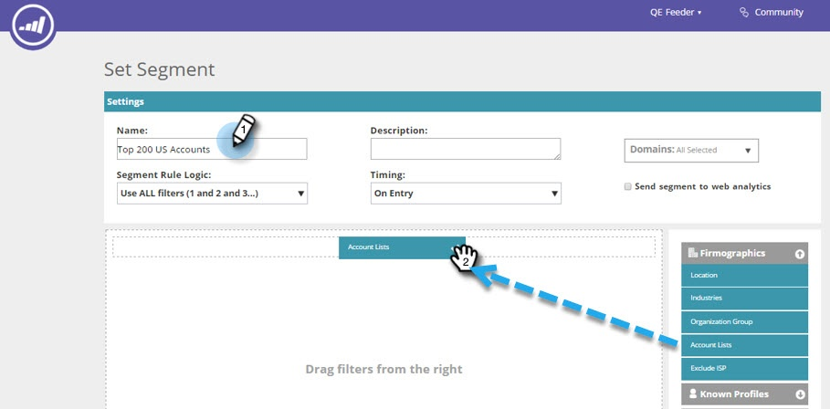

# 使用帳戶清單建立區段 {#create-a-segment-using-an-account-list}

以下說明如何使用「科目清單」建立區段。

>[!PREREQUISITES]
>
>[建立新的帳戶清單](/help/marketo/product-docs/target-account-management/target/account-lists.md)

>[!NOTE]
>
>若要在Web Personalization中檢視帳戶清單，需要名為「Web ABM」的額外模組。 如果您沒有看到帳戶清單選項，請聯絡Adobe帳戶團隊（您的帳戶經理）以尋求協助。

1. 前往 **[!UICONTROL Segments]**。

   

1. 按一下「**[!UICONTROL Create New]**」。

   

1. 輸入區段名稱。 從&#x200B;**[!UICONTROL Firmographics]**&#x200B;區段拖放&#x200B;**[!UICONTROL Account Lists]**。

   

1. 從您已上傳的具名帳戶清單中選取帳戶清單。 「帳戶清單名稱」旁方括弧內的數字是供API參考的清單ID。

   

   >[!NOTE]
   >
   >帳戶清單會從ABM同步至Web Personalization，以便用於分段。 從下拉式清單中選取它們。 同步處理最多可能需要五分鐘。 只有當帳戶清單中有一個或多個具名帳戶時，它才會同步。

1. 按一下&#x200B;**[!UICONTROL Save]**，或按一下&#x200B;**[!UICONTROL Save & Define Campaign]**&#x200B;前往「行銷活動」頁面。

   

恭喜！ 您現在已設定以帳戶清單為目標的區段。
