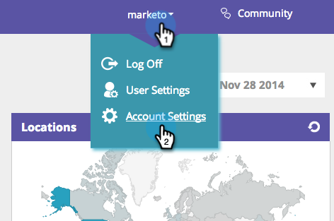
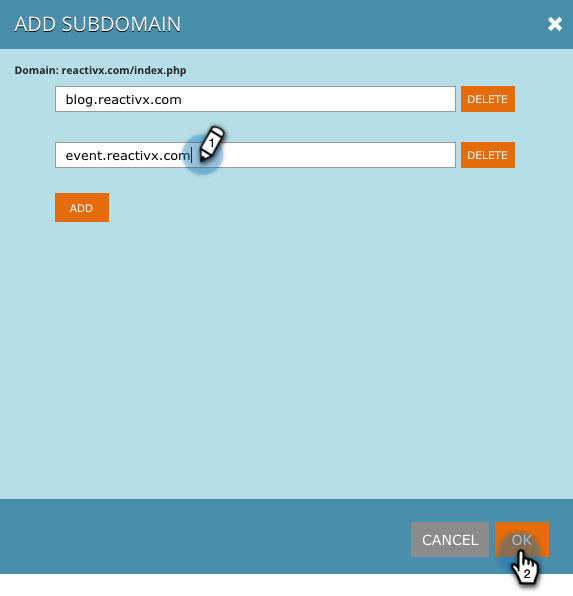

# 在[!UICONTROL Account Settings]中新增子網域 {#add-subdomains-in-account-settings}

以下說明如何在[!UICONTROL Account Settings]中將子網域新增到您的主要網域。 這可讓您管理與主要網域的特定RTP Javascript相關的子網域。 建議將[!DNL Javascript]標籤部署至任何新增的子網域。

1. 在Web Personalization中，移至&#x200B;**[!UICONTROL Account Settings]**。

   

1. 在「網域設定」頁面上，您會看到與帳戶相關聯的所有主要網域的清單。 每個區段都會先列出主要網域（以下反白顯示），然後列出任何子網域。 按一下「**[!UICONTROL Add Subdomain]**」。

   

1. 按一下「**[!UICONTROL Add]**」。

   

1. 輸入子網域URL。 按一下&#x200B;**[!UICONTROL Add]**&#x200B;或&#x200B;**[!UICONTROL Delete]**&#x200B;管理您的子網域清單，然後在完成時按一下&#x200B;**[!UICONTROL OK]**。

   

1. 現在會列出您新新增的子網域。

   

   >[!NOTE]
   >
   >如果您想要將&#x200B;_主要_&#x200B;網域新增至您的帳戶，請聯絡[Marketo支援](https://nation.marketo.com/t5/Support/ct-p/Support)。
