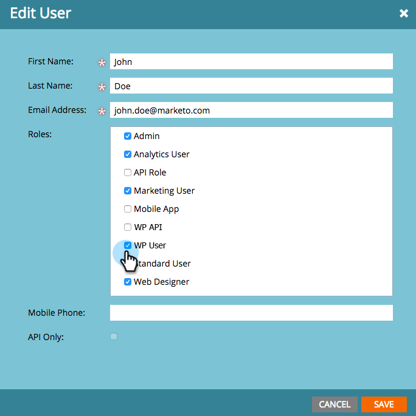

# 登入與使用者管理 {#login-and-user-management}

## 建立Web個人化使用者角色 {#create-a-web-personalization-user-role}

1. 前往 **管理** 區段，然後按一下 **使用者與角色**.

   

1. 按一下 **角色**.

   

   >[!NOTE]
   >
   >如果Web個人化(WP)使用者角色已存在，請確定已依照步驟4所示進行設定。

1. 按一下 **新角色**.

   

1. 輸入角色名稱並選擇權限。 按一下 **建立** (此角色必須 [應用於所有工作區](/help/marketo/product-docs/administration/users-and-roles/managing-marketo-users.md))。

   

   >[!TIP]
   >
   >若要授予使用者存取鎖定目標和個人化中所有內容的權限，請務必選取 _all_ 複選框。

## Web個人化和預測內容使用者權限 {#web-personalization-and-predictive-content-user-permissions}

**鎖定目標和個人化**:如果僅選取此權限，則使用者僅擁有檢視權限。

**管理網站個人化+預測性**:使用者只能存取Web個人化和預測內容應用程式的帳戶設定和內容設定。 使用者可以檢視應用程式中的頁面，但沒有建立、編輯、刪除、啟動權限。

**預測性內容編輯器**:使用者擁有預測內容應用程式的編輯器存取權。 該權限允許建立、編輯、刪除內容片段。 它不允許在網頁或電子郵件上啟用內容以供預測性使用。

**預測性內容啟動器**:使用者可存取「預測內容」功能，但「帳戶」和「內容設定」除外。 此權限可讓您建立、編輯和刪除內容片段，以及啟用內容片段。

**Web促銷活動編輯器**:使用者可存取所有Web個人化功能，以建立、編輯和刪除，但不能啟動Web促銷活動。

**Web促銷活動啟動器**:使用者可存取「帳戶」和「內容設定」以外的所有Web個人化應用程式功能。 此權限可讓您建立、編輯、刪除和啟動Web促銷活動。

## 將WP角色分配給用戶 {#assign-wp-role-to-user}

1. 前往 **使用者**.

   

1. 選擇要授予WP訪問權限的用戶，然後按一下 **編輯用戶**.

   

1. 為所有工作區選擇WP用戶角色。

   

1. 新啟用的使用者會看到 **網頁個人化** 在「我的Marketo」中拼貼。

   
