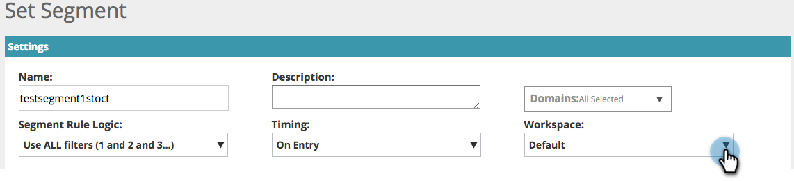

# Web Personalization中的工作區 {#workspaces-in-web-personalization}

Web個人化支援多個工作區用於網頁行銷活動和網頁區段。

## 切換工作區 {#switch-workspaces}

若要在Web個人化中的工作區之間切換，請按一下左上方的地球圖示，然後從下拉式選單中選擇不同的工作區。

## 變更區段的工作區 {#change-a-segments-workspace}

1. 前往 **區段** 頁面上，選取區段，然後按一下編輯圖示。

   

1. 從中選擇不同的工作區 **Workspace** 下拉式清單。

   

   

>[!NOTE]
>
>使用者將只能檢視與其有權存取的工作區相關聯的網頁行銷活動和區段。 以下為操作說明 [授予使用者存取一或多個工作區的許可權](/help/marketo/product-docs/administration/workspaces-and-person-partitions/allow-user-access-to-a-workspace.md).
