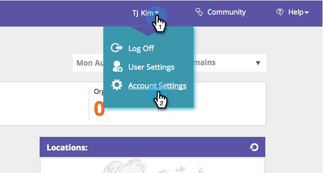

# 排除特定的IP不受追蹤 {#exclude-specific-ips-from-being-tracked}

曾經想要從Web Personalization的追蹤和報告中排除您自己的員工和組織名稱嗎？

您可以排除個別IP和全部或部分IP。

>[!NOTE]
>
>此程式最多可能需要五分鐘才能完成。

1. 登入Web Personalization，在登入下方，按一下 **帳戶設定**.

   

1. 向下捲動至 **IP排除** 區域。 如果您是第一次排除IP位址，請按一下空白的 **排除IP位址** 欄位。

   

1. 輸入您想從追蹤和報告中排除的個別IP或IP範圍，然後按一下 **儲存**.

   

   >[!NOTE]
   >
   >您可以排除單一IPv4或IPv6位址、完整範圍、半範圍或子網路遮罩。 上述範例中的專案會根據Marketo表單本身提供的範例，顯示其中一個。

1. 「排除IP位址」欄位現在會列出您輸入的IP位址。 若要編輯IP排除專案，請按一下綠色加號以重新開啟表單。

   

   您知道這有多簡單嗎？ 現在您可以從新增的IP中排除所有資料，無論是個別或按範圍。
