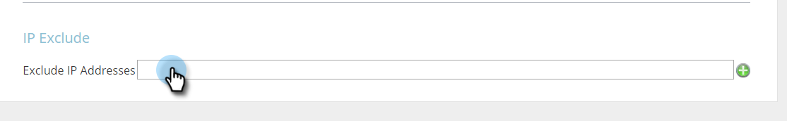

# 排除特定IP以不受追蹤 {#exclude-specific-ips-from-being-tracked}

是否想要將您自己的員工和組織名稱排除在Web個人化的追蹤和報表之外？

您可以排除個別IP，以及IP範圍的全部或部分。

>[!NOTE]
>
>此程式最多需要5分鐘才能完成。

1. 登入Web個人化，在登入下，按一下 **帳戶設定**.

   

1. 向下捲動至 **IP排除** 的上界。 如果您是第一次排除IP位址，請按一下空白 **排除IP位址** 欄位。

   

1. 輸入您要從追蹤和報告中排除的個別IP或IP範圍，然後按一下 **儲存**.

   

   >[!NOTE]
   >
   >您可以排除單個IPv4或IPv6地址，或者全範圍、半範圍或子網掩碼。 以上範例中的項目會根據Marketo表單本身提供的範例，分別顯示其中一個項目。

1. 「排除IP位址」欄位現在會列出您輸入的IP位址。 若要編輯IP排除，請按一下綠色加號以重新開啟表單。

   

   你看到那有多容易嗎？ 現在，您可以個別或依範圍，從新增的IP中排除所有資料。
