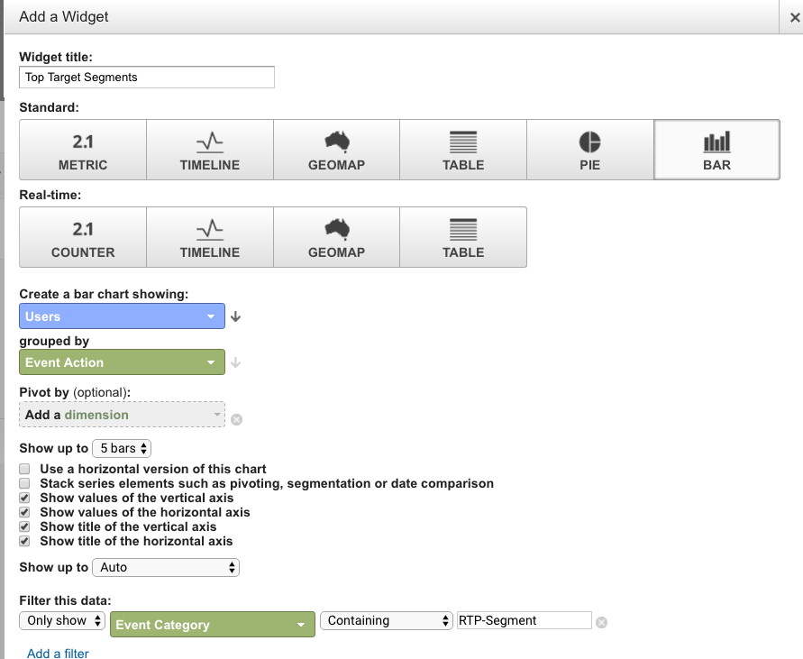

# Google Universal Analytics中的自訂RTP儀表板 {#custom-rtp-dashboards-in-google-universal-analytics}

>[!PREREQUISITES]
>
>[整合RTP與Google Universal Analytics](/help/marketo/product-docs/web-personalization/reporting-for-web-personalization/web-analytics-integrations/integrate-rtp-with-google-universal-analytics.md)

本文說明如何在Google Universal Analytics (GUA)中設定RTP儀表板。 從RTP傳送到GUA的資料可以設定為兩個單獨的自訂儀表板，稱為：

* RTP B2B
* RTP參與

## 設定自訂儀表板 {#setting-up-a-custom-dashboard}

1. 登入Google Analytics。 按一下頂端功能表中的&#x200B;**[!UICONTROL Reporting]**。 按一下&#x200B;**[!UICONTROL Dashboards]**&#x200B;和&#x200B;**[!UICONTROL New Dashboard]**。

   

1. 選取&#x200B;**空白畫布**，新增&#x200B;**儀表板名稱**，然後按一下&#x200B;**[!UICONTROL Create Dashboard]**。

1. 按一下&#x200B;**[!UICONTROL Add Widget]**&#x200B;以建立新的Widget。

   

## RTP B2B控制面板 {#rtp-b-b-dashboard}

此儀表板可讓使用者從B2B角度分析其網站效能。

它提供各種資訊，例如依產業、收入、規模、以帳戶為基礎的清單和目標區段的造訪來源和現場行為。

儀表板包含3欄

* 流量來源
* 分段
* 第一層向下切入

1. 建立名為&#x200B;**RTP B2B儀表板**&#x200B;的新儀表板，並定義下列Widget：

<table> 
 <thead> 
  <tr> 
   <th> 
    

      欄1 — 流量來源
    
</th> 
   <th> 
    
 <strong>欄2 — 分段</strong> 
    
</th> 
   <th> 
    
 <strong>第3欄 — 第一層向下鑽研</strong> 
    
</th> 
  </tr> 
 </thead> 
 <tbody> 
  <tr> 
   <td> 
    <ul> 
     <li>名稱：依區段和管道區分的工作階段</li> 
     <li>Widget型別： 列 </li> 
     <li>建立顯示： 工作階段的橫條圖</li> 
     <li>依分組： 事件標籤</li> 
     <li>樞紐分析依據： 預設通道群組</li> 
     <li>篩選器：  僅顯示 | 事件類別 （包含） RTP區段</li> 
    </ul>

</td> 
   <td> 
    <ul> 
     <li>名稱： RTP分段使用者數</li> 
     <li>型別： 2.1量度</li> 
     <li>顯示下列量度： 使用者 </li> 
     <li>篩選器：  僅顯示 | 事件類別 （包含） RTP區段</li> 
    </ul>

</td> 
   <td> 
    <ul> 
     <li>名稱：依產業區分的工作階段</li> 
     <li>型別： 圓形圖 </li> 
     <li>建立圓形圖，顯示： 工作階段</li> 
     <li>依分組： RTP — 產業</li> 
    </ul>

</td> 
  </tr> 
  <tr> 
   <th> 
    <ul> 
     <li><strong>名稱：依產業和管道區分的工作階段</strong></li> 
     <li><strong>Widget型別： 列</strong></li> 
     <li><strong>建立顯示： 工作階段的橫條圖</strong></li> 
     <li><strong>分組依據： RTP — 產業</strong></li> 
     <li><strong>樞紐分析依據： 預設通道群組</strong> </li> 
    </ul></th> 
   <th> 
    <ul> 
     <li><strong>名稱：依國家/地區劃分的工作階段</strong></li> 
     <li><strong>型別： Geomap</strong></li> 
     <li><strong>繪製選取的量度： 國家/地區 | 個工作階段</strong></li> 
     <li><strong>選取地區： 世界</strong></li> 
     <li><strong>篩選器： 僅顯示 | 事件類別 （包含） RTP區段</strong></li> 
    </ul>

</th> 
   <th> 
    <ul> 
     <li><strong>名稱：按RTP類別排列的階段作業</strong></li> 
     <li><strong>型別： 圓形圖</strong></li> 
     <li><strong>建立圓形圖，顯示： 工作階段</strong></li> 
     <li><strong>分組依據： RTP類別</strong></li> 
    </ul>

</th> 
  </tr> 
  <tr> 
   <th> </th> 
   <th> 
    <ul> 
     <li>名稱：排名在前的目標區段</li> 
     <li>型別： 列</li> 
     <li>建立顯示： 使用者的橫條圖</li> 
     <li>依分組： 事件動作</li> 
     <li>篩選器： 僅顯示 | 事件類別 （包含） RTP區段</li> 
    </ul>

</th> 
   <th> 
    <ul> 
     <li>名稱：按RTP群組排列的階段作業</li> 
     <li>型別：長條圖 </li> 
     <li>建立長條圖，顯示：階段作業</li> 
     <li>分組依據： RTP-Group</li> 
    </ul>

</th> 
  </tr> 
  <tr> 
   <th> </th> 
   <th> 
    <ul> 
     <li>名稱：依排名在前的區段區分的工作階段與目標</li> 
     <li>型別：表格 </li> 
     <li>顯示下列資料行：  事件標籤 | 工作階段 | 目標轉換率</li> 
     <li>篩選器： 僅顯示 | 事件類別（包含） RTP區段</li> 
    </ul>

</th> 
   <th> </th> 
  </tr> 
 </tbody> 
</table>

## RTP參與儀表板 {#rtp-engagement-dashboard}

此儀表板可讓使用者分析其RTP行銷活動績效和建議引擎參與度。 它提供平均值的比較。 工作階段持續時間與每個工作階段頁面介於：

* 未參與
* 參與（個人化行銷活動的曝光數和點按數）
* 按一下推薦引擎和最常推薦的內容

建立名為&#x200B;**RTP參與儀表板**&#x200B;的新儀表板，並定義下列Widget：

<table> 
 <thead> 
  <tr> 
   <th> 
    
 <strong>欄1行銷活動曝光度</strong> 
    
</th> 
   <th> 
    
 <strong>欄2行銷活動點進</strong> 
    
</th> 
   <th> 
    
 <strong>第3欄建議引擎</strong> 
    
</th> 
  </tr> 
 </thead> 
 <tbody> 
  <tr> 
   <td> 
    <ul> 
     <li>名稱： <strong>總CTA （參與度）</strong></li> 
     <li>型別： <strong>2.1量度</strong></li> 
     <li>顯示下列量度： <strong>總事件</strong></li> 
     <li>篩選器： <strong>[僅顯示]事件類別（包含）： RTP-Campaigns</strong> <strong>[僅顯示]事件動作（完全符合）： Impression</strong>[不顯示]事件標籤（包含）： #</li> 
    </ul>

</td> 
   <td> 
    <ul> 
     <li>名稱： <strong>CTA總數（點進）</strong></li> 
     <li>型別： <strong>2.1量度</strong></li> 
     <li>顯示下列量度： <strong>總事件</strong></li> 
     <li>篩選器： <strong>[僅顯示]事件類別（包含）： RTP-Campaigns</strong> <strong>[僅顯示]事件動作（完全相符）：點按次數</strong><strong>[不顯示]事件標籤（包含）： #</strong></li> 
    </ul>

</td> 
   <td> 
    <ul> 
     <li>名稱： <strong>CRE — 總點按</strong></li> 
     <li>型別： <strong>2.1量度</strong> </li> 
     <li>顯示下列量度： <strong>頁面檢視</strong></li> 
     <li>篩選器： <strong>[僅顯示] 頁面 （包含）： rcmd</strong></li> 
    </ul>

</td> 
  </tr> 
  <tr> 
   <td colspan="1"> 
    <ul> 
     <li>名稱： <strong>平均 工作階段持續時間（參與度）</strong></li> 
     <li>型別： <strong>2.1量度</strong></li> 
     <li>顯示下列量度： <strong>平均 工作階段持續時間</strong></li> 
     <li>篩選器： <strong>[僅顯示]事件類別（完全符合）： RTP-Campaigns</strong> <strong>[僅顯示]事件動作（完全符合）： impression</strong><strong>[不顯示]事件標籤（包含）： #</strong></li> 
    </ul>

</td> 
   <td colspan="1"> 
    <ul> 
     <li>名稱： <strong>平均 工作階段持續時間（點進）</strong></li> 
     <li>型別： <strong>2.1量度</strong></li> 
     <li>顯示下列量度： <strong>平均 工作階段持續時間</strong></li> 
     <li>篩選器： <strong>[僅顯示]事件類別（完全符合）： RTP-Campaigns</strong> <strong>[僅顯示]事件動作（完全符合）：點按次數</strong><strong>[不顯示]事件標籤（包含）： #</strong></li> 
    </ul>

</td> 
   <td colspan="1"> 
    <ul> 
     <li>名稱： <strong>CRE — 最常建議的內容</strong></li> 
     <li>型別： <strong>資料表</strong> </li> 
     <li>顯示下列資料行：  <strong>頁面標題 | 頁面檢視</strong> </li> 
     <li>篩選器： 篩選器： <strong>[僅顯示] 頁面 （包含）： rcmd</strong></li> 
    </ul>

</td> 
  </tr> 
  <tr> 
   <td> 
    <ul> 
     <li>名稱： <strong>頁面/工作階段（參與）</strong></li> 
     <li>型別： <strong>2.1量度 </strong></li> 
     <li>顯示下列量度： <strong>頁面/工作階段</strong></li> 
     <li>篩選器： <strong>[僅顯示] 事件類別 （完全符合）： RTP-Campaigns</strong></li> 
     <li><strong>[只顯示] 事件動作 （完全符合）： impression</strong></li> 
     <li><strong>[不顯示] 事件標籤 （包含）： #</strong></li> 
    </ul>

</td> 
   <td> 
    <ul> 
     <li>名稱： <strong>頁面/工作階段（點進）</strong></li> 
     <li>型別： <strong>2.1量度</strong></li> 
     <li>顯示下列量度： <strong>頁面/工作階段</strong></li> 
     <li>篩選器： <strong>[僅顯示]事件類別（完全相符）： RTP — 促銷活動</strong></li> 
     <li><strong>[僅顯示]事件動作（完全相符）：點按</strong></li> 
     <li><strong>[不要顯示]事件標籤（包含）： #</strong></li> 
    </ul>

</td> 
   <td> </td> 
  </tr> 
  <tr> 
   <td> 
    <ul> 
     <li>名稱： <strong>CTA的曝光數</strong></li> 
     <li>型別： <strong>資料表</strong></li> 
     <li>顯示下列資料行： <strong>事件標籤 | 事件總數 | 位使用者</strong></li> 
     <li>篩選器： <strong>[僅顯示] 事件類別 （完全符合）： RTP — 行銷活動</strong> <strong>[僅顯示] 事件動作 （完全符合）： impression</strong><strong>[不顯示] 事件標籤 （包含）： #</strong></li> 
    </ul>

</td> 
   <td> 
    <ul> 
     <li>名稱： <strong>CTA的點進</strong></li> 
     <li>型別： <strong>資料表</strong></li> 
     <li>顯示下列資料行： <strong>事件標籤 | 事件總數 | 位使用者</strong></li> 
     <li>篩選器： <strong>[僅顯示] 事件類別 （完全符合）： RTP — 行銷活動</strong> <strong>[僅顯示] 事件動作 （完全符合）：點按</strong></li> 
    </ul>

</td> 
   <td> </td> 
  </tr> 
 </tbody> 
</table>

>[!MORELIKETHIS]
>
>[整合RTP與Google Universal Analytics](/help/marketo/product-docs/web-personalization/reporting-for-web-personalization/web-analytics-integrations/custom-rtp-reports-in-google-universal-analytics.md)
>
>[Google Universal Analytics中的自訂RTP報告](/help/marketo/product-docs/web-personalization/reporting-for-web-personalization/web-analytics-integrations/custom-rtp-reports-in-google-universal-analytics.md)
