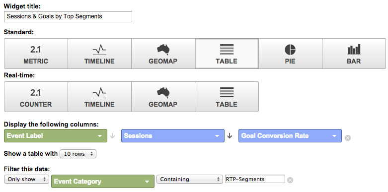

# Google Universal Analytics中的自訂RTP控制面板 {#custom-rtp-dashboards-in-google-universal-analytics}

>[!PREREQUISITES]
>
>[將RTP與Google Universal Analytics整合](/help/marketo/product-docs/web-personalization/reporting-for-web-personalization/web-analytics-integrations/integrate-rtp-with-google-universal-analytics.md)

本文說明如何在Google Universal Analytics(GUA)中設定RTP控制面板。 從RTP傳送至GUA的資料可以設定為兩個獨立的自訂控制面板，稱為：

* RTP B2B
* RTP參與

## 設定自訂控制面板 {#setting-up-a-custom-dashboard}

1. 登入Google Analytics。 按一下 **報表** 的上界。 按一下 **控制面板** 和 **+新增自訂控制面板**.

   

1. 選擇 **空白畫布**，新增 **控制面板名稱** 按一下 **建立控制面板**.

1. 按一下 **新增介面工具集** 來建立新介面工具集。

   

## RTP B2B控制面板 {#rtp-b-b-dashboard}

此控制面板可讓使用者從B2B觀點分析其網站效能。

它提供依產業、收入、大小、帳戶型清單和目標區段的造訪來源和站上行為等資訊。

控制面板包含3欄

* 流量來源
* 區段
* 垂直向下切入

1. 建立名為 **RTP B2B控制面板** 並定義下列小工具：

<table> 
 <thead> 
  <tr> 
   <th> 
    

      第1欄 — 流量來源
    
</th> 
   <th> 
    
 <strong>第2欄 — 分段</strong> 
    
</th> 
   <th> 
    
 <strong>第3欄 — 第一圖表向下鑽取</strong> 
    
</th> 
  </tr> 
 </thead> 
 <tbody> 
  <tr> 
   <td> 
    <ul> 
     <li>名稱：依區段和管道的工作階段</li> 
     <li>介面工具集類型：長條圖 </li> 
     <li>建立長條圖，顯示：工作階段</li> 
     <li>分組依據：事件標籤</li> 
     <li>透視方式：預設管道分組</li> 
     <li>篩選：  僅顯示 |事件類別（包含）RTP — 區段</li> 
    </ul>

</td> 
   <td> 
    <ul> 
     <li>名稱：RTP分段用戶數</li> 
     <li>類型：2.1量度</li> 
     <li>顯示下列量度：使用者 </li> 
     <li>篩選：  僅顯示 |事件類別（包含）RTP — 區段</li> 
    </ul>

</td> 
   <td> 
    <ul> 
     <li>名稱：各產業會議</li> 
     <li>類型：派 </li> 
     <li>建立圓形圖，顯示：工作階段</li> 
     <li>分組依據：RTP-Industry</li> 
    </ul>

</td> 
  </tr> 
  <tr> 
   <th> 
    <ul> 
     <li><strong>名稱：各行業和渠道的會議</strong></li> 
     <li><strong>介面工具集類型：長條圖</strong></li> 
     <li><strong>建立長條圖，顯示：工作階段</strong></li> 
     <li><strong>分組依據：RTP-Industry</strong></li> 
     <li><strong>透視方式：預設管道分組</strong> </li> 
    </ul></th> 
   <th> 
    <ul> 
     <li><strong>名稱：依國家/地區劃分的工作階段</strong></li> 
     <li><strong>類型：Geomap</strong></li> 
     <li><strong>繪製選定度量：國家/地區 |工作階段</strong></li> 
     <li><strong>選取地區：世界</strong></li> 
     <li><strong>篩選：僅顯示 |事件類別（包含）RTP — 區段</strong></li> 
    </ul>

</th> 
   <th> 
    <ul> 
     <li><strong>名稱：按RTP類別列出的會話</strong></li> 
     <li><strong>類型：派</strong></li> 
     <li><strong>建立圓形圖，顯示：工作階段</strong></li> 
     <li><strong>分組依據：RTP類別</strong></li> 
    </ul>

</th> 
  </tr> 
  <tr> 
   <th> </th> 
   <th> 
    <ul> 
     <li>名稱：排名在前的目標區段</li> 
     <li>類型：長條圖</li> 
     <li>建立長條圖，顯示：使用者</li> 
     <li>分組依據：事件動作</li> 
     <li>篩選：僅顯示 |事件類別（包含）RTP — 區段</li> 
    </ul>

</th> 
   <th> 
    <ul> 
     <li>名稱：按RTP組開會</li> 
     <li>類型：長條圖 </li> 
     <li>建立長條圖，顯示：工作階段</li> 
     <li>分組依據：RTP組</li> 
    </ul>
<strong></strong>
</th> 
  </tr> 
  <tr> 
   <th> </th> 
   <th> 
    <ul> 
     <li>名稱：依排名在前的區段的工作階段與目標</li> 
     <li>類型：表格 </li> 
     <li>顯示下列欄：  事件標籤 |工作階段 |目標轉換率</li> 
     <li>篩選：  僅顯示 |事件類別（包含）RTP — 區段</li> 
    </ul>
<strong></strong>
</th> 
   <th> </th> 
  </tr> 
 </tbody> 
</table>

## RTP參與控制面板 {#rtp-engagement-dashboard}

此控制面板可讓使用者分析其RTP促銷活動績效和建議引擎參與。 它提供平均 工作階段持續時間與每個工作階段的頁面之間：

* 未參與
* 參與（個人化行銷活動的曝光次數和點擊次數）
* 建議引擎的點按次數和最高建議內容

建立名為 **RTP參與控制面板** 並定義下列小工具：

<table> 
 <thead> 
  <tr> 
   <th> 
    
 <strong>第1欄促銷活動曝光</strong> 
    
</th> 
   <th> 
    
 <strong>第2欄促銷活動點進</strong> 
    
</th> 
   <th> 
    
 <strong>第3欄建議引擎</strong> 
    
</th> 
  </tr> 
 </thead> 
 <tbody> 
  <tr> 
   <td> 
    <ul> 
     <li>名稱： <strong>CTA總計（參與）</strong></li> 
     <li>類型： <strong>2.1量度 </strong></li> 
     <li>顯示下列量度： <strong>事件總計</strong></li> 
     <li>篩選器： <strong>[僅顯示]事件類別（包含）:RTP — 促銷活動</strong> <strong>[僅顯示]事件動作（完全符合）:曝光</strong><strong>[未顯示]事件標籤（包含）:#</strong></li> 
    </ul>
<strong></strong>
</td> 
   <td> 
    <ul> 
     <li>名稱： <strong>CTA總計（點進）</strong></li> 
     <li>類型： <strong>2.1量度 </strong></li> 
     <li>顯示下列量度： <strong>事件總計</strong></li> 
     <li>篩選器： <strong>[僅顯示]事件類別（包含）:RTP — 促銷活動</strong> <strong>[僅顯示]事件操作（完全匹配）:點按次數</strong><strong>[未顯示]事件標籤（包含）:#</strong></li> 
    </ul>
<strong></strong>
</td> 
   <td> 
    <ul> 
     <li>名稱： <strong>CRE — 點按總次數</strong></li> 
     <li>類型： <strong>2.1量度</strong> </li> 
     <li>顯示下列量度： <strong>頁面檢視</strong></li> 
     <li>篩選： <strong>[僅顯示]頁（包含）:rcmd</strong></li> 
    </ul>

</td> 
  </tr> 
  <tr> 
   <td colspan="1"> 
    <ul> 
     <li>名稱： <strong>平均 工作階段期間（參與）</strong></li> 
     <li>類型： <strong>2.1量度 </strong></li> 
     <li>顯示下列量度： <strong>平均 工作階段期間</strong></li> 
     <li>篩選器： <strong>[僅顯示]事件類別（完全匹配）:RTP — 促銷活動</strong> <strong>[僅顯示]事件操作（完全匹配）:印象</strong><strong>[未顯示]事件標籤（包含）:#</strong></li> 
    </ul>
<strong></strong>
</td> 
   <td colspan="1"> 
    <ul> 
     <li>名稱： <strong>平均 工作階段期間（點進）</strong></li> 
     <li>類型： <strong>2.1量度 </strong></li> 
     <li>顯示下列量度： <strong>平均 工作階段期間</strong></li> 
     <li>篩選器： <strong>[僅顯示]事件類別（完全匹配）:RTP — 促銷活動</strong> <strong>[僅顯示]事件操作（完全匹配）:點按</strong><strong>[未顯示]事件標籤（包含）:#</strong></li> 
    </ul>
<strong></strong>
</td> 
   <td colspan="1"> 
    <ul> 
     <li>名稱： <strong>CRE — 主要建議內容</strong></li> 
     <li>類型： <strong>表格</strong> </li> 
     <li>顯示下列欄：  <strong>頁面標題 |頁面檢視</strong> </li> 
     <li>篩選器： 篩選： <strong>[僅顯示]頁（包含）:rcmd</strong></li> 
    </ul>

</td> 
  </tr> 
  <tr> 
   <td> 
    <ul> 
     <li>名稱： <strong>頁面/工作階段（參與）</strong></li> 
     <li>類型： <strong>2.1量度 </strong></li> 
     <li>顯示下列量度： <strong>頁面/工作階段</strong></li> 
     <li>篩選器： <strong>[僅顯示]事件類別（完全匹配）:RTP — 促銷活動</strong></li> 
     <li><strong>[僅顯示]事件操作（完全匹配）:印象</strong></li> 
     <li><strong>[未顯示]事件標籤（包含）:#</strong></li> 
    </ul>

</td> 
   <td> 
    <ul> 
     <li>名稱： <strong>頁面/工作階段（點進）</strong></li> 
     <li>類型： <strong>2.1量度 </strong></li> 
     <li>顯示下列量度： <strong>頁面/工作階段</strong></li> 
     <li>篩選器： <strong>[僅顯示]事件類別（完全匹配）:RTP — 促銷活動</strong></li> 
     <li><strong>[僅顯示]事件操作（完全匹配）:點按</strong></li> 
     <li><strong>[未顯示]事件標籤（包含）:#</strong></li> 
    </ul>
<strong></strong>
</td> 
   <td> </td> 
  </tr> 
  <tr> 
   <td> 
    <ul> 
     <li>名稱： <strong>依CTA的曝光數</strong></li> 
     <li>類型： <strong>表格</strong></li> 
     <li>顯示下列欄： <strong>事件標籤 |事件總數 |用戶</strong></li> 
     <li>篩選器： <strong>[僅顯示]事件類別（完全匹配）:RTP — 促銷活動</strong> <strong>[僅顯示]事件操作（完全匹配）:印象</strong><strong>[未顯示]事件標籤（包含）:#</strong></li> 
    </ul>

</td> 
   <td> 
    <ul> 
     <li>名稱： <strong>依CTA點進</strong></li> 
     <li>類型： <strong>表格</strong></li> 
     <li>顯示下列欄： <strong>事件標籤 |事件總數 |用戶</strong></li> 
     <li>篩選器： <strong>[僅顯示]事件類別（完全匹配）:RTP — 促銷活動</strong> <strong>[僅顯示]事件操作（完全匹配）:點按</strong></li> 
    </ul>

</td> 
   <td> </td> 
  </tr> 
 </tbody> 
</table>

>[!MORELIKETHIS]
>
>[將RTP與Google Universal Analytics整合](/help/marketo/product-docs/web-personalization/reporting-for-web-personalization/web-analytics-integrations/custom-rtp-reports-in-google-universal-analytics.md)
>
>[Google Universal Analytics中的自訂RTP報表](/help/marketo/product-docs/web-personalization/reporting-for-web-personalization/web-analytics-integrations/custom-rtp-reports-in-google-universal-analytics.md)
