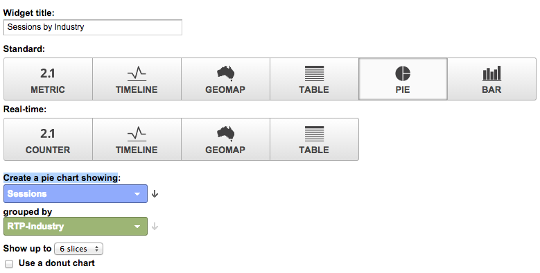
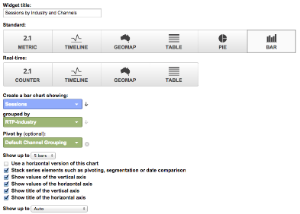

# Google Universal Analytics中的自訂RTP儀表板 {#custom-rtp-dashboards-in-google-universal-analytics}

>[!PREREQUISITES]
>
>[將RTP與Google Universal Analytics整合](integrate-rtp-with-google-universal-analytics.md)

此貼文說明如何在Google Universal Analytics(GUA)中設定RTP儀表板。  從RTP傳送至GUA的資料可以設定為兩個獨立的自訂控制面板，稱為：

* RTP B2B
* RTP參與

## 設定自訂控制面板 {#setting-up-a-custom-dashboard}

1. 登入Google Analytics。 按一下頂端功能表中的**Reporting **。 按一下「**控制面板**和 **+新的自訂控制面板」。**

   

1. 選取「 **空白畫布**」、新增「控制 **面板名稱」** ，然後按一 **下「建立控制面板**」。

1. 按一 **下「新增介面工具集** 」以建立新介面工具集。\
   

## RTP B2B儀表板 {#rtp-b-b-dashboard}

此儀表板可讓使用者從B2B的角度分析其網站效能。

它可依產業、收入、規模、帳戶型清單和目標區段提供造訪來源和站上行為等資訊。

控制面板由3欄組成

* 流量來源
* 區段
* Firmographic向下切入

1. 建立名為**RTP B2B Dashboard **的新控制面板，並定義下列Widget:

<table> 
 <thead> 
  <tr> 
   <th> 
    

      欄1 —— 流量來源 
    
</th> 
   <th> 
    
 <strong>欄2 —— 區段</strong> 
    
</th> 
   <th> 
    
 <strong>Column 3 - Firmographic向下鑽取</strong> 
    
</th> 
  </tr> 
 </thead> 
 <tbody> 
  <tr> 
   <td> 
    <ul> 
     <li>名稱：依區段和頻道的作業</li> 
     <li>介面工具集類型：列 </li> 
     <li>建立長條圖，其中顯示：會話</li> 
     <li>分組依據：事件標籤</li> 
     <li>透視方式：預設渠道群組</li> 
     <li>篩選：  僅顯示 |事件類別（包含）RTP-區段</li> 
    </ul>

</td> 
   <td> 
    <ul> 
     <li>名稱：RTP分段用戶數</li> 
     <li>類型：2.1量度</li> 
     <li>顯示下列量度：使用者 </li> 
     <li>篩選：  僅顯示 |事件類別（包含）RTP-區段</li> 
    </ul>

</td> 
   <td> 
    <ul> 
     <li>名稱：各產業研討會</li> 
     <li>類型：派 </li> 
     <li>建立圓形圖，其中顯示：會話</li> 
     <li>分組依據：RTP-Industry</li> 
    </ul>

</td> 
  </tr> 
  <tr> 
   <th> 
    <ul> 
     <li><strong>名稱：依產業和通道的研討會</strong></li> 
     <li><strong>介面工具集類型：列</strong></li> 
     <li><strong>建立長條圖，其中顯示：會話</strong></li> 
     <li><strong>分組依據：RTP-Industry</strong></li> 
     <li><strong>透視方式：預設渠道群組</strong> </li> 
    </ul></th> 
   <th> 
    <ul> 
     <li><strong>名稱：依國家區分的會議</strong></li> 
     <li><strong>類型：Geomap</strong></li> 
     <li><strong>繪製選取的量度：國家／地區 |工作階段</strong></li> 
     <li><strong>選擇地區：世界</strong></li> 
     <li><strong>篩選：僅顯示 |事件類別（包含）RTP-區段</strong></li> 
    </ul>

</th> 
   <th> 
    <ul> 
     <li><strong>名稱：按RTP類別的會話</strong></li> 
     <li><strong>類型：派</strong></li> 
     <li><strong>建立圓形圖，其中顯示：會話</strong></li> 
     <li><strong>分組依據：RTP類別</strong></li> 
    </ul>

</th> 
  </tr> 
  <tr> 
   <th> </th> 
   <th> 
    <ul> 
     <li>名稱：頂層目標區段</li> 
     <li>類型：列</li> 
     <li>建立長條圖，其中顯示：使用者</li> 
     <li>分組依據：事件動作</li> 
     <li>篩選：僅顯示 |事件類別（包含）RTP-區段</li> 
    </ul>

</th> 
   <th> 
    <ul> 
     <li>名稱：按RTP組的會話</li> 
     <li>類型：列 </li> 
     <li>建立長條圖，其中顯示：會話</li> 
     <li>分組依據：RTP組</li> 
    </ul>
<strong></strong>
</th> 
  </tr> 
  <tr> 
   <th> </th> 
   <th> 
    <ul> 
     <li>名稱：依熱門細分的工作階段和目標</li> 
     <li>類型：表格 </li> 
     <li>顯示下列欄：  事件標籤 |工作階段 |目標轉換率</li> 
     <li>篩選：  僅顯示 |事件類別（包含）RTP-區段</li> 
    </ul>
<strong></strong>
</th> 
   <th> </th> 
  </tr> 
 </tbody> 
</table>

## RTP參與儀表板 {#rtp-engagement-dashboard}

此控制面板可讓使用者分析其RTP促銷活動效能和建議引擎參與。 它提供平均值的比較 會話持續時間和每個會話的頁數介於：

* 

   * 未參與
   * 參與（個人化促銷活動的曝光和點按）
   * 點按建議引擎和主要建議內容

建立名為「 **RTP參與儀表板」的新儀表板** ，並定義下列Widget:

<table> 
 <thead> 
  <tr> 
   <th> 
    
 <strong>第1欄促銷活動曝光度</strong> 
    
</th> 
   <th> 
    
 <strong>欄2促銷活動點進</strong> 
    
</th> 
   <th> 
    
 <strong>第3欄建議引擎</strong> 
    
</th> 
  </tr> 
 </thead> 
 <tbody> 
  <tr> 
   <td> 
    <ul> 
     <li>名稱： <strong>CTA總計（參與）</strong></li> 
     <li>類型： <strong>2.1量度 </strong></li> 
     <li>顯示下列量度： <strong>事件總數</strong></li> 
     <li>篩選器： <strong>[僅顯示]事件類別（包含）:RTP-Campaigns</strong> <strong>[僅顯示]事件操作（完全匹配）:印象</strong><strong>[不顯示]事件標籤（包含）:#</strong></li> 
    </ul>
<strong></strong>
</td> 
   <td> 
    <ul> 
     <li>名稱： <strong>CTA總計（點進）</strong></li> 
     <li>類型： <strong>2.1量度 </strong></li> 
     <li>顯示下列量度： <strong>事件總數</strong></li> 
     <li>篩選器： <strong>[僅顯示]事件類別（包含）:RTP-Campaigns</strong> <strong>[僅顯示]事件操作（完全匹配）:點按</strong><strong>[不顯示]事件標籤（包含）:#</strong></li> 
    </ul>
<strong></strong>
</td> 
   <td> 
    <ul> 
     <li>名稱： <strong>CRE —— 點按總次數</strong></li> 
     <li>類型： <strong>2.1量度</strong> </li> 
     <li>顯示下列量度： <strong>頁面檢視</strong></li> 
     <li>篩選： <strong>[僅顯示]頁面（包含）:rcmd</strong></li> 
    </ul>

</td> 
  </tr> 
  <tr> 
   <td colspan="1"> 
    <ul> 
     <li>名稱： <strong>平均 工作階段持續時間（參與）</strong></li> 
     <li>類型： <strong>2.1量度 </strong></li> 
     <li>顯示下列量度： <strong>平均 工作階段持續時間</strong></li> 
     <li>篩選器： <strong>[僅顯示]事件類別（完全符合）:RTP-Campaigns</strong> <strong>[僅顯示]事件操作（完全匹配）:印象</strong><strong>[不顯示]事件標籤（包含）:#</strong></li> 
    </ul>
<strong></strong>
</td> 
   <td colspan="1"> 
    <ul> 
     <li>名稱： <strong>平均 作業持續時間（點進）</strong></li> 
     <li>類型： <strong>2.1量度 </strong></li> 
     <li>顯示下列量度： <strong>平均 工作階段持續時間</strong></li> 
     <li>篩選器： <strong>[僅顯示]事件類別（完全符合）:RTP-Campaigns</strong> <strong>[僅顯示]事件操作（完全匹配）:點按</strong><strong>[不顯示]事件標籤（包含）:#</strong></li> 
    </ul>
<strong></strong>
</td> 
   <td colspan="1"> 
    <ul> 
     <li>名稱： <strong>CRE —— 主要建議內容</strong></li> 
     <li>類型： <strong>表格</strong> </li> 
     <li>顯示下列欄：  <strong>頁面標題 |頁面檢視</strong> </li> 
     <li>篩選器： 篩選器： <strong>[僅顯示]頁面（包含）:rcmd</strong></li> 
    </ul>

</td> 
  </tr> 
  <tr> 
   <td> 
    <ul> 
     <li>名稱： <strong>頁面／工作階段（參與）</strong></li> 
     <li>類型： <strong>2.1量度 </strong></li> 
     <li>顯示下列量度： <strong>頁面／作業</strong></li> 
     <li>篩選器： <strong>[僅顯示]事件類別（完全符合）:RTP促銷活動</strong></li> 
     <li><strong>[僅顯示]事件操作（完全匹配）:印象</strong></li> 
     <li><strong>[不顯示]事件標籤（包含）:#</strong></li> 
    </ul>

</td> 
   <td> 
    <ul> 
     <li>名稱： <strong>頁面／工作階段（點進）</strong></li> 
     <li>類型： <strong>2.1量度 </strong></li> 
     <li>顯示下列量度： <strong>頁面／作業</strong></li> 
     <li>篩選器： <strong>[僅顯示]事件類別（完全符合）:RTP促銷活動</strong></li> 
     <li><strong>[僅顯示]事件操作（完全匹配）:點擊</strong></li> 
     <li><strong>[不顯示]事件標籤（包含）:#</strong></li> 
    </ul>
<strong></strong>
</td> 
   <td> </td> 
  </tr> 
  <tr> 
   <td> 
    <ul> 
     <li>名稱： <strong>曝光次數（依CTA）</strong></li> 
     <li>類型： <strong>表格</strong></li> 
     <li>顯示下列欄： <strong>事件標籤 |事件總數 |使用者</strong></li> 
     <li>篩選器： <strong>[僅顯示]事件類別（完全符合）:RTP-Campaigns</strong> <strong>[僅顯示]事件操作（完全匹配）:印象</strong><strong>[不顯示]事件標籤（包含）:#</strong></li> 
    </ul>

</td> 
   <td> 
    <ul> 
     <li>名稱： <strong>CTA點進</strong></li> 
     <li>類型： <strong>表格</strong></li> 
     <li>顯示下列欄： <strong>事件標籤 |事件總數 |使用者</strong></li> 
     <li>篩選器： <strong>[僅顯示]事件類別（完全符合）:RTP-Campaigns</strong> <strong>[僅顯示]事件操作（完全匹配）:點擊</strong></li> 
    </ul>

</td> 
   <td> </td> 
  </tr> 
 </tbody> 
</table>

>[!NOTE]
>
>**相關文章**
>
>[將RTP與Google Universal Analytics整合](integrate-rtp-with-google-universal-analytics.md)
>
>[Google Universal Analytics中的自訂RTP報表](custom-rtp-reports-in-google-universal-analytics.md)

