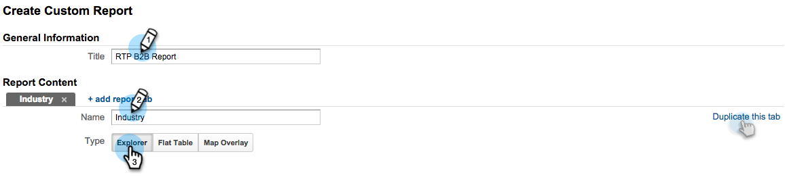
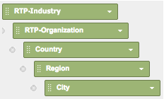
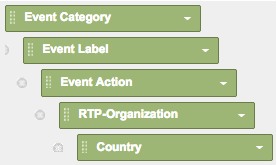

# Google Universal Analytics中的自訂RTP報表 {#custom-rtp-reports-in-google-universal-analytics}

>[!PREREQUISITES]
>
>[將RTP與Google Universal Analytics整合](/help/marketo/product-docs/web-personalization/reporting-for-web-personalization/web-analytics-integrations/integrate-rtp-with-google-universal-analytics.md)

本文說明如何為Google Universal Analytics(GUA)設定RTP自訂報表。  從RTP傳送至GUA的資料可以設定為兩個不同的自訂報表，稱為：

* RTP B2B
* RTP參與

## 設定自訂報表 {#setting-up-a-custom-report}

1. 登入Google Analytics。

1. 按一下 **自訂** 的上界。

1. 按一下 **+新自訂報表**.

## RTP B2B報告 {#rtp-b-b-report}

1. 為報表命名 **RTP B2B報告**.

1. 為第一個標籤命名 **產業**.

>[!NOTE]
>
>您會 **複製此頁簽** 並建立其他類似項目 — 步驟5

1. 選取 **瀏覽器** 報表類型。

   

1. 在 **量度群組** 區段中，選取與您的業務相關的量度。

   a.我們建議下列項目：

   

1. 複製此標籤4次，然後將其命名為：

   1. **產業**
   1. **群組**
   1. **類別**
   1. **ABM**
   1. **組織**

   

1. 在 **Dimension下鑽** 一節中為每個索引標籤設定相關維度，如下所示。

<table> 
 <thead> 
  <tr> 
   <th> 
    

      索引標籤名稱 
    
</th> 
   <th> 
    

      Dimension下鑽
    
</th> 
  </tr> 
 </thead> 
 <tbody> 
  <tr> 
   <td>產業</td> 
   <td></td> 
  </tr> 
  <tr> 
   <td>群組</td> 
   <td></td> 
  </tr> 
  <tr> 
   <td>類別</td> 
   <td></td> 
  </tr> 
  <tr> 
   <td>ABM</td> 
   <td></td> 
  </tr> 
  <tr> 
   <td>組織</td> 
   <td></td> 
  </tr> 
 </tbody> 
</table>

1. 請勿設定任何篩選條件，並將此報表設為可供使用 **所有網站資料** （或在與特定Analytics帳戶相關時進行變更）。

1. 按一下 **儲存**.

   

## RTP參與報告 {#rtp-engagement-report}

1. 為報表命名 **RTP參與報告**.

1. 將第1個索引標籤名稱設為 **所有參與**.

>[!NOTE]
>
>您將複製此標籤並建立其他類似標籤 — 步驟5)

1. 選取 **瀏覽器** 報表類型。

   

1. 在「量度群組」區段中，選取與您的業務相關的量度。 建議如下：

   

1. 複製此標籤4次，然後將其命名為：

   1. **所有參與**
   1. **各產業參與度**
   1. **按組列出的參與**
   1. **按類別列出的參與**
   1. **《反導條約》的參與**

   

1. 在 **Dimension下鑽** 一節中為每個索引標籤設定相關維度，如下所示：

<table> 
 <thead> 
  <tr> 
   <th> 
    

      索引標籤名稱 
    
</th> 
   <th> 
    

      Dimension下鑽 
    
</th> 
  </tr> 
 </thead> 
 <tbody> 
  <tr> 
   <td>所有參與</td> 
   <td></td> 
  </tr> 
  <tr> 
   <td>《反導條約》的參與</td> 
   <td></td> 
  </tr> 
  <tr> 
   <td>按類別列出的參與</td> 
   <td></td> 
  </tr> 
  <tr> 
   <td>按組列出的參與</td> 
   <td></td> 
  </tr> 
  <tr> 
   <td>各產業參與度</td> 
   <td></td> 
  </tr> 
 </tbody> 
</table>

1. 設定下列篩選：

<table> 
 <thead> 
  <tr> 
   <th> 
    

      Inc/Exc 
    
</th> 
   <th> 
    

      欄位 
    
</th> 
   <th> 
    

      符合類型 
    
</th> 
   <th> 
    

      值 
    
</th> 
   <th colspan="1"> 
    

      註解 
    
</th> 
  </tr> 
 </thead> 
 <tbody> 
  <tr> 
   <td>
包含
</td> 
   <td>
事件類別
</td> 
   <td>Regex</td> 
   <td>RTP — 促銷活動|RTP-Recommendations|RTP — 區段</td> 
   <td colspan="1">將篩選與RTP無關的所有其他自訂事件</td> 
  </tr> 
  <tr> 
   <td>排除</td> 
   <td>事件標籤</td> 
   <td>Regex</td> 
   <td>#</td> 
   <td colspan="1">可讓您在促銷活動名稱中使用#從報表促銷活動中篩選</td> 
  </tr> 
 </tbody> 
</table>

1. 將此報告設定為可供 **所有網站資料** （或視需要變更）。

   

1. 按一下 **儲存**.

>[!MORELIKETHIS]
>
>[將RTP與Google Universal Analytics整合](/help/marketo/product-docs/web-personalization/reporting-for-web-personalization/web-analytics-integrations/integrate-rtp-with-google-universal-analytics.md)
>
>[Google Universal Analytics中的自訂RTP控制面板](/help/marketo/product-docs/web-personalization/reporting-for-web-personalization/web-analytics-integrations/custom-rtp-dashboards-in-google-universal-analytics.md)
