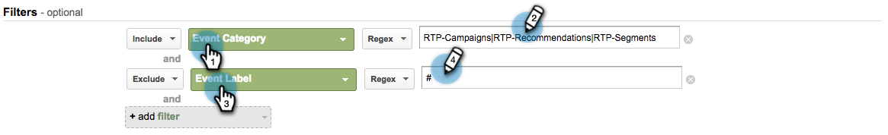

# Google Universal Analytics中的自訂RTP報表 {#custom-rtp-reports-in-google-universal-analytics}

>[!PREREQUISITES]
>
>[將RTP與Google Universal Analytics整合](/help/marketo/product-docs/web-personalization/reporting-for-web-personalization/web-analytics-integrations/integrate-rtp-with-google-universal-analytics.md)

本文說明如何設定Google Universal Analytics (GUA)的RTP自訂報表。  從RTP傳送到GUA的資料可以設定為兩個單獨的自訂報告，稱為：

* RTP B2B
* RTP參與

## 設定自訂報表 {#setting-up-a-custom-report}

1. 登入Google Analytics。

1. 按一下 **自訂** 在頂端功能表中。

1. 按一下 **+新增自訂報表**.

## RTP B2B報表 {#rtp-b-b-report}

1. 為報表命名 **RTP B2B報表**.

1. 為第一個標籤命名 **產業**.

>[!NOTE]
>
>您會 **複製此索引標籤** 和建立其他類似專案 — 步驟5)

1. 選取 **總管** 報告型別。

   

1. 在 **量度群組** 區段，選取與您的業務相關的量度。

   a.我們建議下列專案：

   

1. 複製此索引標籤4次並命名它們：

   1. **產業**
   1. **群組**
   1. **類別**
   1. **ABM**
   1. **組織**

   

1. 在 **Dimension深入研究** 區段會設定每個標籤的相關維度，如下所示。

<table> 
 <thead> 
  <tr> 
   <th> 
    

      標簽名稱 
    
</th> 
   <th> 
    

      Dimension深入研究
    
</th> 
  </tr> 
 </thead> 
 <tbody> 
  <tr> 
   <td>產業</td> 
   <td></td> 
  </tr> 
  <tr> 
   <td>群組</td> 
   <td></td> 
  </tr> 
  <tr> 
   <td>類別</td> 
   <td></td> 
  </tr> 
  <tr> 
   <td>ABM</td> 
   <td></td> 
  </tr> 
  <tr> 
   <td>組織</td> 
   <td></td> 
  </tr> 
 </tbody> 
</table>

1. 請勿設定任何篩選器，並將此報表設定為可用於 **所有網站資料** （如果與特定Analytics帳戶相關，則加以變更）。

1. 按一下 **儲存**.

   

## RTP參與報告 {#rtp-engagement-report}

1. 為報表命名 **RTP參與報告**.

1. 將第一個索引標簽名稱設為 **所有參與**.

>[!NOTE]
>
>您將複製此索引標籤並建立其他類似索引標籤 — 步驟5)

1. 選取 **總管** 報告型別。

   

1. 在「量度群組」段落中，選取與您的業務相關的量度。 建議如下：

   

1. 複製此索引標籤4次並命名它們：

   1. **所有參與**
   1. **各產業參與度**
   1. **依群組的參與**
   1. **依類別的參與**
   1. **ABM的參與**

   

1. 在 **Dimension深入研究** 區段會設定每個標籤的相關維度，如下所示：

<table> 
 <thead> 
  <tr> 
   <th> 
    

      標簽名稱 
    
</th> 
   <th> 
    

      Dimension深入研究 
    
</th> 
  </tr> 
 </thead> 
 <tbody> 
  <tr> 
   <td>所有參與</td> 
   <td></td> 
  </tr> 
  <tr> 
   <td>ABM的參與</td> 
   <td></td> 
  </tr> 
  <tr> 
   <td>依類別的參與</td> 
   <td></td> 
  </tr> 
  <tr> 
   <td>依群組的參與</td> 
   <td></td> 
  </tr> 
  <tr> 
   <td>各產業參與度</td> 
   <td></td> 
  </tr> 
 </tbody> 
</table>

1. 設定下列篩選器：

<table> 
 <thead> 
  <tr> 
   <th> 
    

      公司/分公司 
    
</th> 
   <th> 
    

      欄位 
    
</th> 
   <th> 
    

      相符型別 
    
</th> 
   <th> 
    

      值 
    
</th> 
   <th colspan="1"> 
    

      註解 
    
</th> 
  </tr> 
 </thead> 
 <tbody> 
  <tr> 
   <td>
包含
</td> 
   <td>
事件類別
</td> 
   <td>規則運算式</td> 
   <td>RTP-Campaigns|RTP-Recommendations|RTP-Segments</td> 
   <td colspan="1">將篩選與RTP無關的所有其他自訂事件</td> 
  </tr> 
  <tr> 
   <td>排除</td> 
   <td>事件標籤</td> 
   <td>規則運算式</td> 
   <td>#</td> 
   <td colspan="1">可讓您使用行銷活動名稱中的#從報表行銷活動中進行篩選</td> 
  </tr> 
 </tbody> 
</table>

1. 將此報告設定為可用於 **所有網站資料** （或視需要變更）。

   

1. 按一下 **儲存**.

>[!MORELIKETHIS]
>
>[將RTP與Google Universal Analytics整合](/help/marketo/product-docs/web-personalization/reporting-for-web-personalization/web-analytics-integrations/integrate-rtp-with-google-universal-analytics.md)
>
>[Google Universal Analytics中的自訂RTP儀表板](/help/marketo/product-docs/web-personalization/reporting-for-web-personalization/web-analytics-integrations/custom-rtp-dashboards-in-google-universal-analytics.md)
