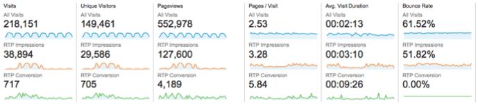

# 將RTP與Google Analytics {#integrate-rtp-with-google-analytics}整合

>[!NOTE]
>
>Universal Analytics現在是作業標準，Google中的所有屬性都已升級為Universal Analytics。
>
>本文說明如何使用舊版Google Standard Analytics，但我們建議您切換至Universal Analytics。
>
>如果您尚未使用[analytics.js追蹤代碼](https://developers.google.com/analytics/devguides/collection/analyticsjs/),Google強烈建議您重新標籤網站以使用它。 Google不建議使用下列項目：
>
>* ga.js
>* urchin.js
>* WAP/伺服器端程式碼片段
>* YT /每月
>* 自訂變數
>* 使用者定義的變數

>
>
瞭解如何將[Web個人化與Universal Analytics整合](integrate-rtp-with-google-universal-analytics.md)

## 簡介{#introduction}

從新角度分析您的網頁分析，使用從Marketo Real-Time Personalization(RTP)到Google Analytics(GA)帳戶的直接資料流。 根據組織、產業和RTP促銷活動，在GA中測量您的網路瀏覽。 檢視量度，例如GA中的產業類型或RTP區段，以及它們如何根據不同的流量來源（社交、付費、有機）執行和產生潛在客戶，分析促銷活動的點按率，並測量個人化促銷活動對您網站的影響。 利用此功能，從您的RTP帳戶中獲得最大的好處

**RTP觀眾分析**

透過整合，您的GA帳戶有了新的維度。 RTP可自動增強您的控制面板，包括：

1. 組織與產業
1. RTP中的自訂區段
1. 帳戶型行銷清單

專注於您的主要B2B潛在客戶。 依目標產業和細分分析通道。

## 渠道報表{#channel-report}

RTP B2B儀表板可協助您瞭解依垂直產業和RTP區段劃分的訪客。 您可以根據金融行業和不同的行銷活動（付費、自然、社交），來查看訪客績效。 控制面板也提供RTP區段執行方式的高階概述，並向下切入以顯示造訪您網站的頂層組織。

## 行為流{#behavioral-flow}

「行為流量」報表（請參閱影像）可視覺化訪客從一個頁面或事件到下一個頁面的路徑。 此影像範例顯示金融業所有訪客的路徑。 此報告可協助您發現哪些內容可讓訪客參與您的網站。

## RTP效能{#rtp-performance}

測量您的RTP促銷活動，並將它們與您的整體網站平均值建立關聯。 瞭解這些促銷活動如何影響您的網站量度，並使用這些資料將個人化努力集中在正確的目標上。 產生自訂報表，以深入瞭解個人化促銷活動的執行方式。

## 使用Google Analytics {#setting-up-rtp-with-google-analytics}設定RTP

1. 將電子郵件[`[email protected]`](https://docs.marketo.com/cdn-cgi/l/email-protection#0674727628616734466b67746d6372692865696b)新增為「讀取並分析」使用者至您的GA帳戶。 如需詳細資訊，請參閱[這裡](https://support.google.com/analytics/answer/2884495?hl=en)。
1. 在您的RTP帳戶中。 前往&#x200B;**帳戶設定**。

   

1. 在&#x200B;**帳戶設定**、**網域**&#x200B;和&#x200B;**Analytics**&#x200B;下
1. 按一下** 「Google Analytics」。**
1. 開啟相關的&#x200B;**自訂變數**&#x200B;和&#x200B;**事件**，將此資料從RTP附加至Google Analytics。
1. 輸入&#x200B;**插槽**&#x200B;編號以傳送自訂變數資料（預設為1,2）。

按一下&#x200B;**SAVE**。

>[!NOTE]
>
>為了傳送區段資料至GA，在RTP平台的[編輯區段頁面](/help/marketo/product-docs/web-personalization/using-web-segments/create-a-basic-web-segment.md)下方，選取核取方塊&#x200B;**區段符合時傳送事件至Google Analytics**。

## 使用RTP資料{#setting-up-google-analytics-reports-with-rtp-data}設定Google Analytics報表

在Google Analytics中，您可以使用儀表板、GA分段和報告來檢視RTP資料：

* [控](https://support.google.com/analytics/answer/1068216?hl=en) 制面板提供網站效能的概述。
* 「GA區段」是用來篩選GA介面中的訪客，並檢視每個區段的流量。 瞭解如何在此處建立區段。
* 建立[自訂報表](https://support.google.com/analytics/answer/1033013?hl=en)以檢視和／或設定排程電子郵件。 請參閱「自訂>新增自訂報表」下方。
