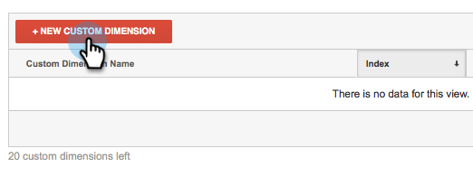

# 將RTP與[!DNL Google Universal Analytics]整合 {#integrate-rtp-with-google-universal-analytics}

## 介紹 {#intro}

善用[!DNL Google Universal Analytics] (GUA)與[!DNL Marketo Real-Time Personalization]的(RTP)影像和個人化資料，以更佳地測量和分析您的線上行銷工作。

此文章說明如何設定及整合[!DNL Marketo Real-Time Personalization] (RTP)平台與[!DNL Google Universal Analytics] (GUA)帳戶。 RTP資料可附加至您的GUA帳戶，讓您檢視並檢視造訪您網站的組織、產業、電影和RTP區段的效能。

**[!DNL Google Universal Analytics]**

包含RTP資料的[!DNL Google Universal Analytics]可讓您更瞭解B2B使用者如何與您的線上內容互動，並協助測量個人化行銷活動並取得更好的結果。 [深入瞭解 [!DNL Google Universal Analytics]](https://support.google.com/analytics/answer/2790010/?hl=en&authuser=1)。

>[!NOTE]
>
>**僅適用於Google Tag Manager使用者**
>
>無需執行編碼或特殊設定。 請務必完成下列檢查清單：
>
>* RTP維度是在[!DNL Google Universal Analytics]中建立
>* 已在Google Tag Manager中正確安裝[RTP標籤](https://docs.marketo.com/display/public/DOCS/Implementing+RTP+using+Google+Tag+Manager)
>* RTP的帳戶設定已啟用[!DNL Google Universal Analytics]整合
>* 已在Google Tag Manager[[!DNL Google Universal Analytics] 中正確設定](https://support.google.com/tagmanager/answer/6107124?hl=en)標籤
>* [Google Tag Manager標籤已正確安裝您的網站](https://developers.google.com/tag-manager/quickstart)

## 在GUA中設定自訂維度 {#set-up-custom-dimensions-in-gua}

1. 在Google Analytics中，

   1. 前往&#x200B;**[!UICONTROL Admin]**
   1. 選取&#x200B;**[!UICONTROL Account].**
   1. 選取&#x200B;**[!UICONTROL Property].**
   1. 選取&#x200B;**[!UICONTROL Custom Definitions]**&#x200B;和&#x200B;**[!UICONTROL Custom Dimensions]**。

      

1. 新增自訂維度。 按一下 **[!UICONTROL +New Custom Dimension]**

   

1. 新增下列&#x200B;**[!UICONTROL Custom Dimensions]：**

<table> 
 <tbody> 
  <tr> 
   <td>
<strong>自訂Dimension名稱</strong>
</td> 
   <td>
<strong>範圍</strong>
</td> 
   <td>
<strong>作用中</strong>
</td> 
  </tr> 
  <tr> 
   <td>
<strong>RTP組織</strong>
</td> 
   <td>
Session
</td> 
   <td>
✓
</td> 
  </tr> 
  <tr> 
   <td>
<strong>RTP — 產業</strong>
</td> 
   <td>
Session
</td> 
   <td>
✓
</td> 
  </tr> 
  <tr> 
   <td>
<strong>RTP — 類別</strong>
</td> 
   <td>
Session
</td> 
   <td>
✓
</td> 
  </tr> 
  <tr> 
   <td>
<strong>RTP群組</strong>
</td> 
   <td>
Session
</td> 
   <td>
✓
</td> 
  </tr> 
 </tbody> 
</table>

>[!NOTE]
>
>**自訂Dimension名稱**&#x200B;必須與上表中的定義完全相同（否則GUA中的自訂RTP儀表板和報告將無法正確顯示）

1. 新增&#x200B;**[!UICONTROL Name]**。 選取範圍作為&#x200B;**[!UICONTROL Session]**。 按一下「**[!UICONTROL Create]**」。

   

您的自訂Dimension清單應如下所示。

在GUA中啟動自訂維度後，請前往RTP平台以在RTP中啟用這些維度。

## 在您的RTP帳戶中啟用GUA整合 {#activate-the-gua-integration-in-your-rtp-account}

1. 在RTP平台中，移至&#x200B;**[!UICONTROL Account Settings].**

   

1. 在&#x200B;**[!UICONTROL Account Settings]**&#x200B;底下，按一下&#x200B;**[!UICONTROL Domain]**。
1. 在&#x200B;**[!UICONTROL Analytics]**&#x200B;底下，按一下&#x200B;**[!UICONTROL Google Universal Analytics]**。
1. 開啟&#x200B;**[!UICONTROL On]**&#x200B;相關的自訂維度和事件，將此資料從RTP附加至[!DNL Google Universal Analytics]。
1. 輸入與GUA中索引編號對齊的維度的&#x200B;**[!UICONTROL Index number]**。
1. 按一下「**[!UICONTROL Save]**」。

>[!NOTE]
>
>自訂Dimension的索引編號可在歸安區的自訂維度下找到。
>
>範例： RTP產業索引編號等於1，RTP組織索引編號等於2。

## 移除Google Analytics中的舊儀表板 {#remove-old-dashboards-in-google-analytics}

1. 在Google Analytics中。 移至&#x200B;**[!UICONTROL Reporting].**
1. 按一下&#x200B;**[!UICONTROL Dashboards].**
1. 選取&#x200B;**[!UICONTROL Dashboard]** （RTP B2B或RTP效能）
1. 按一下「**[!UICONTROL Delete Dashboard]**」。

