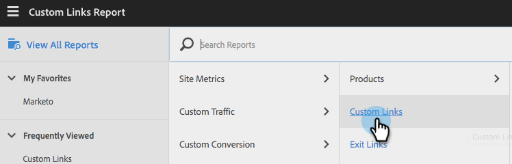

# 整合Adobe Analytics {#integrate-with-adobe-analytics}

## 介紹 {#intro}

檢視Adobe Analytics帳戶中的組織、產業和[!DNL Marketo Real-Time Personalization] (RTP)行銷活動資料，從B2B角度分析您的網站分析。

此檔案可啟用[!DNL Marketo Real-Time Personalization] (RTP)與Adobe Adobe Analytics之間的整合。 來自RTP的資料可讓您偵測和分析所有產業區段和造訪您網站的組織中的趨勢，並測量RTP行銷活動的有效性，提供深入見解和分析，以獲得最佳結果。

您可以檢視每個區段的新訪客與回訪訪客數量等量度，分析行銷活動的點按率，並找出哪些產業和自訂區段和即時行銷活動產生最佳轉換潛在客戶，藉此達成此目標。 利用此功能從您的RTP帳戶中獲得最大利益。

## RTP AUDIENCE ANALYTICS {#rtp-audience-analytics}

透過RTP - AA整合，您的網頁分析介面中會有新的維度。 RTP會透過以下功能自動增強您的Web Analytics控制面板：

1. 組織和產業資料
1. 自訂的RTP區段
1. 具名帳戶清單(Account-Based Marketing)

這樣可強化您的B2B資料，並可讓您透過最佳化以下專案而聚焦於相關訪客：

1. 傳出頻道
1. 內容
1. 重新鎖定目標對象

## 管道報表 {#channel-report}

RTP儀表板可協助您根據垂直和RTP區段來瞭解訪客的劃分情形。 您可以根據產業和與該產業相關的不同行銷活動（付費、有機、社交）來檢視訪客成效。 控制面板也提供訪客根據其產業型別所檢視之網站區段的高層級概觀。

## 行為報表 {#behavioral-report}

根據組織、產業和RTP區段資料，可在Adobe Analytics中建立不同的行為報表。 這些流量報表可將訪客從某個頁面或事件前往下一個頁面的路徑視覺化。 此報表可協助您探索哪些內容可讓訪客持續參與您的網站。

## RTP效能 {#rtp-performance}

在Adobe Analytics的「自訂連結」下檢視RTP促銷活動曝光數和轉換數。

此自訂連結報表會以下列命名格式顯示行銷活動的曝光次數和轉換次數：

* 印象ISegment： [RTP區段名稱]，ICampaign： [RTP促銷活動名稱]
* 轉換ISegment： [RTP區段名稱]，ICampaign： [RTP促銷活動名稱]

## 在Adobe Analytics中設定 {#set-up-in-adobe-analytics}

此整合使用Adobe Analytics提供的JavaScript API。 整合中使用自訂轉換變數(eVar)、自訂事件（事件）和流量變數。 「全部」都必須在AA管理員中啟用。 您必須在A中設定轉換變數、自訂事件和流量變數，否則將無法檢視套裝中的資料，即使您在RTP中啟用該功能亦然。

請完成下列步驟，在AA中設定這些變數：

1. 前往您AA帳戶中的&#x200B;**[!UICONTROL Admin Tools]**。
1. 選取要與整合搭配使用的&#x200B;**[!UICONTROL Report Suite]**。
1. 在&#x200B;**[!UICONTROL Edit Settings]**&#x200B;底下，移至&#x200B;**[!UICONTROL Conversion]**&#x200B;並選取&#x200B;**[[!UICONTROL Conversion Variables]](https://microsite.omniture.com/t2/help/en_US/reference/#Edit_conversion_variables)**。
選取[轉換變數](https://microsite.omniture.com/t2/help/en_US/reference/#Conversion_Variables_eVar)數字（我們建議）：

   1. 適用於產業自訂轉換的Evar # 20
   1. 適用於組織自訂轉換的Evar # 21

   >[!NOTE]
   >
   >如果採用這些#，請選取其他可用的數字。 將此號碼與「RTP帳戶設定」中的位置號碼對齊。

   1. 變更狀態為_[!UICONTROL Enabled_]。

      1. 將名稱變更為&#x200B;**產業**&#x200B;和&#x200B;**組織**。 （這是該變數在報表套裝中的顯示方式。）

      1. 將[過期時間]欄位變更為&#x200B;**[!UICONTROL Visit]**。

1. 在&#x200B;**[!UICONTROL Edit Settings]**&#x200B;下移至&#x200B;**[!UICONTROL Conversion]**&#x200B;並選取&#x200B;**[[!UICONTROL Success Events]](https://microsite.omniture.com/t2/help/en_US/reference/#Configure_success_events)**。

   1. 選取自訂成功事件事件編號（我們建議）：

      1. RTP行銷活動的event20
      1. RTP區段的event21

      >[!NOTE]
      >
      >如果採用這些#，請選取其他可用的數字。 將此號碼與「RTP帳戶設定」中的位置號碼對齊。

      1. 將兩個事件名稱變更為&#x200B;**RTP行銷活動**&#x200B;和&#x200B;**RTP區段**。 這是會出現在報表套裝中的名稱。

   1. 選取[型別]欄位為&#x200B;**計數器（無子關聯）**

1. 在&#x200B;**[!UICONTROL Edit Settings]**&#x200B;底下，移至&#x200B;**[流量](https://microsite.omniture.com/t2/help/en_US/reference/#Traffic_Variable)**&#x200B;並選取&#x200B;**[流量變數](https://microsite.omniture.com/t2/help/en_US/reference/#Enable_traffic_variable_reports)**。

   1. 選取流量變數屬性# （建議使用）：

      1. 屬性# 20 — 名稱：RTP區段組織
      1. 屬性# 21 — 名稱：RTP區段產業
      1. 屬性# 25 — 名稱：促銷活動組織
      1. 屬性# 26 — 名稱：RTP促銷活動產業

      >[!NOTE]
      >
      >如果採用這些#，請選取其他可用的數字。 將此號碼與RTP帳戶設定中的位置號碼對齊)

      1. 變更4個屬性名稱。 這是會出現在報表套裝中的名稱。

   1. 選取[!UICONTROL Enabled]欄位至&#x200B;**[!UICONTROL Enabled]**。

   1. 選取[!UICONTROL Path Reports]欄位至&#x200B;**[!UICONTROL Enabled]**。

## 在[!DNL Marketo Real-Time Personalization] (RTP)中設定 {#set-up-in-marketo-real-time-personalization-rtp}

1. 在RTP平台中，移至&#x200B;**[!UICONTROL Account Settings]**。

   

1. 在&#x200B;**[!UICONTROL Account Settings]**&#x200B;底下，按一下&#x200B;**[!UICONTROL Domain]**。
1. 在&#x200B;**[!UICONTROL Analytics]**&#x200B;底下，按一下&#x200B;**Adobe Analytics**。
1. 將&#x200B;**[!UICONTROL On]**&#x200B;轉換、自訂和流量變數切換。
1. 指派轉換、事件和流量變數&#x200B;**位置編號**&#x200B;以符合AA中建立的位置編號
1. 按一下「**[!UICONTROL Save]**」。

>[!NOTE]
>
>我們建議的時隙設定為
>
>**轉換變數**
>
>* [!UICONTROL Industry Custom Conversions] — 插槽20
>* [!UICONTROL Organization Custom Conversions] — 插槽21
>
>**自訂事件**
>
>* [!UICONTROL Campaign Custom Event] — 插槽20
>* [!UICONTROL Segment Custom Event] — 插槽21
>
>**流量變數**
>
>* [!UICONTROL Segment Organization Traffic Variable] — 插槽20
>* [!UICONTROL Segment Industry Traffic Variable] — 插槽21
>* [!UICONTROL Campaign Organization Traffic Variable] — 插槽22
>* [!UICONTROL Campaign Industry Traffic Variable] — 插槽23
>
>**請確定這些位置編號與AA中建立的變數和事件編號一致。**

## 報表 {#reports}

根據組織名稱、產業和RTP區段以及即時行銷活動資料，建立增強的SiteAdobe Analytics報表。

AA中的自訂報告和儀表板範例包括：

* 依產業或定義區段（以帳戶為基礎的具名清單）的績效
* 根據KPI績效的產業劃分
* 每個組織檢視的頁面數
* 根據組織、產業、區段的行銷管道績效

**報告範例 —**

**熱門產業報告**

**組織報表**

**正在建立RTP儀表板**

建立[新儀表板](https://microsite.omniture.com/t2/help/en_US/sc/user/t_dashboard_add.html)，稱為&#x200B;**RTP儀表板**。 此儀表板有助於瞭解根據垂直和RTP區段劃分訪客的情況。

1. 按一下&#x200B;**[!UICONTROL Dashboard]，**&#x200B;按一下&#x200B;**[!UICONTROL Add Dashboard]**。

1. 命名儀表板&#x200B;**RTP儀表板**。

1. 選取&#x200B;**儀表板大小** 3 x 2， 2 x 2。

1. 建立[小報表](https://microsite.omniture.com/t2/help/en_US/sc/user/t_dashboard_add_report.html#task_EC3AFBBAA51C45CEBAF632F841C305B3)並將[內容新增到儀表板](https://docs.marketo.com/Add%2520content%2520to%2520a%2520dashboard)。

將產業小報表新增到控制面板

1. 移至&#x200B;**[!UICONTROL Custom Conversions]**，按一下&#x200B;**[!UICONTROL Industry]**。

1. 將圖表設定為&#x200B;**圓形圖**。

1. 按一下&#x200B;**[!UICONTROL Dashboard]**，新增&#x200B;**[!UICONTROL Reportlet]**。

1. 為報告命名&#x200B;**熱門產業**。

1. 放在儀表板&#x200B;**RTP儀表板**&#x200B;中。

1. 建立&#x200B;**新**。

新增區段小報表至控制面板

1. 移至&#x200B;**[!UICONTROL Site Metrics]**。 按一下&#x200B;**[!UICONTROL Custom Events]**，**[!UICONTROL Segments]**。

1. 將圖表設定為&#x200B;**垂直條**。

1. 按一下&#x200B;**[!UICONTROL Dashboard]**，新增&#x200B;**[!UICONTROL Reportlet]**。

1. 為報表命名&#x200B;**排名最前的區段**。

1. 放在儀表板&#x200B;**RTP儀表板**&#x200B;中。

1. 建立&#x200B;**新**。

您的小報表會顯示在控制面板中。

## 在Adobe Analytics中檢視曝光數和點按數（轉換） {#view-impressions-and-clicks-conversions-in-adobe-analytics}

1. 按一下&#x200B;**[!UICONTROL Custom]連結**。

   

1. 搜尋曝光數，以檢視代表行銷活動曝光數的區段和行銷活動名稱。
   

1. 搜尋轉換，以檢視代表促銷活動點按次數的區段和促銷活動名稱。

   
