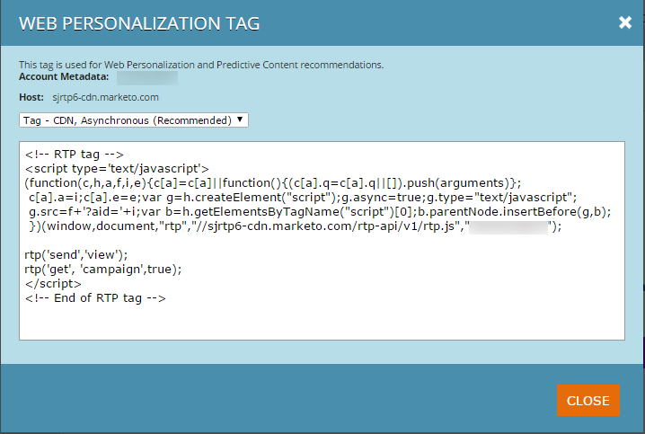

# 部署 RTP JavaScript {#deploy-the-rtp-javascript}

若要產生和設定您的RTP標籤，請遵循下列安裝指示

## [!UICONTROL Generate Tag] {#generate-tag}

1. 登入您的RTP帳戶。 前往 **[!UICONTROL Account Settings]**。

   

1. 在&#x200B;**[!UICONTROL Domain]**&#x200B;和&#x200B;**[!UICONTROL Domain Configuration]**&#x200B;中，找到相關網域並按一下&#x200B;**[!UICONTROL Generate Tag]**。

   

1. 將網頁Personalization (RTP)標籤複製並貼到您的網站中。

   

   >[!NOTE]
   >
   >複製RTP JavaScript標籤，並將其貼上為頁面標頭中的第一個指令碼，介於`<head> </head>`個標籤之間。

   請確定標籤出現在所有頁面上，包括登陸頁面和子網域。 請在您網站的頁面上按一下滑鼠右鍵，以勾選此選項。 前往在網頁瀏覽器中檢視頁面Source 。 搜尋： &#39;RTP&#39;。

1. [!UICONTROL Tag]切換設定為&#x200B;**[!UICONTROL ON]**。

   確認[!UICONTROL Tag]切換設定為[!UICONTROL ON]。 您應該會開始看到資料流入組織的標籤。

   您現在已經設定好RTP標籤，可以開始[建立區段](/help/marketo/product-docs/web-personalization/using-web-segments/create-a-basic-web-segment.md)和即時行銷活動！

1. 確認標籤位於所有頁面上。
