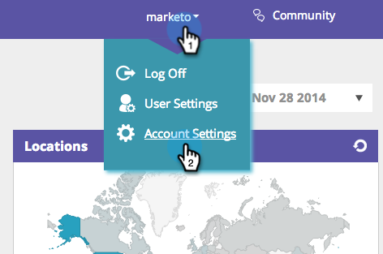

# 使用Adobe Tag Manager實作RTP {#implementing-rtp-using-adobe-tag-manager}

若要實作您的RTP標籤，請遵循下列安裝指示：

1. 登入您的RTP帳戶。

1. 前往 **帳戶設定**.

   a.如果您已從「支援」收到JavaScript標籤，請繼續執行步驟4。

   

1. 在「網域」下，找到相關網域並按一下 **產生標籤**.

   

1. 登入您的Dynamic Tag Manager帳戶([https://dtm.adobe.com/sign_in](https://dtm.adobe.com/sign_in))。

1. 前往 **控制面板。** 按一下相關的Web屬性。

   

1. 前往 **規則**，按一下 **建立新規則**.

1. 填寫下列內容

   1. 名稱： **Marketo RTP**
   1. 條件（折疊）:觸發規則於 —  **頁面頂端**
   1. Javascript（折疊）:按一下 **新增指令碼**

   

1. 呼叫新標籤： **Marketo RTP標籤**

1. 從RTP標籤中移除下列程式碼

   * ``

1. 貼上RTP JavaScript標籤。

   

   >[!CAUTION]
   >
   >請務必移除所有標籤，並僅保留指令碼本身（否） `` )

1. 按一下 **儲存程式碼** 在指令碼編輯器和 **儲存規則** 在規則編輯器中。

1. 在「規則」面板中，找到Marketo RTP頁面載入規則，並在 **動作** 下拉式選擇 **啟動規則**.

   

1. **驗證** 顯示在所有頁面上（包括登錄頁面和子網域）。

   若要這麼做，請在網站的頁面上按一下滑鼠右鍵。 前往 **Inspect元素**，按一下 **網路**，搜尋： **RTP**.
