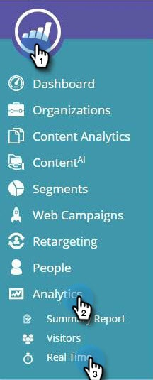

# Web Personalization概覽 {#web-personalization-overview}

## 簡介 {#introduction}

對於新的Marketo客戶，即時個人化分為四個應用程式，使用下列兩個圖磚進行存取： Web個人化和ContentAI。

 

>[!NOTE]
>
>Web Personalization和ContentAI提供所有Marketo支援的語言版本（英文、法文、德文、日文、葡萄牙文、西班牙文）。

現有客戶可繼續透過「即時個人化」圖磚存取應用程式，直到續訂為止，屆時他們將使用上述登入。

按一下「網頁個人化」圖磚，就會顯示「控制面板」頁面。 按一下ContentAI圖磚，即可直接前往「內容Recommendations」頁面。

四個應用程式為：

* 網頁個人化
* 帳戶型網頁行銷
* 網站重新目標定位
* contentai

此 **網頁個人化** 圖磚是您建立個人化網頁行銷活動的存取點。 以帳戶為基礎的網頁行銷與網頁重新目標定位。 您可以在內容分析頁面上新增內容。

**帳戶型網頁行銷** 與Web個人化及具名帳戶功能搭配使用。 「具名帳戶」頁面會提供有關現有客戶、參與總計和組織趨勢的圖形資訊，以及帳戶清單。 您也可以在那裡建立新的具名帳戶。

**網站重新目標定位** 可讓您對細分受眾進行再行銷。 您可以設定區段，但不能在篩選器中使用具名帳戶。

**contentai** 是提供內容建議的位置。 您可以輕鬆將內容新增至內容Recommendations頁面。

>[!NOTE]
>
>若要存取以帳戶為基礎的網站行銷或網站重新目標定位，即使您沒有Web Personalization應用程式，也必須按一下「Web個人化」方塊。

## 組織 {#organizations}

「組織」標籤會顯示指定期間內造訪您網站之組織的所有詳細資訊（名稱、位置、活動和時間戳記）。 表格可依時間、位置、網域及透過任意文字搜尋來排序及組織。

>[!TIP]
>
>「最活躍」與「最新」 — 表格會依已識別的組織，然後依網際網路服務提供者（以ISP圖示表示）組織。 可依下列條件排序：
>
>* 最活躍：表格中最活躍的組織（根據頁面檢視數）
>* 最新：表格中最近的組織（預設）
>* 如需有價值的深入分析，請根據最活躍的專案進行篩選

**組織 — 右側面板**

「組織」頁面的右側面板提供下列功能和深入分析：

<table> 
 <tbody> 
  <tr> 
   <td>
<strong>試算表圖示</strong>：圖示位於面板的右上角，會以CSV格式下載組織表格以供離線使用

<strong>設定電子郵件警報</strong>：每次在選取的組織造訪網站時，都會傳送電子郵件給已登入的使用者

<strong>銷售機會</strong>：開啟所選組織的銷售機會表格

<strong>共用</strong>：開啟快顯視窗，透過電子郵件傳送並分享瀏覽網頁之組織的詳細資訊

<strong>位置圖示</strong>：顯示所選組織的國家/地區和城市

<strong>連結</strong>：Jigsaw、Whois、Linkedin、Google、Twitter會開啟新視窗，其中包含個別網頁的額外資訊，提供所選組織的額外深入分析

<strong>搜尋</strong>：顯示訪客透過搜尋引擎到達時使用的關鍵字

<strong>反向連結</strong>：顯示將流量反向連結至您網站的頁面之URL連結

<strong>訪客</strong>：顯示瀏覽次數、所選組織檢視的頁面數及其電子郵件地址（如果他們已完成提交表單），以及上次瀏覽的時間和日期

<strong>點按資料流</strong>：顯示一個表格，內含網站上的使用者活動和URL路徑以及他們造訪每個頁面的時間
</td> 
   <td></td> 
  </tr> 
 </tbody> 
</table>

**共用組織**

想要將網站訪客的資訊分享給同事嗎？ 按一下組織，然後按一下右側面板上的「共用」連結。

這會啟用「共用此組織」覆蓋圖，您可以在此傳送電子郵件，共用造訪網站之組織的名稱和詳細資料。

## 訪客 {#visitors}

「訪客」頁面會顯示指定時段內到達您網站的每位訪客的所有詳細資訊和線上行為。 此頁面可深入分析每位訪客的活動和線上行為。 表格中的訪客資料會在24到48小時內更新。

「訪客」頁面的右側面板提供下列深入分析：

<table> 
 <thead> 
  <tr> 
   <th colspan="1" rowspan="1">名稱</th> 
   <th colspan="1" rowspan="1">說明</th> 
  </tr> 
 </thead> 
 <tbody> 
  <tr> 
   <td colspan="1" rowspan="1"><strong>試算表圖示</strong></td> 
   <td colspan="1" rowspan="1">圖示位於面板的右上角，會以CSV格式下載訪客表格以供離線使用</td> 
  </tr> 
  <tr> 
   <td colspan="1" rowspan="1">
<strong>組織名稱</strong>
</td> 
   <td colspan="1" rowspan="1"> </td> 
  </tr> 
  <tr> 
   <td colspan="1" rowspan="1"><strong>設定行銷活動</strong></td> 
   <td colspan="1" rowspan="1">可讓您設定與所選訪客相關聯的促銷活動CTA</td> 
  </tr> 
  <tr> 
   <td colspan="1"><strong>位置</strong></td> 
   <td colspan="1">顯示訪客的國家、州和城市</td> 
  </tr> 
  <tr> 
   <td colspan="1" rowspan="1"><strong>點按資料流</strong></td> 
   <td colspan="1" rowspan="1">顯示一個表格，內含訪客在網站上的活動和URL路徑，以及他們造訪每個頁面的時間</td> 
  </tr> 
 </tbody> 
</table>

## 即時 {#real-time}

「即時」頁面會即時顯示您網站上的訪客，並測量其進行中的活動。

即時頁面分為六個資訊性表格，內含網站上的訪客詳細資訊：

<table> 
 <thead> 
  <tr> 
   <th colspan="1" rowspan="1">名稱</th> 
   <th colspan="1" rowspan="1">說明</th> 
  </tr> 
 </thead> 
 <tbody> 
  <tr> 
   <td colspan="1" rowspan="1"><strong>訪客</strong></td> 
   <td colspan="1" rowspan="1"> 代表您網站上目前的訪客數量</td> 
  </tr> 
  <tr> 
   <td colspan="1" rowspan="1">
<strong>每分鐘點按次數</strong>
</td> 
   <td colspan="1" rowspan="1"> 顯示每分鐘網站點按次數的即時折線圖</td> 
  </tr> 
  <tr> 
   <td colspan="1" rowspan="1"><strong>排名在前的組織</strong></td> 
   <td colspan="1" rowspan="1">組織表格的簡短版本</td> 
  </tr> 
  <tr> 
   <td colspan="1"><strong>即時區段</strong></td> 
   <td colspan="1">目前站上符合指定區段的訪客數量</td> 
  </tr> 
  <tr> 
   <td colspan="1"><strong>目前正在瀏覽</strong></td> 
   <td colspan="1">站上訪客目前正在檢視的頁面URL</td> 
  </tr> 
  <tr> 
   <td colspan="1" rowspan="1"><strong>熱門轉介</strong></td> 
   <td colspan="1" rowspan="1">將訪客帶往您網站的轉介URL</td> 
  </tr> 
 </tbody> 
</table>
