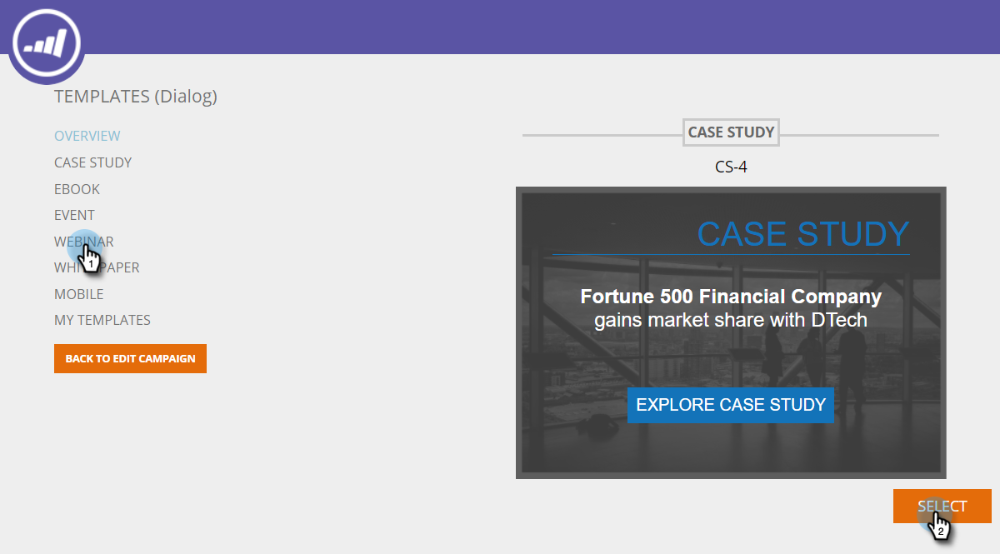

# 使用範本建立Web促銷活動{#using-templates-to-create-web-campaigns}

使用我們內建的範本或透過[儲存您自己的](save-your-campaign-as-a-template.md)，加速並簡化您的網頁宣傳活動建立程式。

>[!NOTE]
>
>針對所有裝置最佳化範本，並針對桌上型電腦和行動裝置提供瀏覽體驗。

1. 前往&#x200B;**Web促銷活動**。

   

1. 按一下「建立新的Web促銷活動」**。**

   

1. 命名促銷活動。

   

1. 選取目標區段。

   

1. 按一下&#x200B;**Templates**。

   

1. 選取適合您促銷活動的區域，以檢視並選取適合您的範本。

   >[!NOTE]
   >
   >有一些酷炫的範本可供選擇，我們將來會新增更多範本。

   

   >[!TIP]
   >
   >對於行動促銷活動，請從&#x200B;**mobile**&#x200B;區段選取範本。

1. 自訂範本。

   

1. 按一下&#x200B;**保存**。

   

幹得漂亮！ 您看到使用範本可節省多少時間嗎？

>[!MORELIKETHIS]
>
>[將促銷活動儲存為範本](/help/marketo/product-docs/web-personalization/using-templates/save-your-campaign-as-a-template.md)
