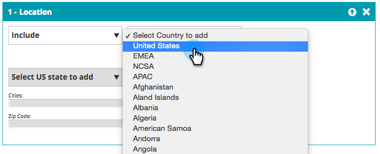

# 建立基本網頁區段{#create-a-basic-web-segment}

讓我們建立一個基本區段，以美國及金融服務業的所有Web訪客為目標。

1. 前往&#x200B;**區段**。

   

1. 按一下&#x200B;**新建**。

   

1. 輸入區段名稱。

   

1. 從右側功能表拖曳&#x200B;**Location**，並放入區段編輯器中。

   

1. 從下拉式清單中選取要新增的國家。 選擇&#x200B;**美國**。

   

   >[!NOTE]
   >
   >城市數量限制在每個區段300個。

1. 從右側功能表拖曳&#x200B;**Industries**&#x200B;並拖曳至區段編輯器。

   

1. 從下拉式清單中選取「產業」以新增。 選擇&#x200B;**金融服務業**。

   

   您現在已針對所有從美國和金融業造訪您網站的潛在客戶設定基本區段。

1. 按一下&#x200B;**儲存**&#x200B;以儲存區段，或按一下&#x200B;**儲存並定義促銷活動**&#x200B;以前往促銷活動頁面。

   

現在您已將來自美國的訪客分段，請繼續加入金融服務業。

>[!MORELIKETHIS]
>
>[網頁區段](/help/marketo/product-docs/web-personalization/using-web-segments/web-segments.md)
