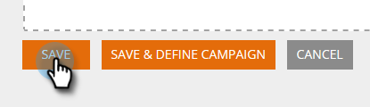

# 使用靜態清單建立區段{#create-a-segment-using-a-static-list}

根據訪客是否在您的行銷人員[靜態清單](https://docs.marketo.com/display/DOCS/Understanding+Static+Lists)中，劃分已知網站訪客瀏覽您網站時的區段。

1. 前往&#x200B;**區段**。

   

1. 按一下&#x200B;**新建**。

   

1. 輸入區段名稱。

   

1. 在「已知銷售線索」中，將**靜態清單**拖曳到畫布。

   

1. 按一下下拉式清單以選取&#x200B;**is**&#x200B;或&#x200B;**is not**（視您要的內容而定），並輸入靜態清單的名稱。

   

1. 如果要添加多個清單，則需要通過按一下&#x200B;**+**&#x200B;為每個清單建立一個新行。 如果您只想要一個清單，請跳至[步驟8](#eight)。

   

1. 對於多個清單（或多個「不」清單），請重複在[步驟5](#five)中學到的步驟。

   

   >[!NOTE]
   >
   >和／或下拉式清單就是這個。 按一下它以選擇&#x200B;**和**、**或**&#x200B;或&#x200B;**和／或**。

1. 按一下&#x200B;**儲存**&#x200B;以儲存區段，或按一下**儲存並定義促銷活動**以儲存並前往「促銷活動」頁面。

   

