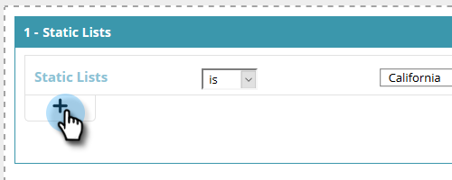

# 使用靜態清單建立區段 {#create-a-segment-using-a-static-list}

根據已知Web訪客是否位於您的某個Marketo中，在他們造訪您的網站時劃分他們 [靜態清單](/help/marketo/product-docs/core-marketo-concepts/smart-lists-and-static-lists/static-lists/understanding-static-lists.md).

1. 前往 **區段**.

   

1. 按一下 **新建**.

   

1. 輸入區段名稱。

   

1. 在已知銷售機會中，拖曳 **靜態清單** 移至畫布。

   

1. 按一下下拉式清單以選取 **是** 或 **不是** （視您需要的而定），並輸入靜態清單的名稱。

   

1. 如果要新增多個清單，您必須按一下 **+**. 如果您只想要一個清單，請跳至 [步驟8](#eight).

   

1. 對於多個清單（或多個「不是」清單），請重複您在中學到的步驟 [步驟5](#five).

   

   >[!NOTE]
   >
   >和/或下拉式清單就是如此。 按一下以選取 **和**， **或**，或 **和/或**.

1. 按一下 **儲存** 若要儲存區段或 **儲存並定義行銷活動** 以儲存並前往「行銷活動」頁面。

   
