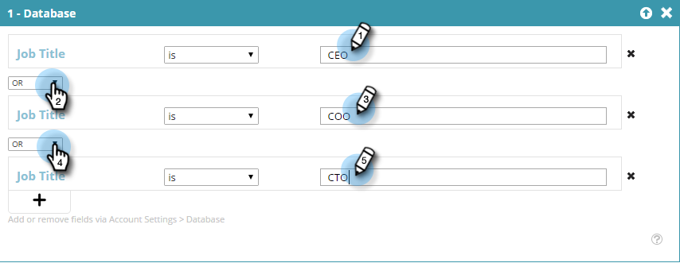

# 使用已知個人資料建立區段 {#create-a-segment-using-known-person-data}

以下說明如何使用已知人員資料值建立區段。

>[!PREREQUISITES]
>
>[管理個人資料](/help/marketo/product-docs/web-personalization/using-web-segments/manage-person-data.md)

1. 前往 **區段**.

   

1. 按一下 **新建**.

   

1. 輸入區段名稱。

   

1. 在設定檔分段中，拖曳 **資料庫** 移至畫布。

   

1. 從下拉式清單中選取人員資料欄位。

   

1. 輸入人員資料值。

   

   每個欄位只能有一個值。 例如，如果您想要為職稱欄位新增多個值，則需要為每個值建立一個具有相同欄位名稱的新行。 請務必使用OR值，以確保任何值都會擷取相符專案。

   

## 選取多個人員資料欄位 {#selecting-multiple-person-data-fields}

1. 按一下 **+** 以新增另一個人員資料欄位。

   

1. 選取AND/OR運運算元。 選取要新增的欄位。 選取人員資料欄位。 輸入人員資料值。

   

1. 按一下 **儲存** 若要儲存區段或 **儲存並定義行銷活動** 以儲存並前往「行銷活動」頁面。

   

   您現在已設定以已知人員資料為目標的區段。
