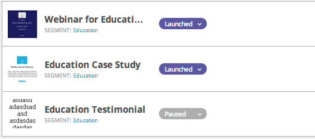

# 尋找使用特定區段的網頁行銷活動 {#find-web-campaigns-that-are-using-a-specific-segment}

正在尋找使用特定區段的網頁行銷活動嗎？

1. 前往 **[!UICONTROL Segments]**。

   

1. 搜尋&#x200B;**區段** 選取&#x200B;**區段名稱**。 在右側面板中，按一下&#x200B;**[!UICONTROL Associated Campaigns]**&#x200B;以檢視與此特定區段相關聯的促銷活動。

   

1. 檢視與所選區段相關聯的&#x200B;**行銷活動**。

   

>[!MORELIKETHIS]
>
>深入瞭解[區段](/help/marketo/product-docs/web-personalization/using-web-segments/web-segments.md)以及如何[建立基本區段](/help/marketo/product-docs/web-personalization/using-web-segments/create-a-basic-web-segment.md)。
