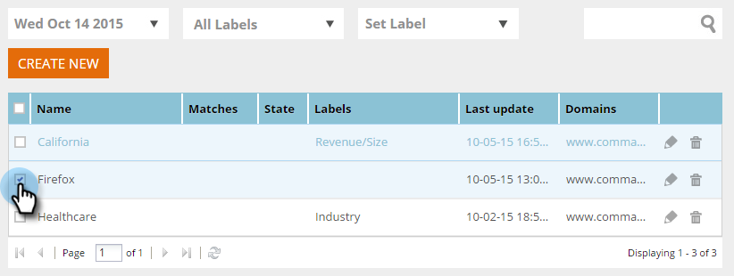
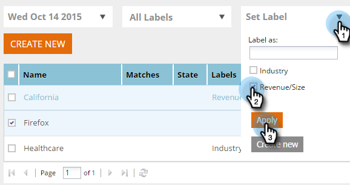

# 將您的區段加上標籤 {#label-your-segment}

您有這麼多區段，使得捲動變得繁瑣嗎？ 使用標籤來標籤區段，讓您可以快速找到。

## 標籤區段 {#tag-a-segment}

1. 登入[!DNL Web Personalization]並移至&#x200B;**[!UICONTROL Segments]**。

   

1. 選取您要使用標籤標籤的區段。

   

1. 若要使用現有標籤，請按一下&#x200B;**[!UICONTROL Set Label]**、核取方塊，然後按一下&#x200B;**[!UICONTROL Apply]**。

   

1. 或者，若要建立新標籤，請按一下&#x200B;**[!UICONTROL Set Label]**，輸入新標簽名稱，然後按一下&#x200B;**新建**。

   

   >[!NOTE]
   >
   >「新建」按鈕會顯示新標籤的名稱。 如果標籤太長，可能不會顯示「新建」。

酷！ 您現在知道如何指派及建立區段的標籤。
