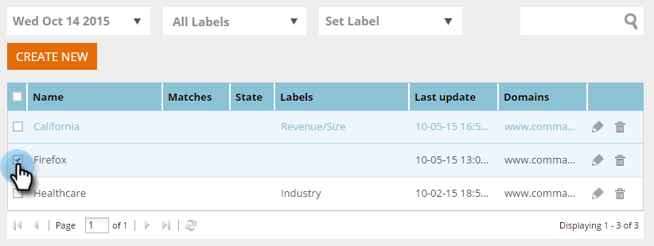

# 標籤您的區段 {#label-your-segment}

您有這麼多區段，捲動變得麻煩嗎？ 使用標籤來標籤區段，以便快速找到區段。

## 標籤區段 {#tag-a-segment}

1. 登入「網頁個人化」並前往「 **區段**」。

   

1. 選取您要以標籤標籤的區段。

   

1. 要使用現有標籤，請按一下「 **設定標籤**」，選中框，然後按一下「 **應用」**。

   

1. 或者，要建立新標籤，請按一下「 **設定標籤**」，輸入新標籤名稱，然後按一下「 **新建」**。

   

   >[!NOTE]
   >
   >「新建」按鈕顯示新標籤的名稱。 如果標籤太長，「建立新」可能不會出現在此處。

酷！ 您現在知道如何指派和建立區段的標籤。
