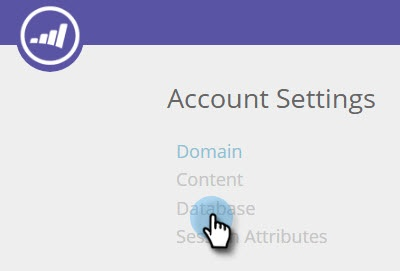

# 管理人員資料 {#manage-person-data}

透過選取要在您的細分中使用的人員欄位，善用人員資料進行網站個人化。

1. 前往 **帳戶設定**.

   

1. 前往 **資料庫**.

   

## 新增人員欄位 {#adding-a-new-person-field}

1. 選擇 **要添加的欄位** 從下拉式清單中新增人員資料欄位至清單。

   

   >[!NOTE]
   >
   >新欄位會以待定狀態新增，最多需要24小時才能啟動。

## 刪除人員欄位 {#deleting-a-person-field}

1. 按一下刪除圖示( )，從清單中移除欄位。 按一下 **是** 確認要刪除欄位。

   

   >[!NOTE]
   >
   >**管理人員資料欄位**
   >
   >* 只能包含人員資料欄位
   >* 您最多可以新增30個人員資料欄位
   >* 新增欄位最多需要24小時才能啟動
   >* 字串類型的長度上限為255個字元
   >* 隱藏欄位將自動移除

<table> 
 <tbody> 
  <tr> 
   <th>
REST API名稱
</th> 
   <th>
SOAP API名稱
</th> 
   <th>
易記名稱
</th> 
  </tr> 
  <tr> 
   <td>
部門
</td> 
   <td>
部門
</td> 
   <td>
部門
</td> 
  </tr> 
  <tr> 
   <td>
標題
</td> 
   <td>
標題
</td> 
   <td>
職稱
</td> 
  </tr> 
  <tr> 
   <td>
評分
</td> 
   <td>
評等
</td> 
   <td>
評等
</td> 
  </tr> 
  <tr> 
   <td>
leadScore
</td> 
   <td>
LeadScore
</td> 
   <td>
分數
</td> 
  </tr> 
  <tr> 
   <td>
leadStatus
</td> 
   <td>
銷售機會狀態
</td> 
   <td>
狀態
</td> 
  </tr> 
  <tr> 
   <td>
優先順序
</td> 
   <td>
優先順序
</td> 
   <td>
優先順序
</td> 
  </tr> 
  <tr> 
   <td>
leadRole
</td> 
   <td>
LeadRole
</td> 
   <td>
角色
</td> 
  </tr> 
  <tr> 
   <td>
取消訂閱
</td> 
   <td>
退訂
</td> 
   <td>
退訂
</td> 
  </tr> 
 </tbody> 
</table>

下列銷售機會欄位是新Web個人化帳戶的現成可用欄位：

>[!MORELIKETHIS]
>
>[使用已知人員資料建立區段](/help/marketo/product-docs/web-personalization/using-web-segments/create-a-segment-using-known-person-data.md)
