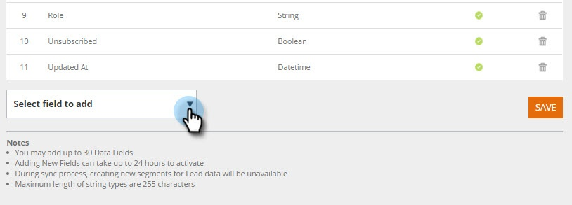

# 管理人員資料 {#manage-person-data}

選取要用於您區段的人員欄位，以利用「人員資料」進行Web個人化。

1. 前往「帳 **戶設定」**。\
   

1. 轉至「數 **據庫**」。\
   

## 添加新人員欄位 {#adding-a-new-person-field}

1. 從下 **拉式清單中** ，選取要新增的欄位，以新增人員資料欄位至清單。

   

   >[!NOTE]
   >
   >
   >    
   >    
   >    * 新欄位會新增至待定狀態，最多需要24小時才能啟動。

## 刪除人員欄位 {#deleting-a-person-field}

1. 按一下刪除表徵圖( )可從清單中刪除欄位。 按一 **下「是** 」以確認您要刪除欄位。

   

   >[!NOTE]
   >
   >**管理人員資料欄位**
   >
   >    
   >    
   >    * 只能包含人員資料欄位
   >    * 您最多可以新增30個人員資料欄位
   >    * 新增欄位最多需要24小時才能啟動
   >    * 字串類型的最大長度為255個字元
   >    * 隱藏的欄位會自動移除

<table> 
 <tbody> 
  <tr> 
   <th>
REST API名稱
</th> 
   <th>
SOAP API名稱
</th> 
   <th>
友好名稱
</th> 
  </tr> 
  <tr> 
   <td>
department
</td> 
   <td>
部門
</td> 
   <td>
部門
</td> 
  </tr> 
  <tr> 
   <td>
標題
</td> 
   <td>
標題
</td> 
   <td>
職稱
</td> 
  </tr> 
  <tr> 
   <td>
評分
</td> 
   <td>
評分
</td> 
   <td>
評分
</td> 
  </tr> 
  <tr> 
   <td>
leadScore
</td> 
   <td>
LeadScore
</td> 
   <td>
分數
</td> 
  </tr> 
  <tr> 
   <td>
leadStatus
</td> 
   <td>
LeadStatus
</td> 
   <td>
狀態
</td> 
  </tr> 
  <tr> 
   <td>
優先順序
</td> 
   <td>
優先順序
</td> 
   <td>
優先順序
</td> 
  </tr> 
  <tr> 
   <td>
leadRole
</td> 
   <td>
LeadRole
</td> 
   <td>
角色
</td> 
  </tr> 
  <tr> 
   <td>
未訂閱
</td> 
   <td>
取消訂閱
</td> 
   <td>
取消訂閱
</td> 
  </tr> 
 </tbody> 
</table>

新的Web個人化帳戶現成可用的銷售線索欄位如下：

>[!NOTE]
>
>**相關文章**
>
>* [使用已知人員資料建立區段](create-a-segment-using-known-person-data.md)

>

