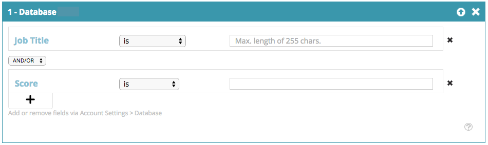

# 網頁區段 {#web-segments}

## 檢視區段 {#view-segment}

「區段」標籤會顯示您根據各種屬性設定之所有自訂已定義的區段。  **區段是符合「設定區段」頁面中定義之指定條件的訪客集合。**&#x200B;區段可以是來自特定產業、位置的訪客，或根據訪客的現場活動而定。

在[!DNL Web Personalizatio]中，訪客可比對多個區段。 例如，如果有美國訪客的區段和金融公司的區段，則來自美國銀行的Web訪客會比對&#x200B;**美國訪客的**&#x200B;區段和金融公司的區段。

**圖表：**&#x200B;區段頁面會根據區段的訪客數（y軸）和區段名稱（x軸）來顯示選取區段的長條圖。

<table>
 <thead>
  <tr>
   <th colspan="1" rowspan="1">名稱</th>
   <th colspan="1" rowspan="1">說明</th>
  </tr>
 </thead>
 <tbody>
  <tr>
   <td colspan="1" rowspan="1"><strong>名稱</strong></td>
   <td colspan="1" rowspan="1">區段的標題</td>
  </tr>
  <tr>
   <td colspan="1" rowspan="1">
<strong>符合</strong>
</td>
   <td colspan="1" rowspan="1">符合區段自訂、定義條件的訪客數</td>
  </tr>
  <tr>
   <td colspan="1" rowspan="1"><strong>設定行銷活動</strong></td>
   <td colspan="1" rowspan="1">可讓您設定與所選搜尋字詞相關聯的促銷活動CTA</td>
  </tr>
  <tr>
   <td colspan="1"><strong>訪客</strong></td>
   <td colspan="1">與所選搜尋字詞相關聯的訪客表格預覽</td>
  </tr>
  <tr>
   <td colspan="1" rowspan="1"><strong>點按資料流</strong></td>
   <td colspan="1" rowspan="1">顯示一個表格，內含訪客在網站上的活動和URL路徑，以及他們造訪每個頁面的時間 </td>
  </tr>
 </tbody>
</table>

請參閱[如何建立和檢視區段標籤](/help/marketo/product-docs/web-personalization/using-web-segments/label-your-segment.md)

**區段 — 右側面板**

在表格中選取區段，會在右側面板中顯示該區段的其他詳細資訊。

這些詳細資料包括：

* 區段名稱
* 區段的建立日期
* 顯示以此區段運作的行銷活動的相關行銷活動。 按一下反應數量會前往行銷活動頁面，顯示該區段的行銷活動CTA (Call to action)
* 區段的符合數量（符合區段條件的訪客數量）以及符合區段的相異（不重複）訪客數量。 按一下「不重複訪客」連結，您會前往訪客顯示區段結果的頁面
* 區段的所有者/使用者建立者
* 與區段相關聯的網域網站
* 區段所選條件的簡短摘要

## 啟用或停用區段 {#enable-or-disable-a-segment}

若要啟用或停用區段，請選取表格中該區段的核取方塊，並在表格底部的&quot;[!UICONTROL Choose Action]&quot;下拉式方塊中，選取動作&quot;[!UICONTROL Enable]&quot;或&quot;[!UICONTROL Disable]&quot;。 區段停用時，「停用」一詞會顯示在[!UICONTROL State]欄下方。

## 建立區段 {#create-segments}

您建立的區段符合您在&#x200B;**[!UICONTROL Set Segment]**&#x200B;頁面中定義的任何特定條件。 您也可以根據條件組合來自訂區段，在您的行銷活動中定位特定對象。

建立新區段的方式

從&#x200B;**[!UICONTROL Segments]**&#x200B;頁面，按一下圖表下方的&#x200B;**[!UICONTROL Create New]**。 下列畫面隨即顯示。

定義區段的一般引數：

* **名稱：**&#x200B;為您的區段命名。
* **描述：**&#x200B;提供更詳細的區段條件說明。
* **網域：**&#x200B;選取要包含在區段中的網域。
* **區段規則邏輯：**&#x200B;選取AND / OR邏輯以建置每個區段屬性
* **時間：**&#x200B;定義您要在行銷活動中進行的訪客參與層級

   * **登入點**：來自訪客進入網站的參與
   * **第1次到第9次點按後**：在網站上進行特定次數的點按後，與訪客互動

>[!TIP]
>
>**區段規則邏輯**
>
>篩選器選項共有三種：
>
>1. 使用所有篩選器（1和2及3...）
>1. 使用任何篩選器（1或2或3...）
>1. 進階篩選（使用和/或運算式）
>
>    進階篩選器可讓您控制區段條件。 輸入以「and」和「or」分隔的篩選編號。
>
>    * 1和2及3
>    * 1或2或3
>
>    混合「and」和「or」需要括弧來釐清邏輯意圖。 例如，「1或2和3」必須寫入為下列其中一項：
>
>    * 1和（2或3）
>    * （1和2）或3
>
>    較複雜的邏輯(例如：
>
>    * （1和2）或（3和4）
>    * 1和(2或（3和4）)
>
>    在插入、刪除或重新排序任何專案後，請檢查您的邏輯。

將「區段」屬性從右側欄拖放至左側的區段編輯器中：

### 第一圖形 {#firmographics}

**位置**

將&#x200B;**[!UICONTROL Location]**&#x200B;拖放到區段編輯器中。

* 從下列引數中選取：

   * **[!UICONTROL Include]** — 選取您要讓行銷活動包含或排除位置。
   * **[!UICONTROL Select country to add]** — 從下拉式方塊中，選取要納入區段的國家/地區。 國家/地區名稱會顯示在右側。 您可以選擇多個國家/地區。

新增國家/地區後，您就可以指定區段的州、城市和郵遞區號。

* **[!UICONTROL Select State or Province to add]** — 從下拉式方塊中，選取要納入的美國州或加拿大省份。 您可以選取多個專案。
* **[!UICONTROL Zip Code]** — 輸入您要納入區段中的郵遞區號。
* **[!UICONTROL Cities]** — 輸入您要納入的城市。 在城市之間使用分號。

>[!TIP]
>
>**我選擇哪些區段條件？ &#39;AND&#39;或&#39;OR&#39;？** OR在每個欄位中作為其他選項運作。 潛在客戶只需符合在每個欄位中選取的多個條件中的一個條件，即可符合該區段的資格。 （例如，潛在客戶可能來自美國&#x200B;*或來自國防工業的*）。 AND會當作此區段必須符合的額外必要引數。 （例如，潛在客戶必須同時來自美國與國防工業）。 在每個分段設定檔中，視選取的區段條件而定，每個個別欄位都可作為兩者使用，即「與」或「或」。

**產業**&#x200B;在&#x200B;**[!UICONTROL Profile Segmentation]**&#x200B;區段下，勾選&#x200B;**[!UICONTROL Industry]**&#x200B;旁的方塊。

* 從下列引數中選取：

   * **[!UICONTROL Includes]** — 選取您要讓區段包含或排除某個產業。
   * **[!UICONTROL Select Industries to add]** — 選取您要納入此區段的產業。 產業會出現在下拉式方塊下方。 您可以選擇多個產業。

**組織群組**

在&#x200B;**[!UICONTROL Profile Segmentation]**&#x200B;區段下，勾選&#x200B;**[!UICONTROL Organization Group].**&#x200B;旁的方塊

* 從下拉式方塊中，選取下列選項：

   * 《財富》500強 — 此區段僅包含《財富》500強公司
   * Fortune 1000 — 在此區段中僅包括Fortune 1000公司
   * Global 2000 — 在此區段中包含Global 2000公司
   * 企業 — 包含員工超過1,000人且收入超過2.5億美元的組織
   * 中小型企業 — 僅包括此區段中的中小型企業

**具名帳戶 —**

**組織**

* **來自這些公司（特定名稱）**

   * 從「選取要新增的公司」下拉式清單中選取要定位的公司。
   * 您可以輸入想要鎖定的確切組織名稱。 *建議&#x200B;_一律_&#x200B;使用具名帳戶清單，而非手動輸入名稱以取得更符合的專案（請參閱下文）。

**具名帳戶清單**

從[具名帳戶清單](/help/marketo/product-docs/web-personalization/account-based-web-marketing/create-a-new-account-list.md)中選取區段金鑰目標帳戶。

>[!NOTE]
>
>具名帳戶清單名稱旁方括弧內的數字會作為網頁Personalization [讀取API](https://experienceleague.adobe.com/zh-hant/docs/marketo-developer/marketo/javascriptapi/web-personalization)清單的索引參考。

**排除ISP**

將網際網路服務提供者(ISP)排除在此區段中。

### 已知人員 {#known-people}

**[!UICONTROL Database]**

[!DNL Web Personalization]與您的Marketo資料庫整合，可讓您依據已知的個人屬性和資料來細分和個人化行銷活動。

選取資料庫，然後從下拉式清單中選取人員資料欄位。 從下拉式清單中選取&#x200B;**+**&#x200B;以新增欄位。

您可以從「帳戶設定>資料庫」新增或移除人員資料欄位

>[!TIP]
>
>根據Marketo人員的所有人員資料欄位（例如職稱、分數、角色等）建立您的區段條件。
>
>例如： 「職稱等於CMO」以及「分數小於或等於50」

**[!UICONTROL Marketo Email Campaign]**&#x200B;透過訪客點選Marketo電子郵件並到達網站時的電子郵件轉介，將行銷活動劃分和個人化。 依Marketo方案名稱或行銷活動名稱進行細分，並繼續從電子郵件到網頁的對話。 從下拉式清單中選取+以新增欄位。

**[!UICONTROL Status]**

根據潛在客戶狀態定義您的區段：已知或匿名。

* 已知 — 從已知訪客的下拉式方塊中選取此選項。 當訪客在您的網站上提交表單並出現在[!DNL Web Personalization] [!UICONTROL People]頁面時，就表示訪客是已知的。
* 匿名 — 從匿名訪客的下拉式方塊中選取此選項。

### 行為 {#behavioral}

**[!UICONTROL Visits]-**&#x200B;根據訪客行為或識別來定義您的區段。

* 造訪次數 — 從下拉式方塊中選取此選項，以指定潛在客戶在網站上的造訪次數。

   * 從下拉式方塊中選取「等於」、「等於」或「大於」或「等於」或「小於」。

* 特定造訪 — 從下拉式方塊中選取此選項，以指定特定訪客。

   * 在右側的文字方塊中，輸入您要追蹤的訪客編號。 按一下訪客（在訪客頁面中）和右側面板的「設定行銷活動」時，可找到唯一的[!DNL Web Personalization]訪客識別碼。 訪客ID位於進階設定區段中。 訪客ID也可在URL中找到（例如VISITOR=JZZJIFJNUI60PZ8Y97BHTY9BL8PKWS）。

**搜尋詞** — 根據潛在客戶的搜尋詞定義區段。

* 搜尋的訪客 — 從下拉式清單中，從訪客搜尋中選取您要追蹤的字詞，或新增您自己的搜尋字詞。 （搜尋字詞上不需要萬用字元&#42;，因為已設定為預設包含搜尋字詞的片語）。

**[!UICONTROL Referrals]** — 新增訪客參考的URL。

* 選取要新增的轉介 — 從下拉式清單中，選取您要追蹤的轉介網站或新增您自己的轉介。 選取之後，反向連結將會顯示在下面的方塊中。 （允許使用&#42;做為萬用字元）

**[!UICONTROL Include Pages]** — 追蹤潛在客戶在您網站上瀏覽的特定頁面。

* URL相符 — 新增您想要追蹤的特定網頁的URL。 您可用分號分隔多個URL，以新增這些URL。 （允許使用&#42;做為萬用字元）。

**[!UICONTROL Exclude Pages]** — 排除您不想要在區段中比對的特定頁面。 （允許使用&#42;做為萬用字元）。

* URL不符合 — 新增您想從追蹤中排除的特定網頁URL。 您可以新增多個URL，方法是以分號分隔

### 裝置/瀏覽器 {#device-browser}

**[!UICONTROL Mobile OS]**

將[!UICONTROL Mobile OS]拖放至區段編輯器中

* **訪客型別** 
  **[!UICONTROL Mobile OS]** — 從下拉式方塊中，選取一或多個列出的行動作業系統。 選取的行動作業系統會顯示於下方。

   * 訪客使用任何行動裝置
   * 訪客使用此特定裝置/作業系統
   * 訪客未使用任何行動裝置

* **[!UICONTROL Device]** — 從下拉式清單中選取一或多個裝置(Apple、Samsung、LG、HTC、Nexus、Blackberry等……)。 選取的裝置會顯示在下方。

**瀏覽器**

使用特定瀏覽器型別和/或版本的目標訪客。

* 瀏覽器型別 — 從下拉式方塊中，選取一或多個網際網路瀏覽器。 選取的瀏覽器會顯示於下方。
* 瀏覽器版本 — 輸入您要新增至區段的瀏覽器版本。 您可以選取多個版本，每個版本以逗號分隔。 （允許使用&#42;做為萬用字元）。

### API {#api}

**資料事件** — 觸發特定自訂資料事件的區段訪客

新增您要鎖定的事件值。 例如來自協力廠商資料來源。

**使用者內容API**

網頁Personalization API呼叫[請在此閱讀更多相關資訊。](https://experienceleague.adobe.com/zh-hant/docs/marketo-developer/marketo/javascriptapi/web-personalization)

>[!TIP]
>
>**使用萬用字元 —**&#x200B;當您想要包含任何搜尋字詞或URL且其中包含&#39;&#39;[google.com](https://google.com)&#39;&#39;或&#39;&#39;搜尋字詞產品&#39;&#39;時，我們稱此為萬用字元，而且應該在每一端輸入星號 — 這個小傢伙&#42;。 因此，來自[google.com](https://google.com)的任何內容都應輸入為&#42; [google.com](https://google.com)&#42;

## 編輯[!UICONTROL Segments] {#edit-segments}

您可以編輯已建立的區段。

1. 若要編輯區段，請前往&#x200B;**[!UICONTROL Segments]**。

   

1. 在&#x200B;**[!UICONTROL Segments]**&#x200B;表格中，按一下您要編輯之區段的編輯圖示( )。 **[!UICONTROL Set Segment]**&#x200B;頁面會以選取的區段開啟。
1. 套用您想要對區段進行的任何編輯或變更。
1. 按一下「**[!UICONTROL Save]**」。

## 刪除區段 {#delete-segments}

您可以刪除已建立的區段。

1. 從上方的&#x200B;**[!UICONTROL Segments]**&#x200B;頁面中，選取區段。
1. 按一下要刪除之區段的刪除圖示(  )。
1. 出現確認訊息，確認您即將刪除&#x200B;**區段**。

>[!NOTE]
>
>您無法刪除與行銷活動相關聯的區段。 首先，您需要刪除行銷活動，然後刪除區段。

太棒了！ 現在您已瞭解區段區段，接下來來瞭解行銷活動。

>[!MORELIKETHIS]
>
>* [建立基本網頁區段](/help/marketo/product-docs/web-personalization/using-web-segments/create-a-basic-web-segment.md)
>* [建立新的對話方塊網頁行銷活動](/help/marketo/product-docs/web-personalization/working-with-web-campaigns/create-a-new-dialog-web-campaign.md)
>* [建立新的區域網路行銷活動](/help/marketo/product-docs/web-personalization/working-with-web-campaigns/create-a-new-in-zone-web-campaign.md)
>* [建立新的Widget Web行銷活動](/help/marketo/product-docs/web-personalization/working-with-web-campaigns/create-a-new-widget-web-campaign.md)
