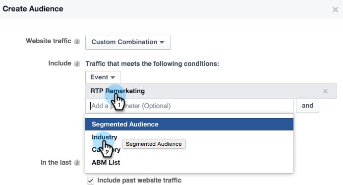

# Facebook中的個人化再行銷 {#personalized-remarketing-in-facebook}

個人化再行銷可讓您使用RTP資料和Facebook再行銷的強大功能，與使用者重新互動。

>[!PREREQUISITES]
>
>* 使用網頁個 [人化資料設定完成重新定位](retargeting-with-web-personalization-data.md)
>* 檢視自訂  受眾和再行銷的 Facebook檔案

>

## 在Facebook中建立對象 {#creating-an-audience-in-facebook}

1. 在Facebook中，前往「廣告管理 [員」中的](https://www.facebook.com/ads/audience_manager) 「對象」標籤。
1. 按一 **下「工具** 」並選 **取「對象」**。

   

1. 按一 **下「建立自訂對象」**。

   

1. 選取 **網站流量**。

   

1. 在「網站流量」清單中，選取**自訂組合**。

   

1. 在「包含」清單中，選擇「 **事件」**。

   

1. 在「事件」清單中，選擇**RTP Remarketing **並選擇參數。

   

1. 在此範例中，選取「產業」以包含 **教育**。 輸入 **教育**，並 **編輯「最近** 180天」。 輸入對象名稱： **教育產業**。 按一 **下「建立對象**」。

   

1. 您現在已在Facebook中使用RTP資料建立新的自訂對象。

   

## Facebook中的RTP資料點 {#rtp-data-points-in-facebook}

<table> 
 <tbody> 
  <tr> 
   <th>事件名稱</th> 
   <th> </th> 
  </tr> 
  <tr> 
   <td>RTP再行銷</td> 
   <td> 
    
 
     <table> 
      <tbody> 
       <tr> 
        <th>參數</th> 
        <th>值</th> 
       </tr> 
       <tr> 
        <td>ABM清單</td> 
        <td>（帳戶型清單的名稱）</td> 
       </tr> 
       <tr> 
        <td colspan="1">類別</td> 
        <td colspan="1">
財富500強

財富1000強

2000年全球
</td> 
       </tr> 
       <tr> 
        <td colspan="1">群組</td> 
        <td colspan="1">
企業

中小型企業
</td> 
       </tr> 
       <tr> 
        <td>產業</td> 
        <td>
防衛

教育

金融服務

政府機關

醫療保健、製藥、生物技術

軟體與網際網路

等等……（根據RTP行業選項）
</td> 
       </tr> 
       <tr> 
        <td colspan="1">細分受眾</td> 
        <td colspan="1">（在RTP中建立的分段對象名稱）</td> 
       </tr> 
      </tbody> 
     </table> 
    
</td> 
  </tr> 
 </tbody> 
</table>

## 使用廣告鎖定受眾 {#target-your-audience-with-an-ad}

如需詳細資訊，請參 [閱Facebook的檔案](https://developers.facebook.com/docs/ads-for-websites/website-custom-audiences/getting-started#target-your-audience)。

1. 前往「廣告管理員」，按一下「 **建立廣告**」。

   

1. 選取 **將訪客傳送至您的網站** ，作為促銷活動的目標。

   

1. 輸入您的網站URL。

   

1. 建立您的廣告集。 從您建立的「對象」清單中選取自訂對象，例如教育產業。

   

1. 選擇所有其他廣告集選項、設定預算並定義廣告創意。

   

1. 您現在都已在Facebook中設定個人化的再行銷活動。

>[!NOTE]
>
>**相關文章**
>
>* [使用網頁個人化資料重新鎖定目標](retargeting-with-web-personalization-data.md)
>* [Google的個性化再營銷](personalized-remarketing-in-google.md)

>

