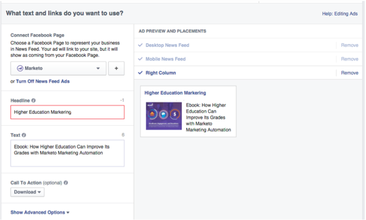

# facebook中的個人化再行銷 {#personalized-remarketing-in-facebook}

個人化再行銷可讓您利用RTP資料和Facebook再行銷的強大功能，重新與使用者互動。

>[!PREREQUISITES]
>
>* 完成 [使用網頁個人化資料重新進行目標定位](/help/marketo/product-docs/web-personalization/website-retargeting/retargeting-with-web-personalization-data.md) 設定
>* 檢閱  [有關自訂對象的Facebook檔案](https://developers.facebook.com/docs/ads-for-websites/website-custom-audiences/getting-started#install-the-pixel) 和再行銷。

## 在Facebook中建立對象 {#creating-an-audience-in-facebook}

1. 在Facebook中，前往 [對象索引標籤](https://www.facebook.com/ads/audience_manager) 在「廣告管理員」中。

1. 按一下 **工具** 並選取 **受眾**.

   

1. 按一下 **建立自訂對象**.

   

1. 選取 **網站流量**.

   

1. 在網站流量清單中，選取 **自訂組合**.

   

1. 在「包含」清單中，選取 **事件**.

   

1. 在「事件」清單中，選取 **RTP再行銷** 並選取引數。

   

1. 在此範例中，選取要包含的產業 **教育**. 輸入 **教育**，並編輯 **過去** 為180天。 輸入對象名稱： **教育產業**. 按一下 **建立對象**.

   

1. 您現在已使用Facebook中的RTP資料建立新的自訂對象。

   

## facebook中的RTP資料點 {#rtp-data-points-in-facebook}

<table> 
 <tbody> 
  <tr> 
   <th>事件名稱</th> 
   <th> </th> 
  </tr> 
  <tr> 
   <td>RTP再行銷</td> 
   <td> 
    
 
     <table> 
      <tbody> 
       <tr> 
        <th>引數</th> 
        <th>值</th> 
       </tr> 
       <tr> 
        <td>ABM清單</td> 
        <td>（以帳戶為基礎的清單名稱）</td> 
       </tr> 
       <tr> 
        <td colspan="1">類別</td> 
        <td colspan="1">
財富500強

《財富》1000大

全球2000
</td> 
       </tr> 
       <tr> 
        <td colspan="1">群組</td> 
        <td colspan="1">
企業

中小型企業
</td> 
       </tr> 
       <tr> 
        <td>產業</td> 
        <td>
防禦

教育

金融服務

政府

醫療保健、醫藥、生物科技

軟體與網際網路

等等…… （根據RTP Industry選項）
</td> 
       </tr> 
       <tr> 
        <td colspan="1">已分段的對象</td> 
        <td colspan="1">（在RTP中建立的細分對象名稱）</td> 
       </tr> 
      </tbody> 
     </table> 
    
</td> 
  </tr> 
 </tbody> 
</table>

## 使用廣告鎖定目標對象 {#target-your-audience-with-an-ad}

如需其他詳細資訊，請參閱 [facebook的檔案](https://developers.facebook.com/docs/ads-for-websites/website-custom-audiences/getting-started#target-your-audience).

1. 前往廣告管理員，按一下 **建立廣告**.

   

1. 選取 **將人員傳送至您的網站** 作為行銷活動的目標。

   

1. 輸入您的網站URL。

   

1. 建立您的廣告集。 從您建立的受眾清單中選取自訂受眾，例如「教育產業」。

   

1. 選取所有其他廣告集選項、設定預算，並定義廣告創意。

   

1. 現在，您已在Facebook中設定個人化再行銷行銷活動。

>[!MORELIKETHIS]
>
>* [使用網頁個人化資料重新進行目標定位](/help/marketo/product-docs/web-personalization/website-retargeting/retargeting-with-web-personalization-data.md)
>* [Google中的個人化再行銷](/help/marketo/product-docs/web-personalization/website-retargeting/personalized-remarketing-in-google.md)
