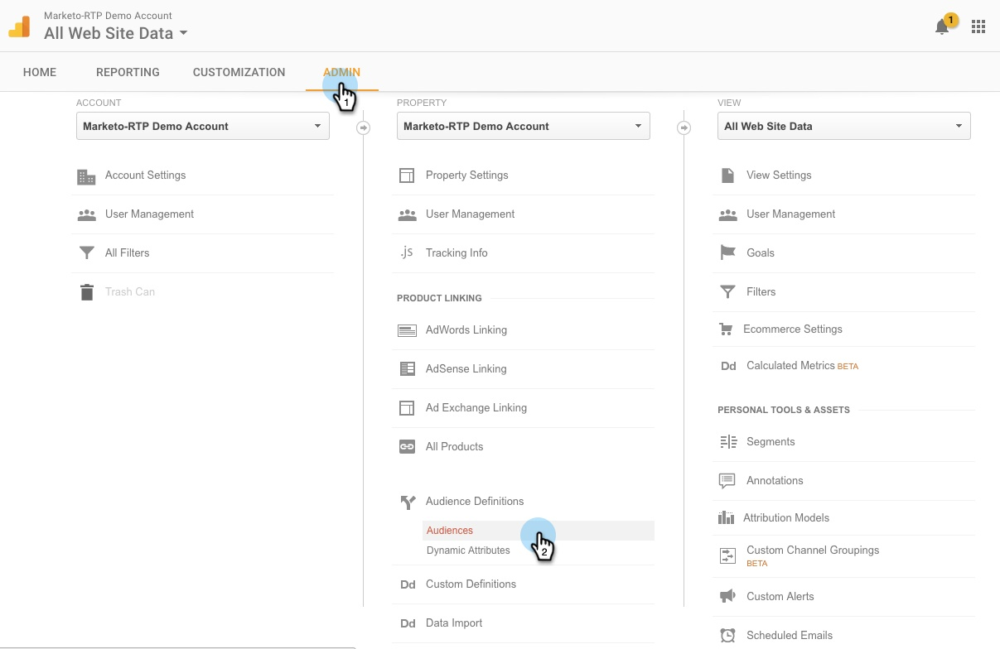

# Google中的個人化再行銷{#personalized-remarketing-in-google}

個人化再行銷可讓您使用RTP資料和Google Analytics的強大功能，透過Google Display Network的觸及面，與使用者重新互動。

>[!PREREQUISITES]
>
>* 完成[使用Web個人化資料重新定位設定](/help/marketo/product-docs/web-personalization/website-retargeting/retargeting-with-web-personalization-data.md)
>* 檢視「使用Google Analytics說明進行再行銷」檔案。

## 在Google {#creating-a-remarketing-audience-in-google}中建立再行銷對象

1. 登入您的Google Analytics。 按一下「**管理**、**帳戶**、**屬性**」。 按一下「對象定義」****&#x200B;和「對象」**。**

   

1. 按一下「**+新對象**」。

   

1. **連結設定**:連結至您的Google Adwords帳戶。**定義對象**:按一下 **建立新**。

   

1. 在「觀眾產生器」中，按一下「自訂維度、自訂變數、事件」下方的「**序列**&#x200B;和&#x200B;**尋找RTP資料**」。

>[!TIP]
>
>如何在Analytics中尋找RTP資料以建立您的觀眾？
>
>在Google Analytics中：
>
>* 自訂變數：組織、產業
>* 事件類別：Segment, Insightera-CTA, RTP-Remarketing
>* 事件標籤：區段名稱、促銷活動名稱、區段對象名稱

>
>
在Google Universal Analytics中：
>
>* 自訂維度：組織、行業、類別（財星500,1000，全球2000）、集團（企業、中小型企業）、ABM清單（指名客戶清單）
>* 事件類別：RTP-Segment、RTP-Campaign RTP-Remarketing
>* 事件標籤：區段名稱、促銷活動名稱、區段對象名稱

**從RTP分段受眾資料重新行銷受眾範例**

1. 按一下&#x200B;**序列。**
1. 選擇&#x200B;**事件標籤。**
1. 輸入&#x200B;**分段對象的名稱**（如RTP中所示）。
1. 按一下&#x200B;**Apply**。

**RTP產業資料的受眾範例**

1. 按一下&#x200B;**序列**。
1. 選擇&#x200B;**RTP-Industry**。
1. 輸入&#x200B;**產業名稱**(例如 金融服務、教育……)。
1. 按一下&#x200B;**Apply**。
1. 輸入&#x200B;**觀眾名稱**。 按一下&#x200B;**保存**。

## 在Google Adwords中建立重新行銷廣告促銷活動{#create-a-remarketing-ad-campaign-in-google-adwords}

1. 登入&#x200B;**Google Adwords**。 按一下「**促銷活動**」，選取「僅顯示網路&#x200B;**」。**

   

1. 輸入&#x200B;**促銷活動名稱**，選擇&#x200B;**類型再行銷。**

   

1. 輸入&#x200B;**廣告群組名稱，**&#x200B;輸入&#x200B;**增強的CPC**，選擇&#x200B;**重新行銷清單**。

   

1. 按一下「儲存」並繼續。
1. 新增影像或文字廣告，開始再行銷促銷活動。

   

>[!MORELIKETHIS]
>
>* [使用網頁個人化資料重新鎖定目標](/help/marketo/product-docs/web-personalization/website-retargeting/retargeting-with-web-personalization-data.md)
>* [Facebook中的個人化再行銷](/help/marketo/product-docs/web-personalization/website-retargeting/personalized-remarketing-in-facebook.md)

