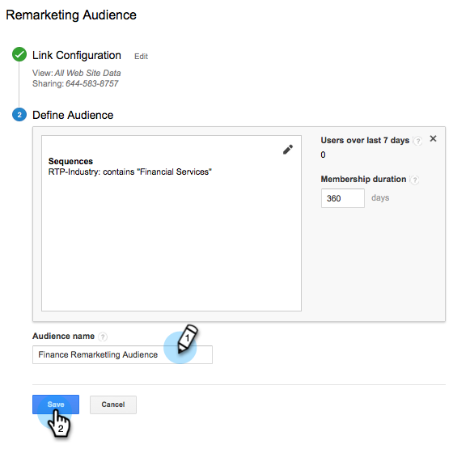

# Google中的個人化再行銷 {#personalized-remarketing-in-google}

個人化再行銷可讓您利用RTP資料和Google Analytics的強大功能，透過Google顯示網路重新與使用者互動。

>[!PREREQUISITES]
>
>* 完成 [使用網頁個人化資料重新目標定位](/help/marketo/product-docs/web-personalization/website-retargeting/retargeting-with-web-personalization-data.md) 設定
>* 檢閱 [使用Google Analytics說明進行再行銷](https://support.google.com/analytics/topic/2611283?hl=en&amp;ref_topic=3413645) 說明檔案。

## 在Google中建立再行銷對象 {#creating-a-remarketing-audience-in-google}

1. 登入您的Google Analytics。 按一下 **管理員**， **帳戶**， **屬性**. 按一下 **對象定義** 和 **受眾**.

   

1. 按一下 **+新增對象**.

   

1. **連結設定**：連結至您的Google Adwords帳戶。 **定義對象**：按一下 **新建**.

   

1. 在對象產生器中，按一下 **序列** 和 **尋找RTP資料** 在「自訂Dimension」、「自訂變數」、「事件」底下。

>[!TIP]
>
>如何在Analytics中尋找RTP資料來建立您的對象？
>
>在Google Analytics中：
>
>* 自訂變數：組織、產業
>* 事件類別：區段、Insightera-CTA、RTP — 再行銷
>* 事件標籤：區段名稱、促銷活動名稱、分段的對象名稱
>
>在Google Universal Analytics中：
>
>* 自訂Dimension：組織、產業、類別(Fortune 500、1000、Global 2000)、群組（企業、中小型企業）、ABM清單（指定帳戶清單）
>* 事件類別：RTP-Segment、RTP-Campaign、RTP-Remarketing
>* 事件標籤：區段名稱、促銷活動名稱、分段的對象名稱

**從RTP分段對象資料再行銷對象的範例**

1. 按一下 **序列。**
1. 選取 **事件標籤。**
1. 輸入 **分段對象的名稱** （如同RTP中所示）。
1. 按一下 **套用**.

**來自RTP產業資料的對象範例**

1. 按一下 **序列**.
1. 選取 **RTP產業**.
1. 輸入 **產業名稱** (例如： 金融服務、教育……)。
1. 按一下 **套用**.
1. 輸入 **對象名稱**. 按一下 **儲存**.

## 在Google Adwords中建立再行銷廣告行銷活動 {#create-a-remarketing-ad-campaign-in-google-adwords}

1. 登入 **Google Adwords**. 按一下 **行銷活動**，選取 **僅顯示網路**.

   

1. 輸入 **行銷活動名稱**，選取 **輸入再行銷。**

   

1. 輸入 **廣告群組名稱，** 輸入 **增強型CPC**，選取 **再行銷清單**.

   

1. 按一下儲存並繼續。
1. 新增您的影像或文字廣告，然後開始您的再行銷活動。

   

>[!MORELIKETHIS]
>
>* [使用網頁個人化資料重新目標定位](/help/marketo/product-docs/web-personalization/website-retargeting/retargeting-with-web-personalization-data.md)
>* [facebook中的個人化再行銷](/help/marketo/product-docs/web-personalization/website-retargeting/personalized-remarketing-in-facebook.md)
