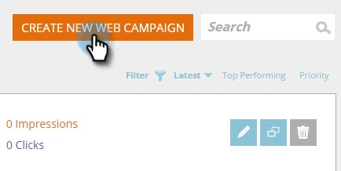

# 新增目標URL至Web促銷活動{#adding-a-target-url-to-a-web-campaign}

目標URL位於「設定促銷活動」頁面下方，並定義Web促銷活動將出現的特定URL或URL。

## 新增對話或介面工具集網頁促銷活動的目標URL {#adding-a-target-url-for-dialog-or-widget-web-campaigns}

1. 前往&#x200B;**Web促銷活動**。

   

1. 選擇&#x200B;**建立新的Web促銷活動**。

   

1. 新增&#x200B;**促銷活動名稱**。 選擇&#x200B;**目標區段**。 新增&#x200B;**目標URL**。

   

<table> 
 <thead> 
  <tr> 
   <th colspan="1" rowspan="1">名稱</th> 
   <th colspan="1" rowspan="1">說明</th> 
  </tr> 
 </thead> 
 <tbody> 
  <tr> 
   <td colspan="1" rowspan="1"><strong>任何頁面</strong></td> 
   <td colspan="1" rowspan="1">
允許促銷活動顯示在任何頁面上。
</td> 
  </tr> 
  <tr> 
   <td colspan="1" rowspan="1">
<strong>相符時包含URL參數</strong>
</td> 
   <td colspan="1" rowspan="1">新增URL參數，以比對並顯示包含此參數之URL上的促銷活動。 例如 campaign=cpc</td> 
  </tr> 
 </tbody> 
</table>

## 將多個URL新增至目標URL {#adding-multiple-urls-to-target-url}

按一下加號表徵圖()將開啟「多值輸入」對話框以添加多個URL。 每行新增一個URL。

>[!NOTE]
>
>
>* 對話方塊和介面工具集網頁促銷活動可使用任何頁面和萬用字元(*)選項。
* 在進階使用案例中，「在區域中」網頁促銷活動可在URL路徑結尾使用萬用字元。 範例：[www.marketo.com/software/personalization/*](https://www.marketo.com/software/personalization/*)
* URL區分大小寫

## 新增區域內Web促銷活動的目標URL {#adding-a-target-url-for-in-zone-web-campaigns}

1. 前往&#x200B;**Web** **促銷活動**。

   

1. 選擇&#x200B;**建立新的Web促銷活動**。

   

1. 新增**促銷活動名稱**。 選擇&#x200B;**目標區段**。 新增&#x200B;**目標URL**。

   >[!NOTE]
   「位於區域中」的目標URL必須定義特定URL或URL。 在進階使用案例中，「在區域中」網頁促銷活動可在URL路徑結尾使用萬用字元。 範例：[www.marketo.com/software/personalization/*](https://www.marketo.com/software/personalization/*)

   

>[!MORELIKETHIS]
* [建立新對話方塊Web促銷活動](create-a-new-dialog-web-campaign.md)
* [在區域網頁促銷活動中建立新功能](create-a-new-in-zone-web-campaign.md)
* [建立新的Widget Web促銷活動](create-a-new-widget-web-campaign.md)

