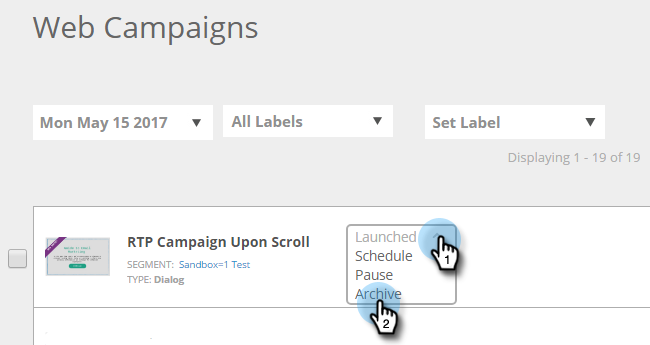

# 封存網站行銷活動 {#archive-a-web-campaign}

1. 前往 **網站行銷活動**.

   

1. 按一下所需網路行銷活動的狀態下拉式清單，然後選取 **封存**.

   

   >[!NOTE]
   >
   >已封存的網頁行銷活動不會顯示在預設篩選器中。 若要檢視，請按一下篩選器圖示並在 **狀態**，選取 **已封存** 核取方塊並按一下 **套用**.

>[!MORELIKETHIS]
>
>[刪除網站行銷活動](/help/marketo/product-docs/web-personalization/working-with-web-campaigns/delete-a-web-campaign.md)
