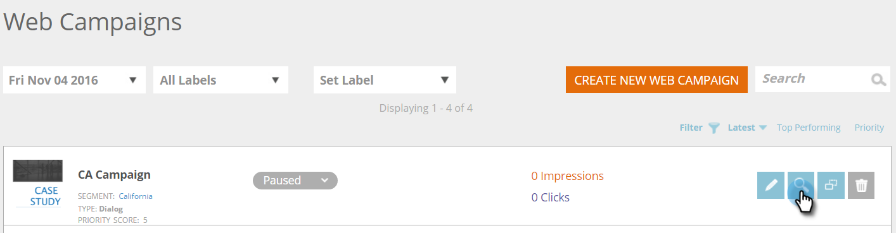

# 建立新的對話方塊Web促銷活動{#create-a-new-dialog-web-campaign}

## 建立對話方塊Web促銷活動{#create-a-dialog-web-campaign}

建立網頁促銷活動，即時個人化您的網頁內容，並在適當的時間向適當的使用者提供適當的訊息。

Web促銷活動是與特定群體相關的自訂反應。 反應可以是網站上的對話方塊、區域取代](create-a-new-in-zone-web-campaign.md)中的[、[介面工具集功能](create-a-new-widget-web-campaign.md)或電子郵件警報。

1. 前往&#x200B;**Web促銷活動**。

   

1. 選擇&#x200B;**建立新的Web促銷活動**。

   

1. 選擇&#x200B;**Dialog** Web促銷活動類型。 在編輯器中設計和新增創意。 按一下「預覽」，查看網站促銷活動在您網站上的反應。****

   

<table> 
 <thead> 
  <tr> 
   <th colspan="1" rowspan="1">名稱</th> 
   <th colspan="1" rowspan="1">說明</th> 
  </tr> 
 </thead> 
 <tbody> 
  <tr> 
   <td colspan="1"><strong>顯示於</strong></td> 
   <td colspan="1">可讓您自訂Web促銷活動的顯示時機和方式。</td> 
  </tr> 
  <tr> 
   <td colspan="1" rowspan="1"><strong>對話框樣式</strong></td> 
   <td colspan="1" rowspan="1"> 
    <ul> 
     <li>現代修剪——具有半透明黑色修剪和圓角的時尚獨特對話</li> 
     <li>現代修剪II —— 獨具風格的對話方式，配有淺色陰影修剪、圓角和封閉按鈕</li> 
     <li>透明——完全透明的對話方塊，最適合透明(png)影像，供您呼叫動作。 </li> 
     <li>基本——簡單的樣式對話框，標題標題空間較粗，滿足基本對話框的需要。</li> 
    </ul></td> 
  </tr> 
  <tr> 
   <td colspan="1"><strong>製作動畫進／出</strong></td> 
   <td colspan="1">在對話方塊進入和／或退出時設定。 選取效果（拖放、盲目、投影片、淡化、無效果）、持續時間（以秒為單位）和方向（向上、向下、左、右）。</td> 
  </tr> 
  <tr> 
   <td colspan="1" rowspan="1">
<strong>位置</strong>
</td> 
   <td colspan="1" rowspan="1">為對話框在頁面上的位置選擇9個選項之一。 例如，選取中間方塊會在畫面中央顯示對話方塊。</td> 
  </tr> 
  <tr> 
   <td colspan="1" rowspan="1">
<strong>按座標</strong>

 
</td> 
   <td colspan="1" rowspan="1">有關對話框的其他定位選項，請選中「位置坐標」複選框，然後輸入要顯示該對話框的確切螢幕坐標（水準、垂直）。</td> 
  </tr> 
  <tr> 
   <td colspan="1"><strong>按鈕填滿</strong></td> 
   <td colspan="1">使用顏色、樣式和位置自訂模型的關閉按鈕。 您也可以在「影像URL」方塊中連結至您自己的按鈕，以使用它。</td> 
  </tr> 
  <tr> 
   <td colspan="1"><strong>黏著</strong></td> 
   <td colspan="1">選取自黏核取方塊後，對話方塊會保持在原位，不受任何時間限制，直到使用者關閉為止，並會顯示在訪客作業的所有頁面上。</td> 
  </tr> 
  <tr> 
   <td colspan="1"><strong>Modal</strong></td> 
   <td colspan="1">讓您更專注在對話方塊上，並在對話方塊視窗後面以黑暗的背景啟動對話方塊，提高使用者對對話方塊的認識。</td> 
  </tr> 
  <tr> 
   <td colspan="1"><strong>模態色彩</strong></td> 
   <td colspan="1">自訂模型的色彩和不透明度。</td> 
  </tr> 
  <tr> 
   <td colspan="1"><strong>逾時 </strong></td> 
   <td colspan="1">對話框在淡出之前被激活的秒數。</td> 
  </tr> 
  <tr> 
   <td colspan="1"><strong>頁首顏色</strong></td> 
   <td colspan="1">將對話框的標題欄設定為首選顏色。 色彩可從色彩圖表中選擇，或以十六進位色碼輸入。 </td> 
  </tr> 
  <tr> 
   <td colspan="1"><strong>內容背景顏色 </strong></td> 
   <td colspan="1">將對話框的背景顏色設定為首選顏色。 色彩可從色彩圖表中選擇，或以十六進位色碼輸入。 </td> 
  </tr> 
  <tr> 
   <td colspan="1"><strong>對話框標題</strong></td> 
   <td colspan="1">新增標題至對話方塊的標題列。</td> 
  </tr> 
  <tr> 
   <td colspan="1"><strong>寬度和高度</strong></td> 
   <td colspan="1">選擇對話框的像素大小。</td> 
  </tr> 
  <tr> 
   <td colspan="1"><strong>寬度自動</strong></td> 
   <td colspan="1">選取此核取方塊可讓對話方塊自動符合內容寬度。</td> 
  </tr> 
  <tr> 
   <td colspan="1"><strong>可調整大小 </strong></td> 
   <td colspan="1">選取可調整大小的核取方塊，可讓使用者調整對話方塊的大小。</td> 
  </tr> 
  <tr> 
   <td colspan="1"><strong>Rich Text Editor</strong></td> 
   <td colspan="1">
富格文本編輯器允許文本格式設定、連結和影像插入。 <a href="using-the-web-personalization-rich-text-editor.md">閱讀更多資訊</a>。
</td> 
  </tr> 
  <tr> 
   <td colspan="1"><strong>在網站上預覽</strong></td> 
   <td colspan="1">在促銷活動啟動之前先預覽。  
    <ul> 
     <li>URL —— 輸入執行促銷活動的範例URL，以檢視促銷活動的顯示效果預覽範例。</li> 
     <li>裝置——預覽促銷活動依裝置的顯示方式：桌上型電腦、行動縱向、行動橫向、平板電腦縱向、縱向橫向。 </li> 
     <li>預覽——按一下「預覽<strong>預覽</strong>」以開啟範例URL的新視窗，瞭解促銷活動的反應。 </li> 
     <li>共用——使用「共用」按鈕，將電子郵件傳送給具有連結的同事，以查看代理促銷活動。</li> 
    </ul></td> 
  </tr> 
 </tbody> 
</table>

>[!TIP]
>
>使用我們內建的[範本](../../../product-docs/web-personalization/using-templates/using-templates-to-create-web-campaigns.md)或[儲存現有促銷活動](../../../product-docs/web-personalization/using-templates/using-templates-to-create-web-campaigns.md)做為範本，以加速並簡化促銷活動建立程式。

## 編輯Web促銷活動{#edit-a-web-campaign}

1. 從&#x200B;**Web****促銷活動**&#x200B;頁面，按一下Web促銷活動上的&#x200B;**編輯**。

>[!NOTE]
>
>若要更輕鬆找到您想要的Web促銷活動，請使用[篩選功能](filter-web-campaigns.md)。

## 預覽Web促銷活動{#preview-a-web-campaign}

1. 在&#x200B;**Web促銷活動**&#x200B;頁面中，按一下您要檢視之Web促銷活動上的&#x200B;**預覽**。

## 複製Web促銷活動{#clone-a-web-campaign}

請參閱[複製Web促銷活動](clone-a-web-campaign.md)。

## 刪除Web促銷活動{#delete-a-web-campaign}

1. 在&#x200B;**Web促銷活動**&#x200B;頁面中，按一下您要刪除之Web促銷活動上的**刪除**。

   

1. 會出現確認訊息，確認您是否要刪除Web促銷活動。

>[!MORELIKETHIS]
>
>* [在區域網頁促銷活動中建立新功能](create-a-new-in-zone-web-campaign.md)
>* [建立新的Widget Web促銷活動](create-a-new-widget-web-campaign.md)

