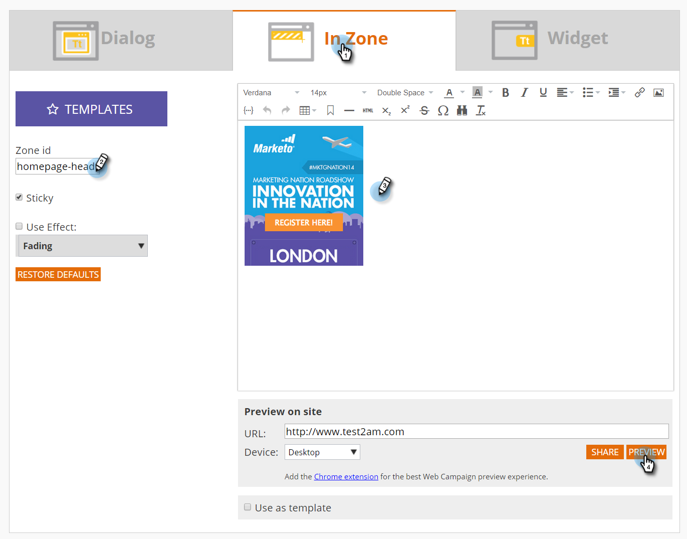

# 建立新的In Zone網頁行銷活動 {#create-a-new-in-zone-web-campaign}

網路行銷活動是與特定區段相關聯的自訂反應，可以是 [對話方塊](/help/marketo/product-docs/web-personalization/working-with-web-campaigns/create-a-new-dialog-web-campaign.md) 在您的網站上，一個區域內的替代專案， [Widget功能](/help/marketo/product-docs/web-personalization/working-with-web-campaigns/create-a-new-widget-web-campaign.md) 或電子郵件警示。 區域內Web促銷活動會根據區域ID以內容或圖形橫幅取代網站的元素。

## 建立區域內網路行銷活動 {#create-an-in-zone-web-campaign}

1. 前往 **網路行銷活動**.

   

1. 選取 **建立新的網站行銷活動。**

   

1. 選取 **在區域中** 行銷活動型別。 自訂並新增 **區域ID。** 將行銷活動設為 **粘性** 並在編輯器中新增您的創意。 新增要預覽的頁面URL並按一下 **預覽** 以瞭解行銷活動在您的網站上將如何反應。

   

   >[!NOTE]
   >
   >**什麼是區域ID？**
   >
   >區域ID是您想要「所在區域」網路促銷活動位於網站上的位置。 若要尋找「區域ID」，只要前往您的網站，選取您要取代為網頁行銷活動的區域，然後按一下右鍵。 在Chrome中，選項為「Inspect元素」，但在其他瀏覽器中可能有所不同。
   >
   >接著，您會想要尋找與網站此區段相關聯的「id」，由於您正在檢查該元素，因此會反白顯示。 例如，如果您在Chrome中按一下滑鼠右鍵，醒目提示的文字會顯示 `
` 那麼您應在「zone id」區段中輸入「feature-slider」。 通常會使用「div id」，但也可使用任何ID，例如h1 id、p id等。

<table> 
 <thead> 
  <tr> 
   <th colspan="1" rowspan="1">名稱</th> 
   <th colspan="1" rowspan="1">說明</th> 
  </tr> 
 </thead> 
 <tbody> 
  <tr> 
   <td colspan="1" rowspan="1"><strong> 區域ID </strong></td> 
   <td colspan="1" rowspan="1">
輸入在行銷活動取代之網站元素的HTML代碼中找到的ID名稱。
</td> 
  </tr> 
  <tr> 
   <td colspan="1" rowspan="1">
<strong> 粘性 </strong>
</td> 
   <td colspan="1" rowspan="1">依預設，「粘著」核取方塊會針對「區域內」促銷活動選取，且「區域內」促銷活動會在訪客在網站上的整個工作階段中保持在其區域ID位置。 建議永遠將In區域設定為Sticky。</td> 
  </tr> 
  <tr> 
   <td colspan="1" rowspan="1">
<strong> 淡出</strong> 
</td> 
   <td colspan="1" rowspan="1">選取「使用效果」核取方塊和「淡化」可讓網站上的「區域ID」區域產生淡入淡出效果。 如果「收入區域」是圖形橫幅，則頁面會先載入，然後行銷活動啟動，並出現淡化效果。</td> 
  </tr> 
  <tr> 
   <td colspan="1"><strong>滑動</strong></td> 
   <td colspan="1">選取「使用效果」核取方塊和「滑動」選項，可對網站上的「區域ID」區域執行滑動。 如果「進入區域」是圖形橫幅，則頁面會先載入，然後促銷活動以從左至右的滑動效果啟動。</td> 
  </tr> 
  <tr> 
   <td colspan="1"><strong> RTF編輯器  </strong></td> 
   <td colspan="1">RTF編輯器允許文字格式、連結和影像插入。 <a href="/help/marketo/product-docs/web-personalization/working-with-web-campaigns/using-the-web-personalization-rich-text-editor.md">請在此閱讀更多資訊</a> .</td> 
  </tr> 
  <tr> 
   <td colspan="1"><strong> 在網站上預覽   </strong></td> 
   <td colspan="1">在啟動行銷活動之前進行預覽。   
    <ul> 
     <li> URL — 輸入行銷活動將執行的範例URL，以檢視行銷活動看起來如何上線的預覽範例。</li> 
     <li>裝置 — 依裝置預覽行銷活動的顯示方式：案頭、行動裝置直向、行動裝置橫向、平板電腦直向、直向。</li> 
     <li> 預覽 — 按一下 <strong>預覽</strong> 開啟範例URL的新視窗，以檢視行銷活動的反應。</li> 
     <li> 共用 — 使用「共用」按鈕傳送電子郵件給同事，其中包含檢視Proxy促銷活動的連結。</li> 
    </ul></td> 
  </tr> 
 </tbody> 
</table>

>[!TIP]
>
>使用我們的 [內建範本](/help/marketo/product-docs/web-personalization/using-templates/using-templates-to-create-web-campaigns.md) 或依據 [儲存您現有的行銷活動](/help/marketo/product-docs/web-personalization/using-templates/using-templates-to-create-web-campaigns.md) 作為可重複使用的範本。

>[!NOTE]
>
>**想要A/B測試您的Web行銷活動？** 一或多個網頁行銷活動可以是 [A/B測試以取得最佳結果](/help/marketo/product-docs/web-personalization/working-with-web-campaigns/ab-test-your-web-campaign.md). 透過「自動調整」功能，平台會自動辨識表現較佳的行銷活動、繼續最高轉換的行銷活動，並暫停其他行銷活動。

## 編輯網站行銷活動 {#edit-a-web-campaign}

從 **網路行銷活動** 頁面，按一下 **編輯** 促銷活動上的資訊。

>[!NOTE]
>
>為了更方便找到您想要的行銷活動，請使用 [篩選功能](/help/marketo/product-docs/web-personalization/working-with-web-campaigns/filter-web-campaigns.md).

## 預覽網站行銷活動 {#preview-a-web-campaign}

1. 從網路行銷活動頁面，按一下 **預覽** 在您想要檢視的網頁行銷活動上。

   

## 複製網站行銷活動 {#clone-a-web-campaign}

另請參閱 [複製網站行銷活動](/help/marketo/product-docs/web-personalization/working-with-web-campaigns/clone-a-web-campaign.md).

## 刪除網站行銷活動 {#delete-a-web-campaign}

1. 從網路行銷活動頁面，按一下 **刪除** 於您要刪除的行銷活動上。

   

1. 系統會顯示確認訊息，確認您是否要刪除行銷活動。

>[!MORELIKETHIS]
>
>* [建立新的Widget Web行銷活動](/help/marketo/product-docs/web-personalization/working-with-web-campaigns/create-a-new-widget-web-campaign.md)
>* [建立新的對話方塊網頁行銷活動](/help/marketo/product-docs/web-personalization/working-with-web-campaigns/create-a-new-dialog-web-campaign.md)
