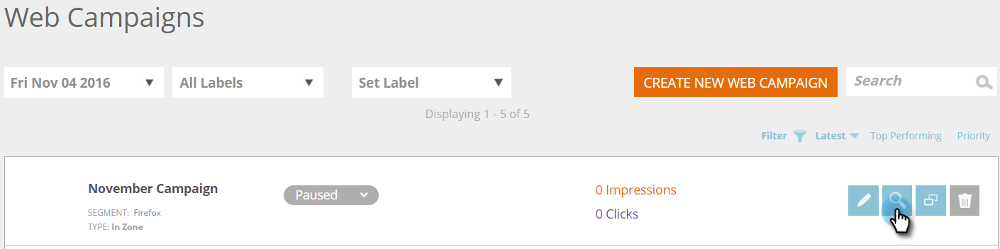

# 在區域Web促銷活動中建立新促銷活動 {#create-a-new-in-zone-web-campaign}

網路促銷活動是與特定區段相關聯的自訂反應，可以是 [對話框](/help/marketo/product-docs/web-personalization/working-with-web-campaigns/create-a-new-dialog-web-campaign.md) 在您的網站上，取代區域 [widget功能](/help/marketo/product-docs/web-personalization/working-with-web-campaigns/create-a-new-widget-web-campaign.md) 或電子郵件警報。 「區域內」網頁促銷活動會以內容或圖形橫幅取代根據區域ID的網站元素。

## 在區域內建立Web促銷活動 {#create-an-in-zone-web-campaign}

1. 前往 **網路行銷活動**.

   

1. 選擇 **建立新的Web促銷活動。**

   

1. 選取 **區域** 促銷活動類型。 自訂和新增 **區域ID。** 將促銷活動設為 **黏著** 並在編輯器中新增您的創意內容。 新增要預覽的頁面URL，然後按一下 **預覽** 以了解促銷活動在您網站上的反應。

   

   >[!NOTE]
   >
   >**什麼是區域ID?**
   >
   >「區域ID」是您希望「區域內」Web促銷活動位於現場的位置。 若要尋找「區域ID」，只要前往您的網站，選取您要以Web促銷活動取代的區域，然後按一下滑鼠右鍵。 在Chrome中，選項是「Inspect元素」，在其他瀏覽器中則可能有所不同。
   >
   >然後，您會想要尋找與網站的此區段相關聯的「id」，這會反白顯示，因為您正在檢查該元素。 例如，在Chrome中按一下滑鼠右鍵後，醒目提示的文字會顯示 `
` 那麼，「featured-slider」就是您應在「zone id」區段中輸入的內容。 通常會使用&quot;div id&quot;，但也可以使用任何ID，例如h1 id、p id等。

<table> 
 <thead> 
  <tr> 
   <th colspan="1" rowspan="1">名稱</th> 
   <th colspan="1" rowspan="1">說明</th> 
  </tr> 
 </thead> 
 <tbody> 
  <tr> 
   <td colspan="1" rowspan="1"><strong> 區域ID </strong></td> 
   <td colspan="1" rowspan="1">
輸入在促銷活動所取代之網站元素的HTML程式碼中找到的id名稱。
</td> 
  </tr> 
  <tr> 
   <td colspan="1" rowspan="1">
<strong> 黏著 </strong>
</td> 
   <td colspan="1" rowspan="1">依預設，「在區內」促銷活動會選取「自黏」核取方塊，並在訪客在網站上的整個工作階段中，將「在區內」促銷活動保留在其「區域ID」位置。 建議一律將「區域內」設為「自黏」。</td> 
  </tr> 
  <tr> 
   <td colspan="1" rowspan="1">
<strong> 衰落</strong> 
</td> 
   <td colspan="1" rowspan="1">選取「使用效果」核取方塊和「淡出」 ，可對網站上的「區域id」區域產生淡出效果。 如果「在區」是圖形橫幅，則頁面會先載入，然後促銷活動會隨著淡出效果啟動。</td> 
  </tr> 
  <tr> 
   <td colspan="1"><strong>滑動</strong></td> 
   <td colspan="1">選取「使用效果」核取方塊和「滑動」選項，可提供對網站上的「區域ID」區域有效的滑動。 如果「在區」是圖形橫幅，則頁面會先載入，然後促銷活動會以從左到右的滑動效果啟動。</td> 
  </tr> 
  <tr> 
   <td colspan="1"><strong> RTF編輯器  </strong></td> 
   <td colspan="1">RTF編輯器可進行文字格式設定、連結和影像插入。 <a href="/help/marketo/product-docs/web-personalization/working-with-web-campaigns/using-the-web-personalization-rich-text-editor.md">詳情請見</a> .</td> 
  </tr> 
  <tr> 
   <td colspan="1"><strong> 在網站上預覽   </strong></td> 
   <td colspan="1">在啟動促銷活動之前先預覽。   
    <ul> 
     <li> URL — 輸入執行促銷活動的範例URL，以查看促銷活動上線的預覽範例。</li> 
     <li>裝置 — 預覽裝置顯示促銷活動的方式：案頭、行動直向、行動橫向、平板電腦直向、直向橫向。</li> 
     <li> 預覽 — 按一下 <strong>預覽</strong> 以開啟範例URL的新視窗，以查看促銷活動的反應。</li> 
     <li> 共用 — 使用「共用」按鈕，透過連結傳送電子郵件給同事，以查看代理促銷活動。</li> 
    </ul></td> 
  </tr> 
 </tbody> 
</table>

>[!TIP]
>
>使用 [內建範本](/help/marketo/product-docs/web-personalization/using-templates/using-templates-to-create-web-campaigns.md) 或 [儲存現有行銷活動](/help/marketo/product-docs/web-personalization/using-templates/using-templates-to-create-web-campaigns.md) 作為可重複使用的範本。

>[!NOTE]
>
>**想要A/B測試您的Web促銷活動嗎？** 一或多個網路行銷活動可以是 [測試A/B以取得最佳結果](/help/marketo/product-docs/web-personalization/working-with-web-campaigns/ab-test-your-web-campaign.md). 透過自動調整功能，平台會自動辨識表現較佳的促銷活動、繼續轉換率最高的促銷活動並暫停其他促銷活動。

## 編輯網頁行銷活動 {#edit-a-web-campaign}

從 **網路行銷活動** 頁面，按一下 **編輯** 在促銷活動上。

>[!NOTE]
>
>若要更輕鬆找到您想要的促銷活動，請使用 [篩選功能](/help/marketo/product-docs/web-personalization/working-with-web-campaigns/filter-web-campaigns.md).

## 預覽網頁促銷活動 {#preview-a-web-campaign}

1. 從「網路促銷活動」頁面，按一下 **預覽** 在您要檢視的Web促銷活動上。

   

## 複製網頁促銷活動 {#clone-a-web-campaign}

請參閱 [複製網頁促銷活動](/help/marketo/product-docs/web-personalization/working-with-web-campaigns/clone-a-web-campaign.md).

## 刪除網路促銷活動 {#delete-a-web-campaign}

1. 從「網路促銷活動」頁面，按一下 **刪除** 在您要刪除的促銷活動上。

   

1. 會出現確認訊息，確認您是否要刪除促銷活動。

>[!MORELIKETHIS]
>
>* [建立新的Widget Web促銷活動](/help/marketo/product-docs/web-personalization/working-with-web-campaigns/create-a-new-widget-web-campaign.md)
>* [建立新的對話方塊Web促銷活動](/help/marketo/product-docs/web-personalization/working-with-web-campaigns/create-a-new-dialog-web-campaign.md)

