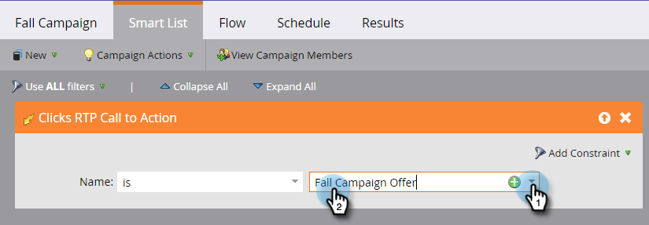

# 定義網頁個人化活動的智慧清單 {#define-a-smart-list-for-web-personalization-activities}

當您在智慧行銷活動中定義智慧清單時，可以在篩選器和觸發器中使用Web個人化活動。 在這裡，您要擷取按一下「網頁個人化行動呼籲」（行銷活動）的任何人。

使用觸發器來傳送電子郵件或警報，或根據訪客點選並參與網站個人化行動號召來變更值或分數。 您也可以篩選並檢視那些點選Web Personalization行動號召的銷售機會。

1. 在您的智慧行銷活動中，按一下 **智慧清單** 標籤。

   

   >[!NOTE]
   >
   >智慧列示可以做許多令人驚異的事情。 進一步瞭解 [智慧清單深入分析](/help/marketo/product-docs/core-marketo-concepts/smart-campaigns/understanding-smart-campaigns.md).

1. 搜尋觸發器，然後將觸發器拖放到畫布上。

   

   >[!NOTE]
   >
   >具有觸發器的智慧行銷活動會在觸發模式下執行。 它會根據觸發的事件和新增的篩選器，一次只對一個人執行。

1. 按一下下拉式清單，然後選擇運運算元。

   

   >[!CAUTION]
   >
   >紅色曲線表示錯誤。 如果未更正，則會使行銷活動無效，且將無法執行。

1. 定義觸發器。

   

1. 視需要新增篩選器。

   

   >[!TIP]
   >
   >在同時具有觸發器和篩選器的智慧行銷活動中，觸發器位於頂端。 觸發時，只有符合篩選條件的人才會通過流程。

   >[!NOTE]
   >
   >使用多個觸發器時，如果任何一個觸發器啟動，則人員會進入流程。

   若要對一組人員同時執行行銷活動，請瞭解如何 [定義Smart Campaign的智慧清單 |批次](/help/marketo/product-docs/core-marketo-concepts/smart-campaigns/creating-a-smart-campaign/define-smart-list-for-smart-campaign-batch.md).

   >[!MORELIKETHIS]
   >
   >* [定義Smart Campaign的智慧清單 |批次](/help/marketo/product-docs/core-marketo-concepts/smart-campaigns/creating-a-smart-campaign/define-smart-list-for-smart-campaign-batch.md)
   >* [將流量步驟新增至Smart Campaign](/help/marketo/product-docs/core-marketo-concepts/smart-campaigns/flow-actions/add-a-flow-step-to-a-smart-campaign.md)
   >* [定義預測性內容活動的智慧清單](/help/marketo/product-docs/predictive-content/define-a-smart-list-for-predictive-content-activities.md)
