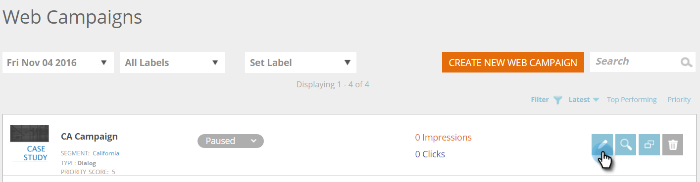

# 編輯現有的網頁行銷活動 {#edit-an-existing-web-campaign}

1. 前往 **[!UICONTROL Web Campaigns]**。

   

1. 在&#x200B;**[!UICONTROL Web Campaigns]**&#x200B;頁面上，按一下您要編輯之行銷活動上的&#x200B;**[!UICONTROL Edit]**。

   

   >[!NOTE]
   >
   >若要更輕鬆地尋找您想要的網頁行銷活動，請使用[篩選功能](/help/marketo/product-docs/web-personalization/working-with-web-campaigns/filter-web-campaigns.md)。

>[!MORELIKETHIS]
>
>* [刪除網站行銷活動](/help/marketo/product-docs/web-personalization/working-with-web-campaigns/delete-a-web-campaign.md)
>* [啟動/暫停行銷活動](/help/marketo/product-docs/web-personalization/working-with-web-campaigns/launch-pause-a-web-campaign.md)。
