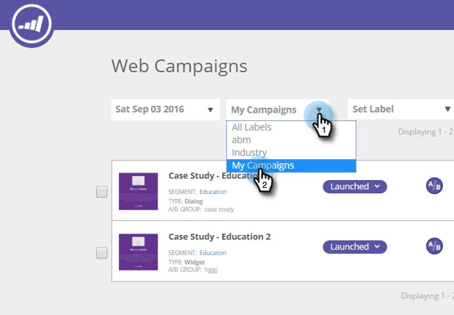

# 將您的網頁行銷活動加上標籤 {#label-your-web-campaigns}

您有這麼多行銷活動，導致捲動變得繁瑣嗎？ 使用標籤來標籤行銷活動，以便您可以排序並快速尋找。

## 新增標籤至網站行銷活動 {#add-a-label-to-a-web-campaign}

1. 登入[!DNL Web Personalization]並移至[!UICONTROL Web Campaigns]區域。

   

   >[!NOTE]
   >
   >若要更輕鬆地尋找您想要的行銷活動，請使用[篩選功能](/help/marketo/product-docs/web-personalization/working-with-web-campaigns/filter-web-campaigns.md)。

1. 選取您要使用標籤標籤的促銷活動。

   

1. 輸入所需的標簽名稱，然後按一下「新建」。

   >[!TIP]
   >
   >如果標籤已存在，請選取該標籤，並且不要建立新標籤。

   

酷！ 您現在知道如何建立標籤並將其指派給行銷活動。

## 依現有標籤篩選 {#filter-by-existing-labels}

1. 在「標籤」下拉式清單中，選取要作為篩選使用的標籤。

   

1. 現在，我們只會顯示與所選標籤相關聯的促銷活動。

   

>[!MORELIKETHIS]
>
>[標籤區段](/help/marketo/product-docs/web-personalization/using-web-segments/label-your-segment.md)
