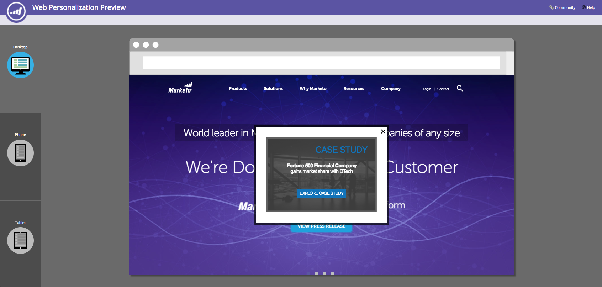

# 預覽並測試Web促銷活動{#preview-and-test-a-web-campaign}

本文會顯示不同的方式來預覽Web促銷活動，以及如何使用網站上即時的沙盒區段來測試它。

## 在「建立頁面{#preview-a-web-campaign-on-the-creation-page}」上預覽Web促銷活動

1. 前往&#x200B;**Web促銷活動**。

   

1. 按一下「建立新的Web促銷活動」**或圖示，以編輯現有的促銷活動。**

   

1. 在「在網站上預覽」中，新增頁面URL，然後按一下「預覽」。 ****&#x200B;隨即開啟新視窗／標籤，顯示促銷活動預覽。

   

   >[!TIP]
   >
   >按一下&#x200B;**共用**&#x200B;以開啟具有促銷活動預覽固定URL的電子郵件。

   >[!NOTE]
   >
   >您也可以選擇安裝瀏覽器外掛程式（[Chrome](https://chrome.google.com/webstore/detail/marketo-web-personalizati/ldiddonjplchallbngbccbfdfeldohkj)或[Firefox](https://rtp-static.marketo.com/rtp/libs/mwp-0.0.0.8.xpi)），以獲得最佳的預覽促銷活動體驗。 請參閱以下章節。

## 使用瀏覽器外掛程式{#preview-a-web-campaign-on-the-creation-page-using-the-browser-plug-in}在建立頁面上預覽網頁促銷活動

1. 請遵循上述章節中的步驟1和2。

1. 按一下瀏覽器外掛程式的連結（在本例中，我們使用Chrome）。

   

1. 隨即開啟新視窗／標籤。 按一下「新增至Chrome **」。**

   

1. 按一下&#x200B;**添加副檔名**。

   

1. 回到Marketo。 新增頁面URL，然後按一下「預覽」。****

   

1. 新視窗／標籤隨即開啟，可讓您預覽促銷活動在桌上型電腦、手機或平板電腦上的外觀。

   

## 在「網頁促銷活動」頁面{#preview-a-web-campaign-on-the-web-campaigns-page}上預覽網頁促銷活動

1. 查看Web促銷活動的清單時，只要選擇促銷活動，然後按一下「預覽」圖示。****

   

   放輕鬆！

## 在您的網站上預覽Web促銷活動{#preview-a-web-campaign-on-your-website}

建立沙盒區段和促銷活動。

1. 前往&#x200B;**區段**。

   

1. 按一下&#x200B;**新建**。

   

1. 命名區段。

1. 在「行為」下方，拖曳「包含頁面」至畫布。 新增值*sandbox=1*。 按一下「儲存並定義促銷活動」**。**

   

1. 在「設定Web促銷活動」頁面上，從清單中選取「目標區段」，將其變更為沙盒區段。

   

1. 完成促銷活動創意，然後按一下&#x200B;**Launch**。

   

1. 前往您的網站，在URL結尾新增URL參數&quot;?sandbox=1&quot;。 範例：`www.marketo.com?sandbox=1`。

1. 查看您網站上的促銷活動反應。

>[!NOTE]
>
>促銷活動在訪客作業期間只會回應一次。 若要再次查看促銷活動，請清除您的瀏覽器Cookie。

>[!NOTE]
>
>無法預覽重新導向促銷活動。 測試它們的唯一方法是使用沙盒區段（依特定頁面定位- *sandbox=redirect*）
