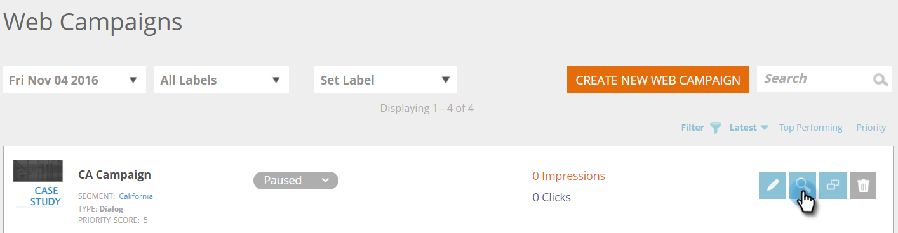

# 預覽和測試網路促銷活動 {#preview-and-test-a-web-campaign}

本文說明預覽網頁促銷活動的不同方式，以及如何使用網站上即時顯示的沙箱區段來測試促銷活動。

>[!NOTE]
>
>預覽只會顯示促銷活動在所選網站上的外觀。 連結和介面工具集將無法運作，因此可避免分析中發生錯誤的點按/檢視。

## 在建立頁面上預覽網頁促銷活動 {#preview-a-web-campaign-on-the-creation-page}

1. 前往 **網路行銷活動**.

   

1. 按一下 **建立新的Web促銷活動** 或圖示來編輯現有的促銷活動。

   

1. 在「在網站上預覽」中，新增頁面URL並按一下 **預覽**. 隨即開啟新視窗/標籤，顯示促銷活動預覽。

   

   >[!TIP]
   >
   >按一下 **共用** 以開啟具有促銷活動預覽之固定URL的電子郵件。

   >[!NOTE]
   >
   >您也可以選擇安裝瀏覽器外掛程式( [鉻黃](https://chrome.google.com/webstore/detail/marketo-web-personalizati/ldiddonjplchallbngbccbfdfeldohkj) 或 [Firefox](https://rtp-static.marketo.com/rtp/libs/mwp-0.0.0.8.xpi))，以獲得預覽促銷活動的最佳體驗。 請參閱下節。

## 使用瀏覽器外掛程式在建立頁面上預覽網頁促銷活動 {#preview-a-web-campaign-on-the-creation-page-using-the-browser-plug-in}

1. 請遵循上節中的步驟1和2。

1. 按一下瀏覽器外掛程式的連結（在此例中為使用Chrome）。

   

1. 將開啟新窗口/頁簽。 按一下 **新增至Chrome**.

   

1. 按一下 **新增擴充功能**.

   

1. 回Marketo。 新增頁面URL，然後按一下 **預覽**.

   

1. 新視窗/標籤隨即開啟，可讓您預覽行銷活動在桌上型電腦、手機或平板電腦上的外觀。

   

## 在「網頁促銷活動」頁面上預覽網頁促銷活動 {#preview-a-web-campaign-on-the-web-campaigns-page}

1. 查看Web促銷活動清單時，只要選擇促銷活動，然後按一下 **預覽** 表徵圖。

   

   放輕鬆！

## 在您的網站上預覽網頁促銷活動 {#preview-a-web-campaign-on-your-website}

建立沙箱區段和促銷活動。

1. 前往 **區段**.

   

1. 按一下 **新建**.

   

1. 為區段命名。

1. 在「行為」下，將「包含頁面」拖曳至畫布上。 新增值 &#42;sandbox=1&#42;. 按一下 **儲存並定義促銷活動**.

   

1. 在「設定網路促銷活動」頁面上，從清單中選取目標區段，將其變更為沙箱區段。

   

1. 完成促銷活動創意內容，然後按一下 **Launch**.

   

1. 前往您的網站，在URL結尾新增URL參數&quot;?sandbox=1&quot;。 範例： `www.marketo.com?sandbox=1`.

1. 查看您網站上的促銷活動反應。

>[!NOTE]
>
>促銷活動在訪客工作階段期間只會回應一次。 若要再次查看促銷活動，請清除您的瀏覽器Cookie。

>[!NOTE]
>
>無法預覽重新導向促銷活動。 測試這些區段的唯一方法是使用沙箱區段(依特定頁面來鎖定目標 —  &#42;sandbox=redirect&#42;)
