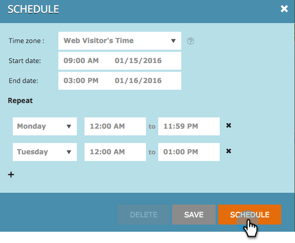

# 排程網站行銷活動 {#schedule-a-web-campaign}

如果您知道要在何時執行網路行銷活動，可以預先排程。 可輕鬆設定開始和停止日期、重複日期和多天。

您可以根據網站訪客的時間或選取的時區來排程網站行銷活動。

>[!NOTE]
>
>**範例**
>
>對於在特定期間執行的已排程事件（例如網路研討會），排程開始和停止日期是最佳選擇。 重複是每週只在特定天執行的特殊優惠的完美選擇。

1. 前往 **網站行銷活動**.

   

   >[!NOTE]
   >
   >為了更方便找到您想要的行銷活動，請使用 [篩選功能](/help/marketo/product-docs/web-personalization/working-with-web-campaigns/filter-web-campaigns.md).

1. 開啟「促銷活動狀態」功能表，然後選取 **排程**.

   

1. 在排程週期對話方塊中，選取行銷活動的時區

   

   >[!TIP]
   >
   >預設設定會在網頁訪客的時區中執行行銷活動。

1. 選取開始日期與時間以及結束日期與時間。

   

   >[!NOTE]
   >
   >您可以從下拉式選單和行事曆中選取日期和時間，或手動輸入。 時間為上午/下午12小時。

1. 根據預設，從開始日期到結束日期期間，行銷活動每天都會執行。 如果您只想在特定日期或特定時間執行行銷活動，請使用 **重複** 設定。 選取日、開始和結束時間以顯示行銷活動。 使用加號+新增額外天數。

   

1. 按一下 **排程**.

   

1. 「行銷活動」頁面上的行銷活動狀態變更為 **已排程** 而且時鐘/日曆圖示會顯示。 按一下此圖示可編輯行銷活動排程。

   

   >[!NOTE]
   >
   >行銷活動狀態維持為 **已排程** 即使行銷活動在選取的排程時間執行。 排程的結束日期過後，行銷活動狀態會變更為 **已暫停**.
