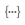

# 使用網頁個人化RTF編輯器 {#using-the-web-personalization-rich-text-editor}

在「設定行銷活動」頁面中找到的「網頁個人化RTF編輯器」允許文字格式設定、連結和影像插入。 它包含與標準文書處理器類似的格式選項。

RTF編輯器中的重要圖示包括：

<table> 
 <tbody> 
  <tr> 
   <td colspan="1"></td> 
   <td colspan="1"><strong>編輯HTML來源</strong></td> 
   <td colspan="1">可讓您檢視HTML原始碼</td> 
  </tr> 
  <tr> 
   <td colspan="1"></td> 
   <td colspan="1">
<strong>插入/編輯影像</strong> 
</td> 
   <td colspan="1">插入影象URL，使圖形影象顯示在編輯器中</td> 
  </tr> 
  <tr> 
   <td colspan="1"></td> 
   <td colspan="1"><strong>從Design Studio插入影像</strong></td> 
   <td colspan="1"><em>晚於</em> 按一下 <strong>插入/編輯影像</strong> 圖示，即可從Marketo Design Studio中選取影像</td> 
  </tr> 
  <tr> 
   <td colspan="1"></td> 
   <td colspan="1">
<strong>插入/編輯連結</strong> 
</td> 
   <td colspan="1">用於將超連結新增至文字或影像</td> 
  </tr> 
  <tr> 
   <td colspan="1"></td> 
   <td colspan="1"><strong>插入/編輯Token</strong></td> 
   <td colspan="1">使用公司或個人代號來個人化您的網路行銷活動</td> 
  </tr> 
 </tbody> 
</table>

>[!NOTE]
>
>Web Token使用 [人員資料](/help/marketo/product-docs/web-personalization/using-web-segments/manage-person-data.md) 從Marketo資料庫（在「帳戶設定>資料庫」下的「網頁個人化」中管理）。 如果Web權杖是「帳戶設定>資料庫」中尚未顯示的新資料庫欄位，則會自動新增，且最多可能需要24小時才能啟用。

>[!MORELIKETHIS]
>
>[使用RTF編輯器](/help/marketo/product-docs/email-marketing/general/understanding-the-email-editor/using-the-rich-text-editor.md)
