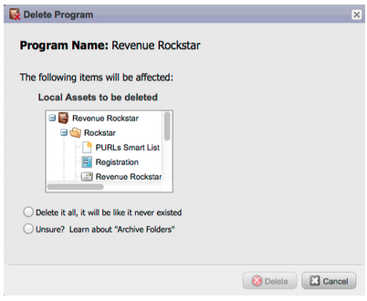

# 發行說明：2012年1月/2月{#release-notes-jan-feb}

1月/2月發行包含下列功能。 查看您的Marketo版功能是否可用。 在發行後回來，取得詳細功能檔案的連結。

## 進階動態內容{#advanced-dynamic-content}

_適用於Pro和Enterprise版本_

使用進階的動態內容，您就可以建立與受眾相關的精彩電子郵件通訊和登陸頁面，而不需針對相同的訊息建立多個資產。 升級的預覽器可讓您在單一畫面中檢視每個獨特版本。

## 區段{#segmentation}

_適用於Pro和Enterprise版本_

區段是一組區段，是您行銷的目標群體。 區段由規則定義，規則由類似於智慧型清單的篩選條件所驅動。 您的區段可以根據人口統計資料（例如職稱或產業），或根據瀏覽或點按的網頁等行為。

## 代碼片段{#snippets}

_適用於Pro和Enterprise版本_

儲存可反複使用的豐富式內容，以建立靜態或動態電子郵件和登陸頁面。

## PURL {#purls}

_適用於Pro和Enterprise版本_

使用個人化URL(PURL)行銷人員現在可以建立特定於連絡人的URL，以針對直接郵件和電子郵件促銷活動，在多點觸控式行銷方案中推動個人化、可測量性和提升回應率。

## EU Privacy Directive Support {#eu-privacy-directive-support}

尊重瀏覽器「不追蹤」設定的新功能包括停用匿名潛在客戶追蹤的功能；這讓遵守歐盟更嚴格的隱私追蹤法規變得更加容易。

## 單一登入{#single-sign-on}

企業組織現在可以支援使用SAML 2.0從公司入口網站單一登入，順暢地登入Marketo應用程式。

## 更新的電子郵件和著陸頁面編輯器{#updated-email-and-landing-page-editors}

電子郵件和著陸頁面編輯器經過重新設計，提供更吸引人的介面、直覺式導覽以及大幅改善的使用者體驗，包括：

並排檢視HTML和文字

編輯器中將顯示「發件人名稱」、「發件人電子郵件」、「收件人(NEW)」和「主旨」。 所有其他設定都可透過「編輯設定」按鈕存取。

## 瀏覽器支援{#browser-support}

* Mozilla Firefox 9.0
* Google Chrome 16
* Microsoft Internet Explorer 8 &amp; 9
* **注意**:我們不再支援Internet Explorer 7

## 方案管理{#program-management}

簡化的程式管理透過Token刪除和更輕鬆的程式刪除來改善可用性。

## 取消訂閱訂閱報表{#unsubscribe-from-subscription-report}

現在您可以直接從報表取消訂閱訂閱！

## Munchkin Updates {#munchkin-updates}

新的Munchkin呼叫可縮短網頁載入時間，並為點按連結事件提供更一致的效能。

## 計畫機會分析（僅限RCA）{#program-opportunity-analysis-rca-only}

瞭解對個別銷售機會收入的行銷貢獻

## 方案收入階段分析{#program-revenue-stage-analysis}

瞭解哪些程式獲得了快速移動器，從而洞察計畫的領先速度

