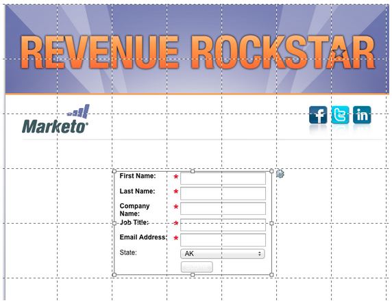
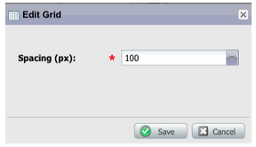
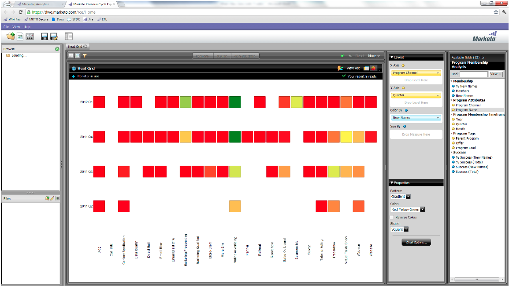

# 發行說明：2012年6月{#release-notes-june}

>[!NOTE]
>
>**深入探討**
>
>如需其他版本，請參閱[發行說明](https://docs.marketo.com/display/docs/release+notes)深入探討。

## Marketo銷售線索管理增強功能{#marketo-lead-management-enhancements}

### 更名{#rename}

您可以重新命名智慧型清單、靜態清單和促銷活動。 如果您在篩選、觸發器或流程中使用這些資產，名稱也會自動更新。 您一直可以重新命名電子郵件、表單和資料夾。

此外，我們也改善了資產的說明文字輸入與檢視。

## 導入欄位映射{#import-field-mapping}

我們讓將清單匯入Market變得更輕鬆！ 在匯入程式中，您可以將Marketo欄位的名稱對應至匯入檔案中的欄標題名稱。 此外，在「管理」中，您可以設定對應至Marketo中欄位名稱的別名，確保您的使用者每次都選取正確的欄位。

當您繼續匯入和對應欄位時，Marketo會在匯入期間記住並顯示對應，以方便使用。 為了讓生活更輕鬆，您可以按一下「範例值」標題，查看填入欄位中的不同值。 這有助於確保每次映射正確的欄位！

## 智慧清單和靜態清單的摘要頁{#summary-page-for-smart-lists-and-static-lists}

您是否曾想過您的清單在何處使用？ 或者，是誰建立清單，還是上次修改清單？ 智慧型清單和靜態清單上提供的新摘要頁面將提供這些重要的詳細資料。

在現有的「方案」和「促銷活動」摘要頁面上，我們也新增了「建立日期／使用者」和「上次修改日期／使用者」資訊！

## 用於資產{#used-by-for-assets}

我們在資產摘要頁面中新增了標籤，稱為「使用者」!

範例：用於靜態清單

## 著陸頁面網格線{#landing-page-gridlines}

著陸頁面網格線的加入讓在著陸頁面上對齊文字、圖形和表單變得更輕鬆。 針對任何指定的著陸頁面開啟或關閉它，並調整線條間的寬度！

## 從郵件中阻止的線索{#leads-blocked-from-mailings}

在排程促銷活動時，您可以按一下連結，查看您的郵件中封鎖的銷售機會清單。

## 等待步驟——銷售機會Token和我的Token {#wait-step-lead-token-and-my-token}

在5月版中，我們新增了「等待流程」步驟的進階選項。 透過這些變更，您可以指定工作日、日期和時間。 在此版本中，我們新增了在等待步驟中使用代號的功能。 例如，您可能想使用`{{lead.Birthday}}`在其生日時傳送電子郵件，或使用`{{my.Event Date}}`傳送最終網路研討會提醒。

## 在Design Studio {#view-as-thumbnails-in-design-studio}中以縮圖形式檢視

將您的檢視從影像清單切換為縮圖檢視！

注意：自此版本起，智慧清單網格上的先前排序將不適用於您查看的下一個智慧清單。 例如，如果您按公司名稱排序智慧型清單，我們不會自動對同一欄位檢視的下一個智慧型清單排序。

提醒：電子郵件績效報告升級正在進行中！

## Marketon Revenue Cycle Analytics增強功能{#marketo-revenue-cycle-analytics-enhancements}

### Program Opportunity Analysis中的新度量{#new-metrics-in-program-opportunity-analysis}

您現在可以在機會建立或關閉之前，先獲得行銷接觸的平均數，以及行銷接觸的平均值。

## 顯示多圖表{#displaying-multi-charts}

多圖表功能可讓您在單一收入週期總管報表中顯示多個圖表。 例如，當您想要在不同月份顯示相同資料時，可使用此功能。 此功能也讓您不必建立個別的篩選器和報表。

## 熱格線圖類型{#heat-grid-chart-type}

「熱度格線」可讓您視覺化資料，以便識別行銷績效的模式。 此視覺化類型會對結果進行色彩編碼，讓您以簡單明瞭的視覺化方式檢視複雜的業務分析。

## 散布圖類型{#scatter-chart-type}

散布圖可協助您在單一圖形中視覺化多個維度的資料。 此視覺化類型會根據使用的屬性在圖形上繪製泡泡圖。 然後，可以使用測量對氣泡進行顏色編碼和／或使用測量來指定氣泡的大小。

