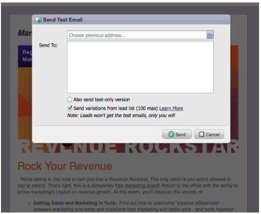

# 發行說明：2012年3月{#release-notes-march}

## 解析我的Token {#resolve-my-tokens}

我的Token（程式Token）會在預覽電子郵件、傳送測試電子郵件，以及透過單一流量動作傳送本機電子郵件時解析。 您不再需要在程式中建立智慧型促銷活動來測試我的Token!

## 在電子郵件和著陸頁面的預覽器和編輯器之間切換{#toggle-between-previewer-and-editor-in-emails-and-landing-pages}

只要按一下滑鼠，即可在編輯器和預覽器之間輕鬆來回切換。

預覽器編輯器：

預覽器至編輯器：

## 程式碼片段預覽器{#snippet-previewer}

從功能表選取「預覽程式碼片段」可讓您檢視程式碼片段，而不需將它設為草稿。此外，如果您有共用程式碼片段的唯讀存取權（透過工作區），則可使用此動作來檢視程式碼片段

## 傳送多封測試電子郵件{#send-multiple-test-emails}

隨著動態內容的增加，預覽和測試傳送給潛在客戶的所有電子郵件變化變得越來越重要。 當您使用「依銷售線索詳細資料檢視」進行預覽時，您可以選擇從銷售線索清單中傳送變化測試（最多100封測試電子郵件）。

## 基於URL參數{#dynamic-landing-pages-based-on-url-parameter}的動態著陸頁面

匿名潛在客源是您登陸頁面瀏覽的一大部分。 加上動態內容以及將區段作為參數放入URL的功能，當匿名或已知的潛在客戶點按連結時，您可以動態顯示著陸頁面內容。
