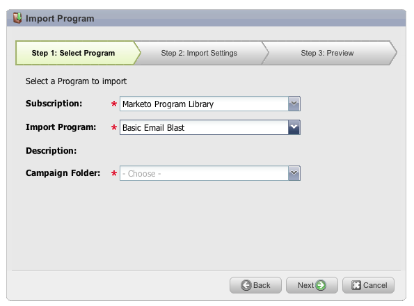

# 發行說明：2012年10月{#release-notes-october}

10月發行包含更令人興奮的新功能！ Social功能可做為附加元件或選取組合的一部分。

## 導入程式和程式交換{#import-programs-and-program-exchange}

一個程式可從一個Marketo訂閱導入另一個。 例如，您可以在沙盒中建立程式，然後將它匯入您的即時訂閱。 此外，您也可以從Marketo方案庫匯入預先建立的方案。

>[!NOTE]
>
>只有已獲得Marketo管理員使用者授權的Marketo使用者才能匯入程式。
>
>請連絡Marketo支援以連線您的即時訂閱沙盒帳戶。

## 通知{#notifications}

通知可讓您隨時掌握Marketo訂閱中發生的系統事件。 例如，當促銷活動失敗或您的CRM同步需要注意時，系統會自動通知您。 「我的Marketo」標籤上提供通知。 此外，您還可以訂閱通知，以便在電子郵件中即時收到。

## 輪詢{#polls}

建立民調問答，以吸引您的潛在客戶參與內容！ 他們可以投票給自己喜愛的網路或電影，然後通過社交網路與朋友分享民調結果。 您可以收集有關您的潛在客源所投票的豐富分析資料。

## 追蹤社交活動{#track-social-activities}

根據特定社交活動建立智慧型清單，以瞭解哪些人在投票中分享您的內容和投票。 例如，建立智慧型促銷活動，以提高最常分享您內容的潛在客戶的分數！

## 社交設定檔{#social-profiles}

您現在可以在潛在客戶分享內容或使用其社交個人檔案填寫表單時，收集有關他們的資訊。 這包括Facebook,LinkedIn,Twitter的手，朋友的數目等等。

## 收入瀏覽器報表訂閱{#revenue-explorer-report-subscriptions}

建立報表訂閱，並定期將「收入總管」報表傳送給您的主要利益相關者，包括非Marketo使用者。 電子郵件包含報表資料表格或圖表的預覽，以及包含所有報表資料的Excel試算表。

>[!NOTE]
>
>僅適用於具有「收入總管」的使用者（透過「企業版」或「選擇版」購買「收入週期分析」）。
