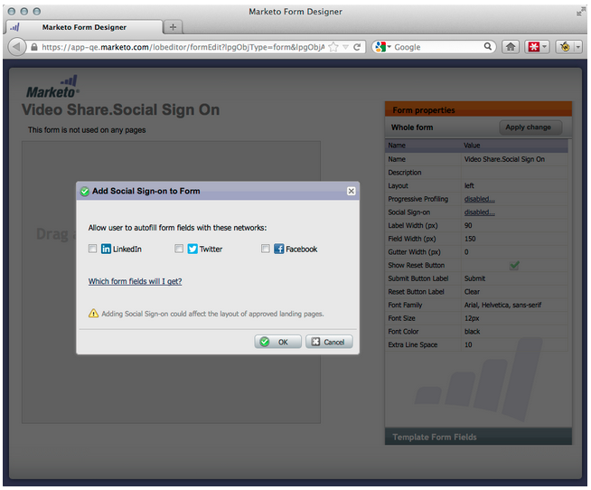

# 發行說明：2012年9月{#release-notes-september}

本版本包含備受期待的整合式社交功能與潛在客戶管理實用功能！ 注意：社交功能可做為附加元件或選取組合的一部分。

## 使用社交分享發佈YouTube影片{#publish-a-youtube-video-with-social-sharing}

在您的登陸頁面上使用新的「視訊分享」，鼓勵訪客在社交上分享，以擴大視訊的受眾。

## 新增共用按鈕{#add-a-share-button}

完全自訂新社交分享按鈕集的分享訊息和外觀。 此外，當您的潛在客戶分享您的內容時，擷取社交個人檔案資料。

## 社交登入{#social-sign-on}

讓潛在客戶從其社交網路預先填寫表單，以獲得見解並減少摩擦。

## 將登陸頁面發佈至Facebook{#publish-landing-pages-to-facebook}

將登陸頁面直接發佈至Facebook，並附上社交應用程式、表格和Marketo登陸頁面的完整功能，以擴展其觸及面。

## ReadyTalk事件適配器{#readytalk-event-adapter}

將Marketo活動與ReadyTalk會議緊密連接。 使用Marketo表格擷取註冊者，並自動在ReadyTalk中註冊。 雙向同步允許考勤資訊填充到Marketo。

## Microsoft Dynamics On Premise {#microsoft-dynamics-on-premise}

我們現在支援Microsoft Dynamics 2011的內部部署，並提供面向網際網路的部署。

## Webhooks(Treasure Chest){#webhooks-treasure-chest}

Webhook是使用者定義的HTTP回呼。 這是將資料從Marketo推送到其他服務的絕佳方式。 此功能目前在Treasure Chest中提供，目前僅在觸發促銷活動中支援。

您可能使用Webhook的範例包括：將用戶名和密碼資訊發佈到另一個系統以建立試用帳戶；在您獲得新線索時傳送SMS文字訊息。

## 更新為getMultipleLeads API {#update-to-getmultipleleads-api}

我們已在getMultipleLeads API呼叫中新增篩選條件。 除了依日期篩選外，我們現在支援其他條件：

* 日期範圍
* 靜態清單名稱
* 鉛鍵陣列
