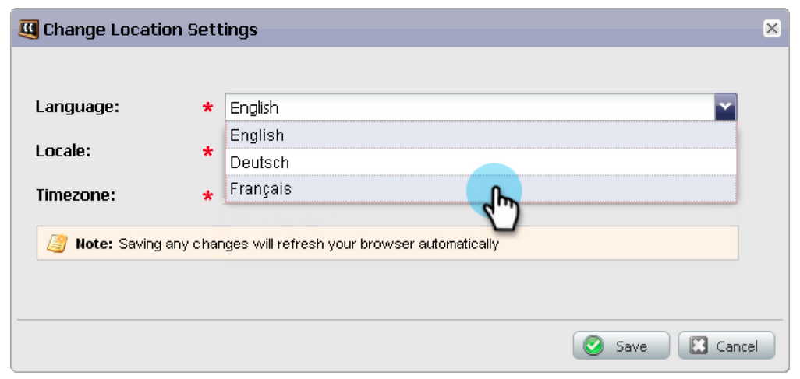

# 發行說明：2013年1月{#release-notes-january}

1月版本會以&#x200B;**轉介選件**&#x200B;擴充我們的社交選件。 此外，Marketo銷售線索管理用戶還可以設定其時區、語言和地區設定首選項。 請注意，標有*的功能只能在「選擇版」中使用。

## 轉介選件{#referral-offers}

**轉介選件**&#x200B;會激勵您的潛在客戶轉介其朋友。 為成功的轉介建立目標和獎勵。 您可以在登陸頁面、網站，甚至Facebook上使用。

## 時區首選項{#time-zone-preference}

您可以變更個人Marketo帳戶的預設時區。 例如，即使訂閱的預設值是「太平洋時間」，您也可以將自己帳戶的訂閱變更為「東部時間」。

## 選擇您的Marketo銷售線索管理語言{#select-your-marketo-lead-management-language}

您可以變更您Marketo使用者帳戶的預設語言。 即使訂閱的預設值是英文，您也可以將訂閱變更為德文或法文供您自用。

## 多語言表單錯誤消息{#multi-lingual-form-error-messages}

當銷售線索填寫Marketo表格時，會自動內建一些驗證訊息。 您可能想要為這些錯誤訊息選擇不同的顯示語言。 我們現在支援英文、德文和法文。

法文表格的範例：

## 選擇您的Sales Insight語言（僅限Salesforce）{#select-your-sales-insight-language-salesforce-only}

如果您的Salesforce語言偏好設定為法文或德文，Marketo銷售分析將會遵循此偏好設定。 下載最新的MSI套件以取得此功能（於1月14日當周推出）。

## 欄位顯示名稱{#field-display-name}

欄位顯示名稱可顯示不同語言的文字（例如支援多位元組字元）。

## 更改程式資料{#change-program-data}

「更改程式資料流」步驟允許您通過促銷活動手動更改方案成員的成功狀態和成功日期。 您可以使用此流程步驟來更正錯誤，或手動更改可能未如預期參與計畫的成員。

